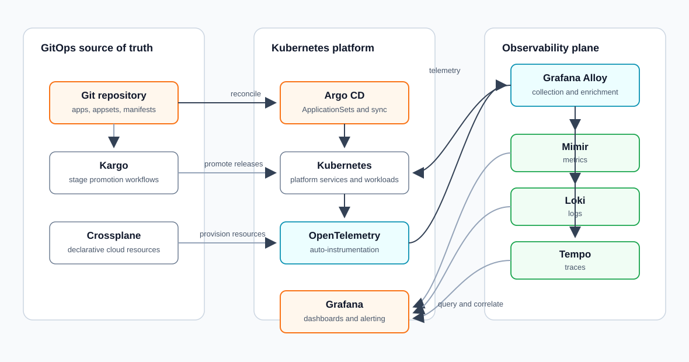

# bwcloud-gitops

GitOps-based Kubernetes observability platform using Argo CD, Kargo, OpenTelemetry, Grafana LGTM, and Crossplane.
It models infrastructure, telemetry pipelines, dashboards, alerts, and promotion workflows as code.
The repository is structured around self-service platform capabilities for onboarding applications, instrumentation, and release paths through declarative interfaces.
Sensitive runtime material is intentionally kept outside Git and referenced through existing secrets or bootstrap manifests.
Spring Petclinic is used as a demo workload for validating OpenTelemetry auto-instrumentation and metrics-traces-logs correlation.

This is a modern GitOps repository managing a complete Observability and CD stack using Argo CD, Kargo, Grafana, and Mimir. It follows a declarative approach where infrastructure configuration lives in Git, while sensitive data is decoupled from the codebase.

## Architecture Overview

The platform flow starts with Git as the source of truth. Argo CD reconciles platform services, Kargo promotes changes across stages, Crossplane exposes infrastructure resources through declarative APIs, and the OpenTelemetry/Grafana LGTM stack turns application and cluster behavior into correlated metrics, logs, traces, dashboards, and alerts.

## Why This Matters

This repository is a practical platform-engineering exercise in reducing operational complexity without hiding the underlying system. It combines self-service interfaces, observability as code, promotion workflows, and a telemetry pipeline that keeps metrics, logs, traces, dashboards, and alerts reviewable through Git.

## 📂 Repository Structure

-   **`appsets/`**: Argo CD ApplicationSets (one per service). Managed by the Root App.
-   **`apps/`**: Helm charts and stage-specific values.
    -   `base/`: Common configuration shared across all environments.
    -   `prod/`: Production overrides (primary focus).
-   **`0day-deployment-manifests/`**: Templates for manual bootstrap (Secrets, Repo-Access). **See `BOOTSTRAP.md` inside this folder for setup instructions.**
-   **`manifests/`**: Static Kubernetes manifests (e.g., Kargo Stages).

## 🛠 Managed Applications

| Application | Role | Access URL |
| :--- | :--- | :--- |
| **Argo CD** | Continuous Delivery (GitOps) | [argocd.saadisfy.me](https://argocd.saadisfy.me) |
| **Grafana** | Visualization & Alerting | [grafana.saadisfy.me](https://grafana.saadisfy.me) |
| **Kargo** | Multi-Stage Promotion | [kargo.saadisfy.me](https://kargo.saadisfy.me) |
| **Mimir** | Long-term Metric Storage | [mimir.saadisfy.me](https://mimir.saadisfy.me) |
| **Alloy** | Telemetry Collection | (Internal Cluster DaemonSet) |
| **Istio** | Service mesh control plane (no workloads meshed by default) | (Internal Cluster Control Plane) |
| **Spring Petclinic** | Demo app (OTel auto-instrumentation, LGTM correlation example) | [spring-petclinic.saadisfy.me](https://spring-petclinic.saadisfy.me) |
| **Kibana** | Log & search UI (Elasticsearch 8.5) | [kibana.saadisfy.me](https://kibana.saadisfy.me) |
| **Elasticsearch** | Log/metric storage backend for Kibana | (Internal: `elasticsearch-master.elk`) |
| **Cluster Priority** | PriorityClass objects for critical control-plane apps | (Internal Cluster Resources) |

## 🔐 Security & GitOps Decoupling

This repository is designed to be **public**. We use two mechanisms to keep it secure:

1.  **External Secrets:** Applications like Grafana use `existingSecret` references. The Kubernetes Secret is created once manually; the Helm chart only references it by name.
2.  **Selective ignoreDifferences:** For Argo CD and Kargo, the Helm charts manage the Secret structure (including the auto-generated `server.secretkey`), but we use `ignoreDifferences` in the ApplicationSet to prevent Git placeholders from overwriting the manually set admin password hashes.

## 📊 Observability Stack

-   **Collector**: **Grafana Alloy** runs as a DaemonSet, scraping metrics (KSM, Node-Exporter) and forwarding them via OTLP.
-   **Storage**: **Grafana Mimir** (Distributed) stores metrics with high efficiency.
-   **Dashboarding**: **Grafana Operator** manages dashboards and alerts as code via Custom Resources (CRs).
-   **Correlation (LGTM):** Mimir exemplars → Tempo, Tempo → Loki (`trace_id`), Loki derived fields → Tempo. Demo app: Spring Petclinic. Dashboard: *Spring Petclinic / LGTM Correlation* in Grafana. Details: [General/LGTM-Correlation.md](docs/ObservabilitySolutions/General/LGTM-Korrelation.md).
-   **Auto-Reload**: **Stakater Reloader** monitors Secrets and ConfigMaps to trigger zero-downtime rolling restarts on changes.
-   **ELK (Elasticsearch + Kibana)**: Official Elastic Helm charts (8.5.1) in namespace `elk`. Elasticsearch deploys first (Argo CD sync-wave 1); a post-install hook bootstraps the native security realm (`.security-7`) before Kibana (sync-wave 2) creates its service-account token. **SSO**: GitHub via Argo CD Dex (OIDC), reusing the same GitHub connector as Argo CD. `saadisfy` is mapped to superuser access, all other users to viewer access. Fallback login uses the `elastic` user and the password from `elasticsearch-master-credentials`. Secrets are referenced through `0day-deployment-manifests/grafana-secrets.yaml` (`kibana-oidc` for Dex, `kibana-oidc-credentials` for the Elasticsearch keystore).

## 🔄 Promotion Workflow (Kargo)

Promotions between stages (Dev -> Int -> Prod) are handled by **Kargo**.
-   Freight is composed of Git commits and Container images.
-   Promotions update stage-specific `values.yaml` files via automated commits.
-   Managed via `apps/kargo-projects/`.

## 📚 Documentation & Concepts

Detailed information about the architecture and usage of this stack:

-   **[Observability Guide](docs/OBSERVABILITY.md)**: Central source of truth for the observability stack, including architecture, onboarding, and operational know-how.
-   **[LGTM Correlation Basics](docs/ObservabilitySolutions/General/LGTM-Korrelation.md)**: Metrics → traces → logs, key labels, and Grafana navigation with the Spring Petclinic demo.
-   **[Data Pipeline Concept (Alloy)](docs/data-pipeline-concept.md)**: Deep dive into the Grafana Alloy pipeline (Receive -> Process -> Export) and label enrichment strategy.
-   **[Instrumentation & Pod Association](docs/OBSERVABILITY.md#24-advanced-label-enrichment--pod-association)**: How applications are identified and enriched with Kubernetes metadata.

---
*Maintained by Saad Masood. Managed via Argo CD.*
