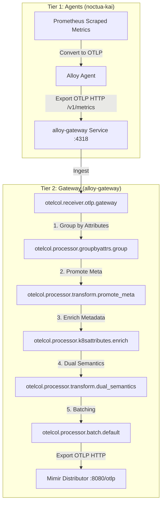

# Two-Tier Alloy Architecture: Lessons Learned & Knowledge Base

This document summarizes the technical challenges and solutions discovered during the implementation of a two-tier observability pipeline on the `noctua-k3s` cluster.

## 1. Inter-Tier Connectivity (Tier 1 -> Tier 2)

### Protocol Choice: HTTP vs. gRPC
*   **Challenge:** When using gRPC (port 4317) for OTLP export from Tier 1 to Tier 2, the `k8s-monitoring` chart defaults to a secure TLS handshake even when the URL is `http://`.
*   **Error:** `rpc error: code = Unavailable desc = connection error: desc = "transport: authentication handshake failed: tls: first record does not look like a TLS handshake"`
*   **Solution:** For internal cluster traffic without a sidecar-mesh or mutual TLS, use **OTLP HTTP (port 4318)**. It bypasses the mandatory TLS negotiation that often plagues gRPC in simple Helm configurations.

### Port Conflicts & hostNetwork
*   **Challenge:** The Alloy Gateway (Tier 2) often inherits `hostNetwork: true` from base values. If Tier 1 (Agent) is also running on the same node with host networking, they will conflict on port 12345 (Alloy UI/Metrics).
*   **Solution:** Tier 2 should run with `hostNetwork: false` and `dnsPolicy: ClusterFirst`. This allows it to use its own virtual IP and avoid port collisions with host-level agents.

## 2. Helm Chart Schema (grafana/k8s-monitoring v4)

### Metrics Enablement
*   **Observation:** Enabling metrics in v4 requires a specific hierarchy. Setting `telemetryServices.node-exporter.deploy: true` only starts the pod; it does **not** configure the scrape job.
*   **Requirement:** You must set `metrics.node-exporter.enabled: true` (or similar keys depending on the minor version) to trigger the generation of `prometheus.scrape` blocks in the Alloy configuration.

### Collector Presets
*   **Challenge:** Features like `clusterMetrics` or `hostMetrics` have mandatory validations. For example, `clusterMetrics` requires `clustering` to be enabled.
*   **Error:** `The Kubernetes Cluster metrics feature requires clustering to be enabled on the alloy-metrics collector.`
*   **Solution:** Use explicit clustering enablement in the collector block:
    ```yaml
    collectors:
      alloy-metrics:
        alloy:
          clustering:
            enabled: true
    ```

## 3. Evolutionary Strategy from Single-Tier to 2-Tier

Before adopting the 2-Tier architecture, our general pipeline concept was outlined in [data-pipeline-concept.md](file:///Users/saad.masood/Documents/Git/bwcloud-gitops/docs/data-pipeline-concept.md). This layout relied on a flat structure where a single daemonset Alloy scraped and processed all metrics. 

To scale efficiently and simplify configuration, we are transitioning to a **2-Tier Strategy** (utilizing the Grafana `k8s-monitoring` Helm chart) executed via the following three-stage roadmap:

---

## 4. The 3-Stage Migration Plan

### Stage 1: Out-of-the-Box `k8s-monitoring` Chart Baseline
The goal of this stage is to build a solid baseline using standard chart features without custom routing workarounds.
*   **Infrastructure Metrics Scrapes:** We use the Grafana `k8s-monitoring` Helm chart to deploy Kubernetes monitoring agents (e.g., Node Exporter, Kube-State-Metrics) and scrape them. Out of the box, standard infrastructure metrics are sent directly to Mimir via `prometheus.remote_write`.
*   **OTLP Receivers for Instrumented Apps:** The Alloy deployment acts as a standard OTLP receiver for auto-instrumented OpenTelemetry-based applications (e.g., Java apps). The chart's internal pipeline receives these telemetry payloads, uses the `k8sattributes` processor to inject Kubernetes metadata (associating the pod via the source IP of the `connection`), and forwards the processed metrics to the backend via OTLP.
*   **Verification:** Confirm that classic Prometheus metrics flow to Mimir and that OTel applications are successfully enriched and forwarded.

---

### Stage 2: The Two-Tier OTLP Loopback Trick (The Pivot)
This stage introduces a custom loopback architecture to obtain standardized OTel resource attributes for the entire infrastructure while maintaining legacy Prometheus compatibility.
*   **The Concept:** Instead of exporting Prometheus metrics directly to Mimir via `prometheus.remote_write`, we convert them to OTLP metrics. The OTLP exporter is configured to send these metrics *back into the Alloy instance's own OTLP receiver* (or to the Tier-2 OTLP receiver).
*   **The Processing Loop:**
    1. Alloy scrapes target endpoints (e.g. Node Exporter, custom ServiceMonitors).
    2. Scraped metrics are converted and exported via OTLP HTTP.
    3. The payload is sent to the local OTLP HTTP receiver (port `4318`).
    4. The receiver treats the incoming metrics as if they were pushed from an instrumented OTel application, routing them through the `otelcol.processor.k8sattributes` component.
*   **Critical Caveats & Technical Hurdles:**
    1.  **Pod IP & Connection IP Association:** Because the metrics are routed internally via a loopback connection from Alloy to Alloy, the network connection's source IP is that of the Alloy agent pod itself. If we rely on standard `connection` pod association in `k8sattributes`, the processor will mistakenly tag *every* metric with the metadata of the Alloy agent. 
        *   *Solution:* We must extract the target's original IP from the scraped metrics (such as the `pod_ip` or `instance` labels) and map/promote it to the `k8s.pod.ip` resource attribute *before* it passes through the `k8sattributes` processor. We then configure `k8sattributes` to perform pod association using `resource_attribute: k8s.pod.ip` instead of the connection IP.
    2.  **Protocol & TLS Constraints:** Due to TLS handshake requirements of gRPC and internal routing limitations within the Gateway API (as described in Section 1), this loopback connection must utilize **OTLP HTTP (port 4318)** instead of OTLP gRPC.
*   **Benefits:**
    *   **Unified Metadata:** Standardized OTel-compliant resource attributes (`k8s.*`) are automatically attached to all infrastructure metrics.
    *   **Dashboard Compatibility:** Because the original Prometheus labels (like `pod` and `namespace`) are preserved at the data point level, upstream Grafana dashboards and alerts continue to work out of the box.

---

### Stage 3: Dual-Semantics & Attribute Promotion
The final stage bridges the gap between OTel resource attributes and Prometheus metric labels for advanced correlation.
*   **The Concept:** In addition to adding resource attributes, we introduce an extra step in the OTel processing pipeline to promote specific Kubernetes attributes (e.g., `k8s.namespace.name`, `k8s.pod.name`, `k8s.container.name`) back to metric labels (data resource attributes).
*   **Use Case:** This is critical for cross-signal correlation between Mimir (Metrics), Tempo (Traces), and Loki (Logs). Certain legacy alerting rules or specialized panels query metric labels directly instead of OTel resource attributes. Promoting these select attributes back to metric labels enables robust, seamless cross-linking and drill-downs across the entire LGTM stack.

---

## 5. Final Implementation Details (Stage 2 & 3)

The complete two-tier OTLP loopback architecture is deployed via the [noctua-kai](file:///Users/saad.masood/Documents/Git/bwcloud-gitops/apps/alloy/noctua-kai/values.yaml) Helm chart.

### Data Flow Diagram



### Gateway Pipeline Stages & Configuration

The Gateway's configuration (`config.alloy`) implements the pipeline as follows:

1. **`otelcol.receiver.otlp "gateway"`**
   Listens on `0.0.0.0:4318` for HTTP OTLP metrics exported from the Tier 1 agents.

2. **`otelcol.processor.groupbyattrs "group"`**
   Because the Tier 1 agents scrape multiple targets and forward them in batches under a single OTel Resource (representing the forwarding agent itself), we must group the metrics back into separate resource blocks before processing them. This component groups metrics by `namespace`, `pod`, `k8s_pod_ip`, and `instance` and promotes these keys from datapoint attributes to resource attributes. This avoids cross-contamination of metadata.

3. **`otelcol.processor.transform "promote_meta"`**
   Before running `k8sattributes`, we promote metric labels to OTel resource attributes (now executing in context = `"resource"`). This allows the enrichment step to associate metrics based on the target pod's IP or name rather than the forwarding agent's IP:
   * Promotes `namespace` to `k8s.namespace.name`.
   * Promotes `pod` to `k8s.pod.name`.
   * Maps `k8s_pod_ip` or `instance` to `k8s.pod.ip`.
   * Runs a regex replacement (`replace_pattern`) to strip port suffixes (e.g. `:8080` or `:9100`) from the IP.

4. **`otelcol.processor.k8sattributes "enrich"`**
   Uses the API server connection to fetch cluster metadata (including UID, Node, Deployment, and Container name) based on the resource attributes (`k8s.pod.ip` or `k8s.pod.name`) promoted in the previous step.

5. **`otelcol.processor.transform "dual_semantics"`**
   To ensure complete backwards-compatibility with upstream Prometheus dashboards and alerting rules, this step mirrors the enriched OTel resource attributes back to data point labels (e.g. `namespace`, `pod`, `container`, `node`, `cluster`).

6. **`otelcol.processor.batch "default"`**
   Batches outgoing metrics with a max size of `10,000` data points and a `10s` timeout for efficient transmission.

7. **`otelcol.exporter.otlphttp "mimir"`**
   Forwards the fully enriched, dual-semantic metrics to Mimir (`http://mimir-distributor.mimir.svc.cluster.local:8080/otlp`) using organization ID header `X-Scope-OrgID: 1`.

### Legacy Cleanup & Operational Stability
During deployment, the legacy `alloy` Argo CD Application and its crashing `alloy-alloy-operator` deployment (which was stuck due to finalizers after its ServiceAccount was deleted) were completely pruned and deleted. Only the new `alloy-kai` components are running, and Mimir ingester out-of-order errors have successfully stabilized.


