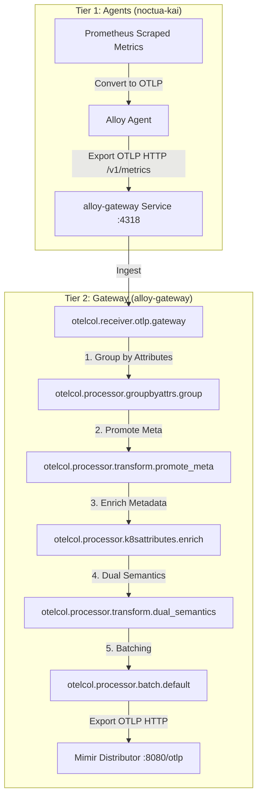

# Two-Tier Alloy Architecture: Lessons Learned & Knowledge Base

This document summarizes the technical challenges and solutions discovered during the implementation of a two-tier observability pipeline on the `noctua-k3s` cluster.

## 1. Core Observability Requirement: OTLP Resource Attributes First

A fundamental requirement of our Two-Tier Observability architecture is that **ALL telemetry signals (Metrics, Logs, and Traces) must possess standardized OTLP resource attributes** (specifically Kubernetes metadata like `k8s.namespace.name`, `k8s.pod.name`, `k8s.container.name`, etc.) by the time they reach their storage backends (Mimir, Loki, Tempo).

* **Why this is critical:** Standardizing on OpenTelemetry resource semantic conventions is the only way to achieve reliable cross-signal correlation (e.g. drilling down from a metric spike directly to the logs of that container, or correlating a trace span with host metrics).
* **Impact on the Pipeline:** 
  * **Metrics:** Handled via the Stage 2/3 OTLP Loopback where Prometheus metrics are converted to OTLP, enriched in Tier 2, and dual-semantically mapped back.
  * **Logs & Traces:** Any future expansion or current integration (like Loki log ingestion) must ensure that these signals are either enriched using OTel processor components (like `k8sattributes` in a unified OTLP pipeline) or mapped using OTel-compatible resource metadata so that the LGTM stack can correlate them seamlessly.

---

## 2. Hard Requirement: Single Point of Configuration für Pipeline-Logik

Jede Pipeline-Logik (k8s-Metadaten, Label-Mapping, Enrichment) darf **nur an einer einzigen Stelle definiert sein**. Änderungen an z. B. der `metadata`-Liste oder den `dual_semantics`-Statements müssen an exakt einer Stelle gemacht werden können — ohne Risiko, eine zweite Kopie zu vergessen und damit inkonsistente Labels zwischen Loki und Mimir zu produzieren.

### Warum das kritisch ist

Der gleiche ArgoCD-Pod wird sowohl über den Prometheus-Pull-Pfad (Metrics) als auch über den OTel-Push-Pfad (Logs) erfasst. Wenn `namespace`, `pod`, `container` oder `deployment` in beiden Pipelines nicht identisch definiert sind, entstehen **korrelationsunfähige Daten**: man kann in Grafana nicht mehr vom Metric-Panel direkt zu den Logs dieses Pods drilldownen.

### Umsetzung: River-Module als Single Source of Truth

Die `k8sattributes`- und `dual_semantics`-Logik ist in einer dedizierten Alloy-Modul-Datei gekapselt:

```
apps/alloy/noctua-kai/templates/alloy-modules-configmap.yaml
  └── k8s-enrich.alloy
        └── declare "metrics_enrichment" { ... }
              ├── otelcol.processor.k8sattributes "enrich"   ← metadata-Liste hier pflegen
              └── otelcol.processor.transform "dual_semantics" ← statements hier pflegen
```

Beide Collectors (`alloy-metrics` und `alloy-node`) importieren dieses Modul via `import.file` in ihrem `extraConfig`. Eine Änderung an der Modul-Datei wirkt automatisch für beide.

### Single Source of Truth & Reduzierte Duplikation

Um die Anzahl der Stellen zu minimieren, an denen dieselben Listen gepflegt werden müssen, haben wir die Konfiguration wie folgt vereinfacht:

1. **Globale Dual-Semantics:** Die `dual_semantics`-Transformationen (Promotion von Resource-Attributen zu Datenpunkt-Labels wie `namespace`, `pod` etc.) wurden komplett aus dem River-Modul (`k8s-enrich.alloy`) und der `applicationObservability`-Konfiguration entfernt. Sie sind nun **zentral an einer einzigen Stelle** in `values.yaml` unter `k8s-monitoring.destinations.mimir.processors.transform.metrics.datapoint` definiert. Da alle Metrik-Pfade (Scraped Prometheus und OTLP App-Metriken) vor dem Export über diese Destination laufen, greift die Transformation automatisch für alle Metriken konsistent.
2. **Dynamische Metadaten-Listen:** Die Liste der zu extrahierenden Kubernetes-Metadaten ist primär in `values.yaml` unter `customConfig.metadata` gepflegt. Das River-Modul `k8s-enrich.alloy` (`templates/alloy-modules-configmap.yaml`) rendert diese Liste dynamisch mittels Helm-Templating.

### Bekannte unvermeidliche Kopien (und warum)

Es gibt nur noch eine verbleibende Stelle, die manuell synchron gehalten werden muss:

| Stelle | Grund |
|---|---|
| `replaceComponent` → `pod_logs` → `extract.metadata` | `content:` ist ein opaker River-String-Block innerhalb der `values.yaml`; Helm-Templates können diesen Wert nicht dynamisch interpolieren, da `values.yaml` vor dem Rendering geparst wird. |

### Regel für zukünftige Änderungen

> Wenn du ein neues Metadaten-Feld (z. B. `k8s.replicaset.name`) hinzufügen möchtest:
> 1. Trage es in `values.yaml` unter `customConfig.metadata` ein (wird automatisch ins River-Modul für Metrics gerendert).
> 2. Ergänze es in `values.yaml` in der `metadata`-Liste unter `replaceComponent` → `pod_logs` (für Loki Logs).
> 
> Wenn du ein neues Label-Mapping hinzufügen möchtest:
> 1. Trage das Statement in `values.yaml` unter `k8s-monitoring.destinations.mimir.processors.transform.metrics.datapoint` ein.
> Es greift sofort für alle Metrikquellen (Metrics und Application Observability).

---

## 3. Core Requirement: Minimal Additional Alloy Configuration

To keep the pipeline maintainable and avoid deploying additional infrastructure, all custom OTel processing (metrics enrichment, metadata lookup, and label mapping) must be kept to a minimum and executed **inline within the existing collectors (`alloy-metrics` and `alloy-node`)** rather than spinning up a separate, dedicated `alloy-gateway` deployment.

* **No Dedicated Gateway Pods:** Eliminating the gateway saves pod overhead, network hops, and inter-collector OTLP traffic.
* **Inline Processing via `replaceComponent`:** We intercept the chart-generated `mimir` prometheus receiver using the subchart's `replaceComponent` values and feed it directly into our inline enrichment processors.
* **Declarative Fallback Logics:** Custom pipelines are fully documented with inline comments detailing how IP addresses are extracted, how port numbers are stripped from Prometheus scrape targets, and how newly added metadata (like `node` or `container`) is copied back to metrics for dashboard compatibility.

---

## 3. Wrapper Chart Architecture & Pod Count

In `apps/alloy/noctua-kai/Chart.yaml`, we only declare the `k8s-monitoring` Helm chart as a dependency. This is a highly consolidated and unified design choice:

* **Tier 1 (Collectors/Scrapers):** Managed via the `k8s-monitoring` subchart. It deploys sub-Alloy instances optimized for target scraping (e.g. `alloy-node` as a DaemonSet for host/node metrics, and `alloy-metrics` as a StatefulSet/Deployment for Kubernetes cluster metrics).
* **Tier 2 (Gateway):** Managed as a **custom collector** (called `alloy-gateway`) directly within the `k8s-monitoring` collectors map. It deploys a central deployment (`alloy-gateway`) via the Alloy Operator that receives OTLP metrics from Tier 1 and runs our custom transformation pipeline (`groupbyattrs`, `k8sattributes` metadata enrichment, and `dual_semantics` label promotion) before forwarding to Mimir.

By managing the gateway as a custom collector within `k8s-monitoring`, we eliminate the need for a separate `alloy` subchart dependency. We can configure the custom pipeline under the collector's `extraConfig` and let the operator provision the Service and Pods automatically.

### Pod Count & Layout in a 5-Node Cluster

Depending on whether log scraping is consolidated or separated, the pod count changes:

#### Option A: Separate DaemonSet for Logs (Default/Production)
* **Alloy Gateway (Tier 2):** 1 Pod (Deployment, managed by Alloy Operator)
* **Alloy Node Scraper (`alloy-node`):** 5 Pods (DaemonSet, 1 per node)
* **Alloy Metrics Scraper (`alloy-metrics`):** 2 Pods (Clustered StatefulSet/Deployment)
* **Alloy Logs Scraper (`alloy-logs`):** 5 Pods (DaemonSet, 1 per node)
* **Total:** 13 Alloy Pods + 1 Operator Pod.

#### Option B: Consolidated DaemonSet (Used in Noctua PoC)
* **Alloy Gateway (Tier 2):** 1 Pod (Deployment, managed by Alloy Operator)
* **Alloy Node Scraper (`alloy-node`):** 5 Pods (DaemonSet, 1 per node, configured with `filesystem-log-reader` preset)
* **Alloy Metrics Scraper (`alloy-metrics`):** 2 Pods (Clustered StatefulSet/Deployment)
* **Total:** 8 Alloy Pods + 1 Operator Pod.
* *Note:* By assigning the `podLogsViaLoki` feature to the existing `alloy-node` collector, we avoid starting a separate `alloy-logs` DaemonSet, saving 5 pods of overhead in our PoC environment.

---

## 4. Inter-Tier Connectivity (Tier 1 -> Tier 2)

### Protocol Choice: HTTP vs. gRPC
*   **Challenge:** When using gRPC (port 4317) for OTLP export from Tier 1 to Tier 2, the `k8s-monitoring` chart defaults to a secure TLS handshake even when the URL is `http://`.
*   **Error:** `rpc error: code = Unavailable desc = connection error: desc = "transport: authentication handshake failed: tls: first record does not look like a TLS handshake"`
*   **Solution:** For internal cluster traffic without a sidecar-mesh or mutual TLS, use **OTLP HTTP (port 4318)**. It bypasses the mandatory TLS negotiation that often plagues gRPC in simple Helm configurations.

### Port Conflicts & hostNetwork
*   **Challenge:** The Alloy Gateway (Tier 2) often inherits `hostNetwork: true` from base values. If Tier 1 (Agent) is also running on the same node with host networking, they will conflict on port 12345 (Alloy UI/Metrics).
*   **Solution:** Tier 2 should run with `hostNetwork: false` and `dnsPolicy: ClusterFirst`. This allows it to use its own virtual IP and avoid port collisions with host-level agents.

## 5. Helm Chart Schema (grafana/k8s-monitoring v4)

### Metrics Enablement
*   **Observation:** Enabling metrics in v4 requires a specific hierarchy. Setting `telemetryServices.node-exporter.deploy: true` only starts the pod; it does **not** configure the scrape job.
*   **Requirement:** You must set `metrics.node-exporter.enabled: true` (or similar keys depending on the minor version) to trigger the generation of `prometheus.scrape` blocks in the Alloy configuration.

### Collector Presets
*   **Challenge:** Features like `clusterMetrics` or `hostMetrics` have mandatory validations. For example, `clusterMetrics` requires `clustering` to be enabled.
*   **Error:** `The Kubernetes Cluster metrics feature requires clustering to be enabled on the alloy-metrics collector.`
*   **Solution:** Use explicit clustering enablement in the collector block:
    ```yaml
    collectors:
      alloy-metrics:
        alloy:
          clustering:
            enabled: true
    ```

## 6. Evolutionary Strategy from Single-Tier to 2-Tier

Before adopting the 2-Tier architecture, our general pipeline concept was outlined in [data-pipeline-concept.md](file:///Users/saad.masood/Documents/Git/bwcloud-gitops/docs/data-pipeline-concept.md). This layout relied on a flat structure where a single daemonset Alloy scraped and processed all metrics. 

To scale efficiently and simplify configuration, we are transitioning to a **2-Tier Strategy** (utilizing the Grafana `k8s-monitoring` Helm chart) executed via the following three-stage roadmap:

---

## 7. The 3-Stage Migration Plan

### Stage 1: Out-of-the-Box `k8s-monitoring` Chart Baseline
The goal of this stage is to build a solid baseline using standard chart features without custom routing workarounds.
*   **Infrastructure Metrics Scrapes:** We use the Grafana `k8s-monitoring` Helm chart to deploy Kubernetes monitoring agents (e.g., Node Exporter, Kube-State-Metrics) and scrape them. Out of the box, standard infrastructure metrics are sent directly to Mimir via `prometheus.remote_write`.
*   **OTLP Receivers for Instrumented Apps:** The Alloy deployment acts as a standard OTLP receiver for auto-instrumented OpenTelemetry-based applications (e.g., Java apps). The chart's internal pipeline receives these telemetry payloads, uses the `k8sattributes` processor to inject Kubernetes metadata (associating the pod via the source IP of the `connection`), and forwards the processed metrics to the backend via OTLP.
*   **Verification:** Confirm that classic Prometheus metrics flow to Mimir and that OTel applications are successfully enriched and forwarded.

---

### Stage 2: The Two-Tier OTLP Loopback Trick (The Pivot)
This stage introduces a custom loopback architecture to obtain standardized OTel resource attributes for the entire infrastructure while maintaining legacy Prometheus compatibility.
*   **The Concept:** Instead of exporting Prometheus metrics directly to Mimir via `prometheus.remote_write`, we convert them to OTLP metrics. The OTLP exporter is configured to send these metrics *back into the Alloy instance's own OTLP receiver* (or to the Tier-2 OTLP receiver).
*   **The Processing Loop:**
    1. Alloy scrapes target endpoints (e.g. Node Exporter, custom ServiceMonitors).
    2. Scraped metrics are converted and exported via OTLP HTTP.
    3. The payload is sent to the local OTLP HTTP receiver (port `4318`).
    4. The receiver treats the incoming metrics as if they were pushed from an instrumented OTel application, routing them through the `otelcol.processor.k8sattributes` component.
*   **Critical Caveats & Technical Hurdles:**
    1.  **Pod IP & Connection IP Association:** Because the metrics are routed internally via a loopback connection from Alloy to Alloy, the network connection's source IP is that of the Alloy agent pod itself. If we rely on standard `connection` pod association in `k8sattributes`, the processor will mistakenly tag *every* metric with the metadata of the Alloy agent. 
        *   *Solution:* We must extract the target's original IP from the scraped metrics (such as the `pod_ip` or `instance` labels) and map/promote it to the `k8s.pod.ip` resource attribute *before* it passes through the `k8sattributes` processor. We then configure `k8sattributes` to perform pod association using `resource_attribute: k8s.pod.ip` instead of the connection IP.
    2.  **Protocol & TLS Constraints:** Due to TLS handshake requirements of gRPC and internal routing limitations within the Gateway API (as described in Section 1), this loopback connection must utilize **OTLP HTTP (port 4318)** instead of OTLP gRPC.
*   **Benefits:**
    *   **Unified Metadata:** Standardized OTel-compliant resource attributes (`k8s.*`) are automatically attached to all infrastructure metrics.
    *   **Dashboard Compatibility:** Because the original Prometheus labels (like `pod` and `namespace`) are preserved at the data point level, upstream Grafana dashboards and alerts continue to work out of the box.

---

### Stage 3: Dual-Semantics & Attribute Promotion
The final stage bridges the gap between OTel resource attributes and Prometheus metric labels for advanced correlation.
*   **The Concept:** In addition to adding resource attributes, we introduce an extra step in the OTel processing pipeline to promote specific Kubernetes attributes (e.g., `k8s.namespace.name`, `k8s.pod.name`, `k8s.container.name`) back to metric labels (data resource attributes).
*   **Use Case:** This is critical for cross-signal correlation between Mimir (Metrics), Tempo (Traces), and Loki (Logs). Certain legacy alerting rules or specialized panels query metric labels directly instead of OTel resource attributes. Promoting these select attributes back to metric labels enables robust, seamless cross-linking and drill-downs across the entire LGTM stack.

---

## 8. Final Implementation Details (Stage 2 & 3)

The complete two-tier OTLP loopback architecture is deployed via the [noctua-kai](file:///Users/saad.masood/Documents/Git/bwcloud-gitops/apps/alloy/noctua-kai/values.yaml) Helm chart.

### Data Flow Diagram



### Gateway Pipeline Stages & Configuration

The Gateway's configuration (`config.alloy`) implements the pipeline as follows:

1. **`otelcol.receiver.otlp "gateway"`**
   Listens on `0.0.0.0:4318` for HTTP OTLP metrics exported from the Tier 1 agents.

2. **`otelcol.processor.groupbyattrs "group"`**
   Because the Tier 1 agents scrape multiple targets and forward them in batches under a single OTel Resource (representing the forwarding agent itself), we must group the metrics back into separate resource blocks before processing them. This component groups metrics by `namespace`, `pod`, `k8s_pod_ip`, and `instance` and promotes these keys from datapoint attributes to resource attributes. This avoids cross-contamination of metadata.

3. **`otelcol.processor.transform "promote_meta"`**
   Before running `k8sattributes`, we promote metric labels to OTel resource attributes (now executing in context = `"resource"`). This allows the enrichment step to associate metrics based on the target pod's IP or name rather than the forwarding agent's IP:
   * Promotes `namespace` to `k8s.namespace.name`.
   * Promotes `pod` to `k8s.pod.name`.
   * Maps `k8s_pod_ip` or `instance` to `k8s.pod.ip`.
   * Runs a regex replacement (`replace_pattern`) to strip port suffixes (e.g. `:8080` or `:9100`) from the IP.

4. **`otelcol.processor.k8sattributes "enrich"`**
   Uses the API server connection to fetch cluster metadata (including UID, Node, Deployment, and Container name) based on the resource attributes (`k8s.pod.ip` or `k8s.pod.name`) promoted in the previous step.

5. **`otelcol.processor.transform "dual_semantics"`**
   To ensure complete backwards-compatibility with upstream Prometheus dashboards and alerting rules, this step mirrors the enriched OTel resource attributes back to data point labels (e.g. `namespace`, `pod`, `container`, `node`, `cluster`).

6. **`otelcol.processor.batch "default"`**
   Batches outgoing metrics with a max size of `10,000` data points and a `10s` timeout for efficient transmission.

7. **`otelcol.exporter.otlphttp "mimir"`**
   Forwards the fully enriched, dual-semantic metrics to Mimir (`http://mimir-distributor.mimir.svc.cluster.local:8080/otlp`) using organization ID header `X-Scope-OrgID: 1`.

### Legacy Cleanup & Operational Stability
During deployment, the legacy `alloy` Argo CD Application and its crashing `alloy-alloy-operator` deployment (which was stuck due to finalizers after its ServiceAccount was deleted) were completely pruned and deleted. Only the new `alloy-kai` components are running, and Mimir ingester out-of-order errors have successfully stabilized.

---

## 9. Loki & Log-Scraping Integration (Consolidated DaemonSet)

To collect and persist cluster logs efficiently, we deployed Loki and expanded our Alloy architecture:

### Loki Deployment (noctua)
* **Mode:** Monolithic `SingleBinary` configuration for local development and PoC.
* **Storage:** PVC-backed (`5Gi` size on `local-path` storageClass) storing TSDB indexes and chunks.
* **Retention:** Configured to `24h` (1 day) using the Loki compactor.
  * *Note:* Specifying retention requires setting `delete_request_store: filesystem` under `compactor` in Loki v3.x+.
* **Grafana Integration:** Added Loki as a data source under `grafana.datasources.datasources.yaml` with the URL `http://loki-gateway.loki.svc.cluster.local` and UID `loki`.

### Consolidated DaemonSet for Metrics & Logs (OTLP-First)
* **Challenge:** Deploying a separate collector for logs (`alloy-logs`) would spin up another 5 pods on a 5-node cluster, consuming significant node resources.
* **Solution:** We consolidated log collection onto the existing `alloy-node` DaemonSet (Tier 1 agent).
* **Enforcing OTLP and k8sattributes:**
  * Enabled `podLogsViaOpenTelemetry` (instead of `podLogsViaLoki`) to enforce pure OpenTelemetry log formats.
  * Added the `loki-otlp` destination of type `otlp` (URL: `http://loki-gateway.loki.svc.cluster.local/otlp`) with `logs.enabled: true`.
  * Routed `podLogsViaOpenTelemetry` logs to `loki-otlp` so they bypass the central Tier 2 gateway, preventing log-processing bottlenecks.
  * Set `stabilityLevel: public-preview` on the `alloy-node` collector as required by OTel logs features.
* **Metadata Enrichment (Local k8sattributes):**
  * The node agents run `otelcol.processor.k8sattributes` locally, caching metadata only for pods running on their own node (filtered by environment variable `K8S_NODE_NAME` to protect the API server).
  * This processor enriches logs with `k8s.deployment.name`, `k8s.statefulset.name`, `k8s.daemonset.name`, `k8s.node.name`, and other Kubernetes metadata using the official `k8s.pod.uid` association.
  * The enriched logs are batched and exported directly via OTLP to Loki's native OTLP ingestion endpoint, ensuring 100% OTLP resource attribute compliance.

### Memberlist DNS Deadlock Mitigation
* **Challenge:** During initial startup, Loki pods returned `503 Service Unavailable` on `/ready` because the `loki-memberlist` headless service selector had no endpoints. CoreDNS returned `NXDOMAIN` (No such host) because the headless service filters out unready pods. This prevented memberlist from initializing, causing a deadlock.
* **Solution:** We configured `memberlist.service.publishNotReadyAddresses: true` in the Loki Helm values. This forces Kubernetes to publish the pod IP in CoreDNS immediately upon startup, allowing the memberlist cluster to bootstrap before the pods pass their readiness checks.


