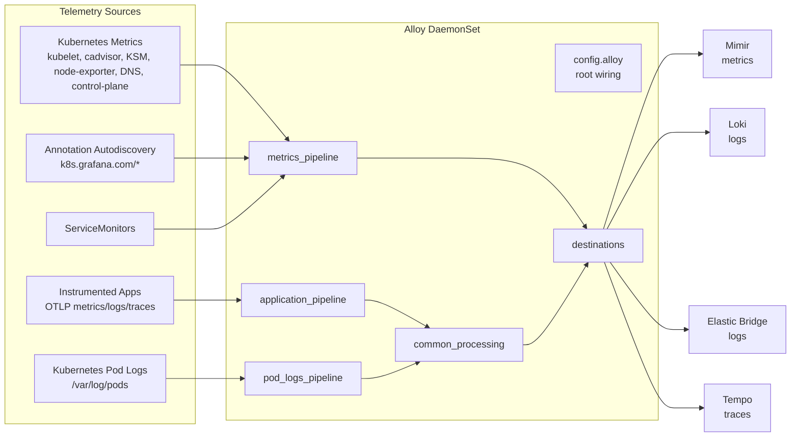

# Alloy Noctua Stage Deployment

Diese Doku beschreibt das neue, modulare Alloy-Deployment fuer Noctua. Das Ziel ist Feature-Paritaet zum bisherigen `k8s-monitoring`-Ansatz, aber ohne eine schwer durchschaubare, chart-generierte 1200+-Zeilen-ConfigMap.

Der neue Ansatz benutzt die `grafana/alloy` Helm Chart als Runtime, legt die River-Konfiguration aber selbst als kleine Module unter `apps/alloy/noctua/files/alloy/` ab. Die `k8s-monitoring` Chart bleibt als Referenz fuer "welche Telemetry-Quellen brauchen wir?", aber nicht mehr als Zielarchitektur fuer "wie pflegen wir die Konfiguration?".

## Kurzfassung

| Frage | Antwort |
| --- | --- |
| Runtime | Grafana Alloy als DaemonSet |
| Deployment-Pfad | `apps/alloy/noctua` |
| Main-Wiring | `apps/alloy/noctua/files/alloy/config.alloy` |
| Shared Processing | `apps/alloy/noctua/files/alloy/common_processing.alloy` und `apps/alloy/noctua/templates/_ottl.tpl` |
| Backend-Endpoints | `apps/alloy/noctua/values.yaml` unter `alloyPipeline` |
| Metrics-Ziele | Mimir via OTLP/HTTP |
| Logs-Ziele | Loki via OTLP/HTTP und Elastic Bridge via OTLP/gRPC |
| Traces-Ziel | Tempo via OTLP/gRPC |
| App-Ingestion | OTLP gRPC `4317`, OTLP HTTP `4318` |
| Pod-Logs | `otelcol.receiver.filelog` auf `/var/log/pods/*/*/*.log` |
| K8s-Metrics | Prometheus Scrapes plus OTel Processing |
| Globales Metric Filtering | `alloyPipeline.metrics.globalDropRegex` und `globalKeepRegex` |

## Warum nicht einfach `k8s-monitoring`?

Die `k8s-monitoring` Chart ist sehr gut darin, schnell viele Kubernetes-Telemetriequellen einzusammeln. Sie ist aber eine Generator-Chart: viel Logik entsteht implizit aus Values, `replaceComponent`, Chart-Defaults und internen Templates. Bei Noctua-Kai wurde dadurch am Ende wieder viel chart-spezifisches Wissen notwendig:

- Welche Komponente wird von der Chart generiert?
- Wo muss `replaceComponent` greifen?
- Welche Defaults injiziert die Chart trotzdem?
- Welche OTTL-Regeln muessen in mehreren Chart-Pfaden synchron bleiben?
- Welche Backends bekommen welche Signale?
- Wo filtert man eine bestimmte Metrik?

Das neue Noctua-Deployment dreht das um:

- Telemetry-Quellen sind explizite Module.
- Gemeinsame Enrichment-/Drop-Regeln liegen an einem zentralen Ort.
- Target-spezifische Sonderfaelle bleiben im jeweiligen Scrape-Modul.
- Werte, Tenants, Endpoints und globale Filter liegen in `values.yaml`.
- Die gerenderte ConfigMap besteht aus mehreren nachvollziehbaren River-Dateien.

Das alte Konzept ist weiterhin dokumentiert unter [`k8s-monitoring/README.md`](./k8s-monitoring/README.md).

## Zielarchitektur



## Deployment-Dateien

### Helm Wrapper

| Datei | Zweck |
| --- | --- |
| `apps/alloy/noctua/Chart.yaml` | Wrapper Chart fuer `grafana/alloy`, `kube-state-metrics` und `prometheus-node-exporter`. |
| `apps/alloy/noctua/values.yaml` | Noctua-spezifische Runtime-, Endpoint-, Tenant-, Filter- und Limiter-Werte. |
| `apps/alloy/base/values.yaml` | Basiswerte fuer DaemonSet, RBAC, Ressourcen, stabile Namen und Subchart-Defaults. |
| `apps/alloy/noctua/templates/alloy-configmap.yaml` | Rendert alle River-Module aus `files/alloy/*.alloy` in eine ConfigMap. |
| `apps/alloy/noctua/templates/_ottl.tpl` | Helm-Helper fuer wiederverwendbare OTTL-Fragmente. |

### River-Module

| Modul | Aufgabe |
| --- | --- |
| `config.alloy` | Root-Wiring: Imports, Receiver, Pipeline-Instanzen, Scrape-Target-Liste. |
| `destinations.alloy` | OTLP Exporter zu Mimir, Loki, Elastic Bridge und Tempo inklusive persistenter Queue. |
| `common_processing.alloy` | Zentrale Cross-Signal-Regeln fuer Enrichment, Compatibility Labels, Redaction und Safety Filter. |
| `application_pipeline.alloy` | Vorverarbeitung fuer OTLP-App-Telemetrie mit `memory_limiter`, `resourcedetection`, `k8sattributes`. |
| `pod_logs_pipeline.alloy` | Vorverarbeitung fuer Pod-Logs mit k8s enrichment, OTel-Injection-Dedupe und Service-Identity. |
| `metrics_pipeline.alloy` | Metric-Pipelines fuer pod-level und meta-level Scrapes inklusive globaler Metric-Policy. |
| `*_scrape.alloy` | Jeweils eine explizite Datenquelle: Alloy, annotation autodiscovery, kubelet, cadvisor, KSM usw. |

## Werte in `values.yaml`

Die wichtigsten Noctua-spezifischen Schalter liegen unter `alloyPipeline`:

```yaml
alloyPipeline:
  clusterName: prod-bwcloud
  environmentName: noctua
  mimir:
    endpoint: http://mimir-distributor.mimir.svc.cluster.local:8080/otlp
    tenantId: "1"
  loki:
    endpoint: http://loki-gateway.loki.svc.cluster.local/otlp
  elasticLogs:
    endpoint: http://otel-elk-bridge-collector.elk.svc.cluster.local:4317
  tempo:
    endpoint: http://tempo.tempo.svc.cluster.local:4317
  metrics:
    globalDropRegex: ""
    globalKeepRegex: ""
  memoryLimiter:
    limit: 1536MiB
    spikeLimit: 384MiB
  scrapeMemoryLimiter:
    limit: 3000MiB
    spikeLimit: 500MiB
```

`mimir.tenantId` ist bewusst ein Value. Fuer die Standard-Variante ist `"1"` gesetzt. Fuer eine DZ-Variante kann derselbe Chart z.B. mit `"anonymous"` betrieben werden, ohne River-Code zu aendern.

## Signalwege

### App-Telemetrie via OTLP

`config.alloy` definiert einen OTLP Receiver fuer Anwendungen:

- gRPC: `0.0.0.0:4317`
- HTTP: `0.0.0.0:4318`
- Metrics, Logs und Traces gehen zuerst in `application_pipeline.preprocess`.

Die Pipeline-Reihenfolge ist:

```text
OTLP receiver
  -> memory_limiter
  -> resourcedetection
  -> k8sattributes
  -> common_processing
  -> destinations
```

Das folgt dem OTel-Collector-Prinzip: erst Backpressure, dann Enrichment, dann Redaction/Transform, dann Export.

### Pod-Logs

Pod-Logs werden mit `otelcol.receiver.filelog` aus `/var/log/pods/*/*/*.log` gelesen. Der Container-Operator extrahiert Kubernetes-Metadaten aus dem Pfad. Danach laeuft:

```text
filelog receiver
  -> pod_logs_pipeline.memory_limiter
  -> pod_logs_pipeline.k8sattributes
  -> dedupe_otlp_injected
  -> identity transform
  -> common_processing
  -> Loki + Elastic Bridge
```

Wichtig: Pods mit OTel-Operator-Injection koennen bereits Logs via OTLP liefern. `dedupe_otlp_injected` verhindert, dass dieselben Logs parallel aus Dateien und via OTLP exportiert werden.

### Metrics

Metrics haben zwei Pipeline-Typen:

| Pipeline | Zweck | Beispiele |
| --- | --- | --- |
| `pod_level` | Targets, die einem Pod/Service zugeordnet werden koennen und k8s enrichment brauchen. | Alloy self scrape, annotation autodiscovery, ServiceMonitors. |
| `meta_level` | Exporter oder Infrastrukturquellen, deren Metriken nicht mit dem Exporter-Pod ueberschrieben werden duerfen. | KSM, node-exporter, kubelet, cadvisor, kube-dns, control-plane. |

Das verhindert den klassischen Fehler, dass z.B. Kube-State-Metrics-Daten ueber Workloads versehentlich die Labels des `kube-state-metrics` Pods bekommen.

## Telemetry-Quellen

| Quelle | Modul | Pipeline |
| --- | --- | --- |
| Alloy self metrics | `alloy_scrape.alloy` | `pod_level` |
| Annotation autodiscovery | `annotation_autodiscovery_scrape.alloy` | `pod_level` |
| ServiceMonitor CRs | `config.alloy` | `pod_level` |
| Kubelet `/metrics` | `kubelet_scrape.alloy` | `meta_level` |
| Kubelet `/metrics/resource` | `kubelet_resources_scrape.alloy` | `meta_level` |
| cAdvisor | `cadvisor_scrape.alloy` | `meta_level` |
| kube-state-metrics | `ksm_scrape.alloy` | `meta_level` |
| node-exporter | `node_exporter_scrape.alloy` | `meta_level` |
| kube-dns/CoreDNS | `kube_dns_scrape.alloy` | `meta_level` |
| kube-apiserver | `apiserver_scrape.alloy` | `meta_level` |
| kube-controller-manager | `controllermanager_scrape.alloy` | `meta_level` |
| kube-scheduler | `scheduler_scrape.alloy` | `meta_level` |
| kube-proxy | `kubeproxy_scrape.alloy` | `meta_level` |

Damit ist das Telemetry-Quellen-Set im Kern auf Paritaet mit dem bisherigen `noctua-kai` / `k8s-monitoring` Deployment gebracht.

## Annotation Autodiscovery

`annotation_autodiscovery_scrape.alloy` uebernimmt die `k8s-monitoring`-artige Erkennung ueber `k8s.grafana.com/*` Annotationen.

Beispiel:

```yaml
metadata:
  annotations:
    k8s.grafana.com/scrape: "true"
    k8s.grafana.com/metrics.path: "/metrics"
    k8s.grafana.com/metrics.portNumber: "8080"
    k8s.grafana.com/metrics.scheme: "http"
```

Clusterweite Scrapes nutzen Alloy-Clustering, damit ein DaemonSet nicht pro Node dieselben Targets mehrfach scrapt.

## Zentrales Processing

`common_processing.alloy` verarbeitet Metrics, Logs und Traces gemeinsam. Die technische River-Syntax muss getrennte `metric_statements`, `log_statements` und `trace_statements` haben, weil die OTel-Kontexte unterschiedlich sind. Die fachlich gemeinsamen Regeln liegen aber in `templates/_ottl.tpl`.

Wichtige Helper:

| Helper | Zweck |
| --- | --- |
| `alloy.ottl.resource.identity` | Setzt `k8s.cluster.name` und `deployment.environment.name`. |
| `alloy.ottl.resource.kubernetes_compat_labels` | Setzt Legacy-Kompatibilitaetslabels wie `cluster`, `namespace`, `pod`, `container`, `node`, `job`. |
| `alloy.ottl.drop.query_payload` | Entfernt Request-/Response-Bodies, DB Statements und URL Query Strings. |
| `alloy.ottl.drop.sensitive_attributes` | Entfernt Authorization/Cookie/Token/Secret-artige Attribute. |
| `alloy.ottl.drop.log_record_defaults` | Log-spezifische Attribute-Drops. |
| `alloy.ottl.drop.span_defaults` | Span-spezifische Attribute-Drops. |

Wenn ein neues Resource-Label wirklich fuer Metrics, Logs und Traces gelten soll, wird es in einem Helper in `_ottl.tpl` ergaenzt und dann an den bestehenden Include-Stellen gerendert.

## Metric Filtering

Es gibt zwei Ebenen.

### Global fuer alle Metrics

In `values.yaml`:

```yaml
alloyPipeline:
  metrics:
    globalDropRegex: "go_.*|process_.*|scrape_.*"
    globalKeepRegex: ""
```

Oder als Whitelist:

```yaml
alloyPipeline:
  metrics:
    globalDropRegex: ""
    globalKeepRegex: "up|kube_.*|container_.*|node_.*"
```

Die globale Policy wird in beiden Metric-Pipelines in `metrics_pipeline.alloy` angewendet. Ohne gesetzte Regex bleibt das Verhalten unveraendert.

### Spezialfall pro Scrape-Target

Wenn nur eine Quelle betroffen ist, gehoert die Regel in das jeweilige Scrape-Modul:

```alloy
prometheus.relabel "drop_unwanted" {
  forward_to = [otelcol.receiver.prometheus.kubelet.receiver]

  rule {
    source_labels = ["__name__"]
    regex         = "container_network_receive_errors_total|example_noisy_metric_.*"
    action        = "drop"
  }
}
```

Faustregel:

- Globaler Muell: `values.yaml`.
- Quellenspezifischer Muell: `*_scrape.alloy`.
- Attribute/Labels umbauen: `metrics_pipeline.alloy` oder `common_processing.alloy`.

## Best Practices fuer dieses Repo

### 1. Neue Scrape-Targets

1. Neue Datei `apps/alloy/noctua/files/alloy/<name>_scrape.alloy` anlegen.
2. Darin `declare "scrape"` mit `argument "forward_to"` verwenden.
3. Kubernetes Discovery und Relabeling im Modul kapseln.
4. Optional lokale `prometheus.relabel`-Regeln fuer Drop/Keep/Rename einbauen.
5. Modul in `templates/alloy-configmap.yaml` zur Dateiliste hinzufuegen.
6. Modul in `config.alloy` importieren.
7. Modul in `config.alloy` instanziieren und auf `pod_level` oder `meta_level` routen.

### 2. Enrichment und Labels

- Cross-Signal-Resource-Labels in `_ottl.tpl` pflegen.
- Metric-spezifische OTel/Prometheus-Bruecken in `metrics_pipeline.alloy` pflegen.
- Log-Backend-spezifische Loki-Labels in `common_processing.alloy` beim `loki_logs` Transform pflegen.
- Keine high-cardinality Werte als Mimir-Labels einfuehren, wenn sie nur fuer Debugging gebraucht werden.

### 3. Processor-Reihenfolge

In Produktionspipelines gilt:

```text
memory_limiter
  -> enrichment
  -> static identity
  -> redaction/filtering
  -> compatibility mapping
  -> exporter
```

`memory_limiter` gehoert frueh in die Pipeline. Export-Batching passiert ueber die `sending_queue` der Exporter, nicht ueber einen separaten Batch-Prozessor.

### 4. Exporter

`destinations.alloy` nutzt fuer alle Backends:

- Retry on failure.
- `sending_queue`.
- File-backed storage unter `/var/lib/alloy/queue`.
- Backend-spezifische Protokolle:
  - Mimir: OTLP/HTTP mit `X-Scope-OrgID`.
  - Loki: OTLP/HTTP.
  - Elastic Bridge: OTLP/gRPC.
  - Tempo: OTLP/gRPC.

### 5. Logs und Loki

Loki bekommt bewusst nur wenige Resource Labels:

```text
cluster, namespace, job, pod
```

Mehr Labels bedeuten mehr Streams und damit mehr Loki-Cardinality. Detailinformationen sollen als Log-Attribute/Structured Metadata erhalten bleiben, nicht automatisch als Indexlabel.

### 6. Traces

Traces werden ueber OTLP angenommen und nach `tempo` exportiert. Query- und Body-Daten werden entfernt, URL-Pfade und Routes werden normalisiert, Client-Adressen werden grob maskiert. Das reduziert sensible Daten und Cardinality.

## Validierung

Lokaler Render:

```bash
helm template alloy apps/alloy/noctua \
  -n alloy \
  -f apps/alloy/base/values.yaml \
  -f apps/alloy/noctua/values.yaml \
  > /tmp/alloy-noctua-render.yaml
```

ConfigMap extrahieren und `import.file`-Pfade fuer lokale Validierung umbiegen:

```bash
rm -rf /tmp/alloy-noctua-validate
mkdir -p /tmp/alloy-noctua-validate

for key in $(yq -r 'select(.kind == "ConfigMap" and .metadata.name == "alloy") | .data | keys | .[]' /tmp/alloy-noctua-render.yaml); do
  yq -r 'select(.kind == "ConfigMap" and .metadata.name == "alloy") | .data["'"$key"'"]' \
    /tmp/alloy-noctua-render.yaml > "/tmp/alloy-noctua-validate/$key"
done

perl -0pi -e 's#/etc/alloy/#/tmp/alloy-noctua-validate/#g' /tmp/alloy-noctua-validate/config.alloy
alloy validate --stability.level=public-preview /tmp/alloy-noctua-validate/config.alloy
```

Helm und Kubernetes Shape:

```bash
helm lint apps/alloy/noctua \
  -f apps/alloy/base/values.yaml \
  -f apps/alloy/noctua/values.yaml

kubeconform -summary -ignore-missing-schemas /tmp/alloy-noctua-render.yaml
```

## Betriebs-Checkliste

- `alloy` DaemonSet laeuft auf allen Nodes.
- Service `alloy` exposed `4317` und `4318` fuer OTLP.
- Service `alloy-cluster` existiert, wenn Clustering aktiv ist.
- Mimir empfaengt Metrics mit korrektem `X-Scope-OrgID`.
- Loki empfaengt Logs mit begrenzten Resource Labels.
- Tempo empfaengt Traces.
- `globalDropRegex` und `globalKeepRegex` sind leer, solange keine globale Policy gewollt ist.
- Target-spezifische Keep/Drop-Regeln sitzen im jeweiligen Scrape-Modul.
- Neue OTTL-Regeln werden mit `alloy validate` geprueft.

## Offene Designpunkte

Das aktuelle Noctua-Deployment ist bewusst ein cleanes Single-Tier-DaemonSet. Ein spaeteres Gateway kann sinnvoll werden, wenn:

- mehrere Cluster einheitlich ueber einen zentralen OTLP-Hop normalisiert werden sollen,
- Tail Sampling fuer Traces gebraucht wird,
- teure Enrichment-Schritte zentralisiert werden sollen,
- Agenten nur noch lokal sammeln und nicht direkt in Backends exportieren sollen.

Bis dahin ist das Noctua-Deployment bewusst direkt, nachvollziehbar und GitOps-freundlich.
