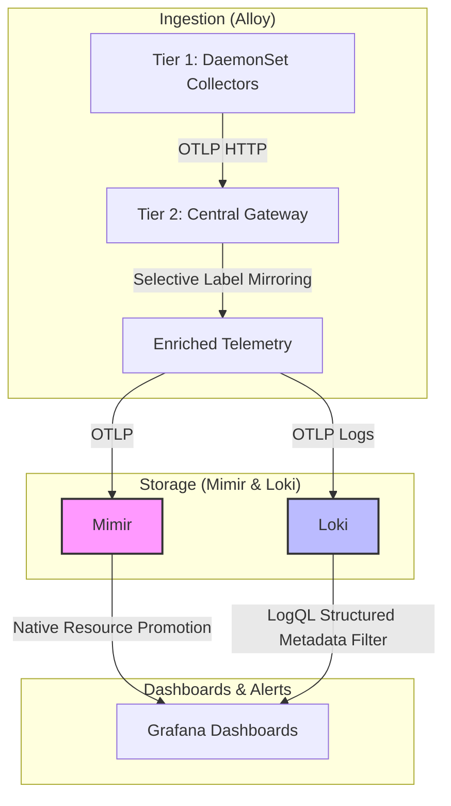

# Alloy & OpenTelemetry Observability Concept: Requirements, Design & Evaluation

This document outlines the conceptual framework, requirements, and design choices for our multi-cluster on-premise observability stack. It focuses on resolving the semantic differences between OpenTelemetry (OTel) metadata and legacy Prometheus labels within the Grafana LGTM stack (Loki, Mimir, Tempo) using Grafana Alloy as the primary collector.

---

## 1. Introduction & Objectives

Establishing a centralized, open-source, on-premise observability platform for multiple Kubernetes clusters across development, integration, test, and production stages requires consistent metadata translation. 

### 1.1 The Semantic Rift
A major conflict occurs when trying to align modern CNCF OpenTelemetry standards with legacy Prometheus ecosystems:
* **Legacy Prometheus Schema**: Relies on flat key-value pairs (like `namespace`, `pod`, `container`) attached directly to each time-series. This schema is deeply baked into years of community assets (Grafana dashboards, Prometheus recording rules, and alerting definitions from projects like `kubernetes-mixin`).
* **OpenTelemetry Semantic Conventions**: Structures metadata as global **Resource Attributes** (e.g., `k8s.namespace.name`, `k8s.pod.name`, `k8s.container.name`). 

If OTel metrics are exported directly to a Prometheus-compatible backend like Mimir without transformation, resource attributes are moved to a separate synthetic metric called `target_info`. Performing namespace or pod filtering in dashboards then requires complex, resource-intensive vector joins (`n-to-1` joins), which significantly degrades query performance on-premise.

### 1.2 Core Objectives
* **DRY (Don't Repeat Yourself) Configuration**: Minimize duplicate definitions of target scraping and label mapping.
* **Seamless Correlation**: Ensure that a user can seamlessly drill down from a metric panel in Grafana to the corresponding logs in Loki or traces in Tempo (requiring identical namespace, pod, and container names).
* **Upstream Compatibility**: Retain the ability to use unmodified community dashboards and alerts while storing native OTel telemetry.

---

## 2. Requirements & Constraints

### 2.1 OTLP Resource Attributes First
All telemetry signals (Metrics, Logs, and Traces) must possess standardized OTLP resource attributes by the time they reach storage backends (Mimir, Loki, Tempo). This is the only way to achieve reliable cross-signal correlation.

### 2.2 Single Point of Configuration for Pipeline Logic
Any pipeline logic (such as metadata lists or dual-semantics mappings) must be defined in exactly **one place**. Having duplicate definitions risks mismatching labels across pipelines (e.g. metrics vs logs), which breaks cross-signal correlation in Grafana.
* **Example**: If `pod` is defined differently in the metrics pipeline versus the log pipeline, a dashboard query trying to link from a pod metric to pod logs will return empty results.

### 2.3 Topologie & Ingestion Constraints
* **DaemonSet Ingestion**: Alloy must run as a DaemonSet for OTLP-push scenarios (e.g., instrumented Java apps) to preserve the original client IP. Running behind a Kubernetes Service (Deployment) introduces NAT/kube-proxy, causing the source IP to be lost and preventing accurate pod association.
* **Pipeline Splitting (Dual Chains)**: The collector must distinguish between direct pod scrapes (which require API-based metadata enrichment) and cluster-wide meta-exporters (like Kube-State-Metrics) whose exporter pod labels must not overwrite the metric labels of the workloads they report.

---

## 3. Resource Attributes & Label Harmonization

To bridge the metadata gap, we implement a **Dual-Semantics** mapping strategy:

| Dimension | Prometheus Legacy Schema | OTel Semantic Convention | OTel-to-Prometheus (Legacy-Bridge) |
| :--- | :--- | :--- | :--- |
| **Cluster** | `cluster` | `k8s.cluster.name` | `k8s_cluster_name` |
| **Namespace** | `namespace` | `k8s.namespace.name` | `k8s_namespace_name` |
| **Pod** | `pod` | `k8s.pod.name` | `k8s_pod_name` |
| **Container** | `container` | `k8s.container.name` | `k8s_container_name` |
| **Deployment** | `deployment` | `k8s.deployment.name` | `k8s_deployment_name` |
| **DaemonSet** | `daemonset` | `k8s.daemonset.name` | `k8s_daemonset_name` |
| **Service Name** | `job` | `service.name` | `service_name` |
| **Instance ID** | `instance` | `service.instance.id` | `service_instance_id` |

### 3.1 OpenTelemetry Semantic Conventions Guidelines
When designing or modifying metadata schemas, the platform team must adhere to CNCF OpenTelemetry guidelines:
* **Registry Alignment**: Always search the official OpenTelemetry Attribute Registry first before inventing custom attributes. Standard attributes (e.g., `http.request.method`) must be preferred over custom variants (e.g., `custom.http.verb`) to ensure tools and dashboards integrate seamlessly.
* **Level Placement**: Distinguish between **Resource Attributes** (describing the entity producing the telemetry, e.g., `service.name` or `k8s.pod.name`) and **Span/Log/Datapoint Attributes** (describing the specific operation or event). Once an attribute level is determined, it must be used consistently across all pipelines and services. Do not duplicate resource-level properties on individual spans/datapoints unless performing explicit dual-semantics mirroring.
* **Cardinality Boundaries**: Metric attributes must be bounded, low-cardinality values. High-cardinality values (e.g. user IDs, full raw URLs, request paths) belong in span/log attributes or structured log metadata, never in Prometheus-compatible metric labels.

### 3.2 Resource Attribute Promotion
Prometheus 3.0 and Grafana Mimir support native **Resource Attribute Promotion**. This allows OTel resource attributes (like `k8s.pod.name`) to be promoted directly to database-level labels at ingestion time. Additionally, Prometheus 3.0 natively supports UTF-8 characters, meaning labels can keep their dot-notation (e.g., `k8s.pod.name` is stored directly without being forced into `k8s_pod_name`). 

However, even with promotion, the naming mismatch persists: upstream dashboards continue to query for the flat label `pod`, whereas the promoted OTel attribute is named `k8s.pod.name`.

---

## 4. Evaluation of Label Harmonization Strategies

We evaluate four primary strategies for resolving the label mismatch in our platform:

### Strategy A: Label-Mirroring (Dual Ingestion via Grafana Alloy)
Grafana Alloy is configured to duplicate critical resource attributes. For example, `k8s.pod.name` is copied and attached both as an OTel resource attribute (`k8s.pod.name`) and as a flat Prometheus label (`pod`).
* **Pros**: Outstanding compatibility. Standard community dashboards (Node Exporter, cAdvisor, kubernetes-mixin) work out of the box without changes.
* **Cons**: Massive cardinality growth (index explosion) in Mimir. Duplicating high-cardinality labels (like pods) increases memory utilization on Mimir Ingesters and Queriers.

### Strategy B: Regex-based Upstream Translation in CI/CD
A script running in the CI/CD pipeline scans all downloaded dashboards, alerts, and recording rules, replacing Prometheus queries (e.g., `pod=`) with OTel equivalents (e.g., `k8s_pod_name=`).
* **Pros**: Low on-premise hardware cost. No duplicate labels are stored in Mimir, keeping cardinality to a minimum.
* **Cons**: Fragile. Complex PromQL queries involving regular expressions, vector joins, or aggregation functions are easily broken by simple regex string replacements.

### Strategy C: Declarative Overrides via Jsonnet
Since upstream monitoring assets (like `kubernetes-mixin`) are written in Jsonnet, we import them as dependencies and override their configuration parameters.
* **Pros**: Clean build process. Generates valid JSON/YAML assets deterministically. Original upstream code remains untouched, allowing easy updates. Zero runtime overhead or cardinality impact.
* **Cons**: Requires the platform team to build and maintain a Jsonnet compilation pipeline (e.g., via GitLab CI or Argo CD) and learn Jsonnet.

### Strategy D: Migration to OTel-Native Mixins
Migrating to new community projects like `kubernetes-mixin-otel`, which are built from the ground up to query OTel semantic conventions directly.
* **Pros**: Clean, forward-looking, standard-compliant architecture. No translation layers needed.
* **Cons**: The ecosystem is young and lacks the mature feature set, dashboard depth, and tuning of the legacy Prometheus mixins.

### Comparative Matrix

| Evaluation Criteria | Strategy A: Label-Mirroring | Strategy B: Regex-Translation | Strategy C: Jsonnet-Overrides | Strategy D: OTel-Native Mixins |
| :--- | :--- | :--- | :--- | :--- |
| **On-Prem Resource Cost** | **Very High** (Index growth) | **Very Low** | **Very Low** | **Very Low** (Optimum) |
| **Upstream Compatibility** | **Excellent** (Out of the box) | **Poor** (Fragile builds) | **Very Good** (Inheritance) | **Medium** (Requires migration) |
| **Operational Overhead** | **Low** (Central Alloy rule) | **High** (Constant patching) | **Moderate** (CI/CD-managed) | **High** (Immature ecosystem) |
| **Risk of Broken Alerts** | **Very Low** | **High** (Regex bugs) | **Very Low** | **Moderate** (Incomplete alerts) |
| **Future Readiness** | **Low** (Workaround) | **Poor** | **Very High** (Flexible) | **Excellent** (CNCF target) |

---

## 5. Cardinality & Tenant Configurations (On-Premise Focus)

In on-premise environments with limited hardware scalability, keeping database cardinality and tenant isolation in check is critical for system stability.

### 5.1 Tenant Variation: standard vs. dz-repo
The tenant definition (OrgID) determines how data is isolated and exported:
* **Standard Repository (`bwcloud-gitops`)**: Uses OrgID `"1"` (header `X-Scope-OrgID: 1`).
* **External Variant (`dz-repo`)**: Configured for tenant `"anonymous"` (header `X-Scope-OrgID: anonymous`). Under this variant, Mimir's Ruler storage utilizes S3 buckets provisioned via Crossplane rather than local emptyDir filesystems, and the tenant OrgID `anonymous` must be strictly configured in both the Mimir ProviderConfig and managed Alertmanager Config objects to prevent access authentication errors.

### 5.2 Metric Cardinality in Mimir
When every metrics series is forced to carry both OTel attributes and duplicate Prometheus labels, the index size grows significantly. For clusters with short-lived pods (e.g., CI/CD runners or batch processing), the continuous creation and deletion of pod labels causes index fragmentation, which increases Mimir Querier memory consumption and slows down alerts.

### 5.3 Log Cardinality in Loki: The Structured Metadata Dilemma
For log collection, the `k8s-monitoring` Helm chart utilizes Loki's **Structured Metadata**. 
* **Mechanism**: High-cardinality metadata fields (such as `k8s_pod_name`, `pod`, and `service_instance_id`) are attached to log lines as metadata without being indexed. This protects Loki from Out-Of-Memory (OOM) crashes caused by excessive stream cardinality.
* **The Conflict**: Upstream log dashboards expect these fields to be indexed labels (e.g., `{pod="api-gateway-123"}`). Because they are not indexed, standard LogQL queries return empty results. To query structured metadata, the LogQL must be rewritten (e.g., `{namespace="prod"} | pod = "api-gateway-123"`).
* **Configuration Issues**: Overriding the `k8s-monitoring` chart to turn structured metadata back into indexed labels is difficult because the chart templates frequently inject default structured metadata configurations even when disabled.

---

## 6. Community Best Practices & Operational Pitfalls

### 6.1 Upstream Mixin Evolution
Large-scale projects are moving towards native support for both formats. For example, `kubernetes-mixin` (via PR #1182) has introduced configuration parameters to map core metrics to OTel semantics. Similarly, Mimir's self-monitoring mixins now include toggles to switch data sources between Prometheus and OTel.

### 6.2 Resource Alignment & GitOps Operators
Resource alignment has a direct impact on other platform GitOps operators:
* **Grafana Operator CRDs**: Custom Resources (like `GrafanaAlertRuleGroup` or `GrafanaDashboard`) must successfully match the ingested telemetry metrics. Mismatched pod or namespace labels between Loki, Mimir, and the Grafana Alert Rules will result in failed alerts.
* **Crossplane Managed Resources**: Ensure that Prometheus query definitions embedded in Crossplane Mimir `Rules` custom resources use the correct tenant namespace (`"1"` or `"anonymous"`) and query semantics.

### 6.3 Loki Memberlist DNS Deadlock
During cluster startups, Loki pods can fail their readiness checks because the `loki-memberlist` headless service has no active endpoints (CoreDNS returns `NXDOMAIN` since headless services filter out unready pods). This prevents memberlist pods from communicating, causing a startup deadlock.
* **Mitigation**: Setting `memberlist.service.publishNotReadyAddresses: true` forces Kubernetes to publish pod IPs in CoreDNS immediately upon creation, allowing the memberlist to bootstrap before pods pass readiness checks.

---

## 7. Recommended Target Architecture

To balance query performance, storage overhead, and dashboard compatibility, we adopt a three-tier hybrid architecture:

### Stufe 1: Selective Label Mirroring in Alloy
We implement a two-tier Alloy topology. Instead of mirroring all labels, Alloy's central gateway duplicates only the three core dimensions: **`cluster`**, **`namespace`**, and **`pod`**. Other high-cardinality attributes are stripped or kept strictly as OTel resource attributes. This maintains compatibility for 90% of community dashboards while preventing index explosion.

### Stufe 2: Native Mimir Promotion
Enable Mimir's native resource attribute promotion for standard attributes (e.g. `service.name`, `k8s.namespace.name`). This allows OTel-native queries to run efficiently without joins.

### Stufe 3: Log Card-Protection & CI/CD Dashboard Rewrites
Keep structured metadata enabled in Loki to protect the index. To make upstream dashboards work, establish a CI/CD compilation job that downloads community Loki dashboards and translates their LogQL queries from label filters `{pod="..."}` to structured metadata filters `| pod = "..."`.
