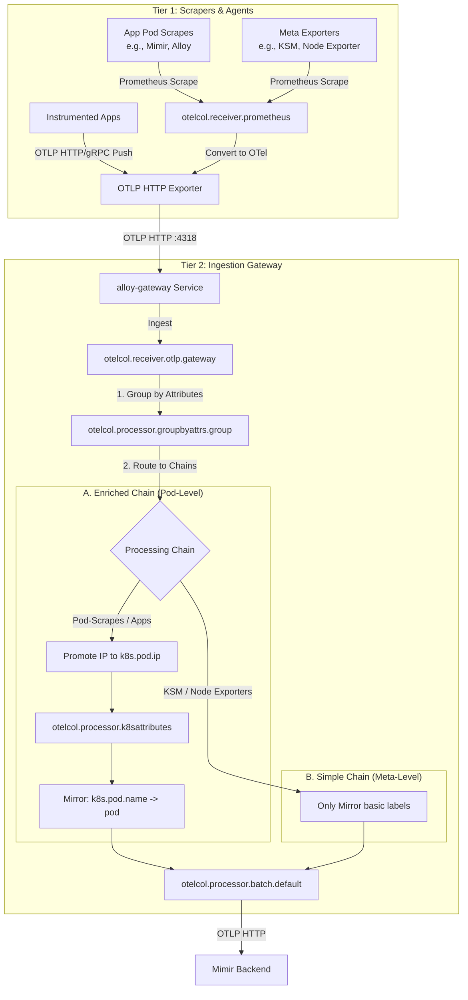

# Alloy Observability Pipeline: Implementation Guide & Strategies

This guide describes the concrete implementation patterns, topologies, and configurations of Grafana Alloy within our cluster, specifically detailing the **Two-Tier Architecture** and **Dual-Semantics** processing pipelines.

---

## 1. Pipeline Implementation Topologies

Depending on environment size and resources, we choose between two main architectural layouts for Grafana Alloy:

### 1.1 Single-Tier (Flat) Architecture
* **Topology**: A single Alloy DaemonSet running on all nodes, scraping endpoints directly and sending metrics to the backend.
* **Limitations**: High CPU/Memory overhead on every node; duplicate configuration across nodes; hard to scale; direct Kubernetes API calls from every node collector can stress the API server.

### 1.2 Two-Tier Architecture (Modern Standard)
We decouple collection (scraping) from ingestion processing (enrichment and routing):
* **Tier 1 (Collectors/Scrapers)**: Lightweight agents optimized for local data collection.
  * `alloy-node` (DaemonSet): Collects host metrics (Node Exporter, cAdvisor) and local logs.
  * `alloy-metrics` (StatefulSet/Deployment): Scrapes cluster-wide endpoints (Kube-State-Metrics, custom app endpoints).
* **Tier 2 (Gateway)**: A centralized `alloy-gateway` Deployment. It receives OTLP metrics from Tier 1 agents and runs the intensive Kubernetes metadata lookup (`k8sattributes`) and label promotion pipelines before sending them to Mimir.

#### Pod Layout Options in a 5-Node Cluster
* **Option A: Separate DaemonSet for Logs (Production)**
  * **Alloy Gateway (Tier 2)**: 1 Pod
  * **Alloy Node Scraper (`alloy-node`)**: 5 Pods
  * **Alloy Metrics Scraper (`alloy-metrics`)**: 2 Pods (Clustered)
  * **Alloy Logs Scraper (`alloy-logs`)**: 5 Pods
  * **Total**: 13 Alloy Pods + 1 Operator Pod.
* **Option B: Consolidated DaemonSet (Noctua PoC)**
  * **Alloy Gateway (Tier 2)**: 1 Pod
  * **Alloy Node Scraper (`alloy-node`)**: 5 Pods (with logs & metrics consolidated)
  * **Alloy Metrics Scraper (`alloy-metrics`)**: 2 Pods
  * **Total**: 8 Alloy Pods + 1 Operator Pod.
  * *Benefit*: Eliminating the separate `alloy-logs` DaemonSet saves 5 pods of overhead in resource-constrained environments.

### 1.3 Inter-Tier Connectivity Details
* **Protocol Choice (HTTP vs. gRPC)**: Internal cluster OTLP exports from Tier 1 to Tier 2 should utilize **OTLP HTTP (port 4318)** instead of gRPC. Under standard Helm charts, gRPC (port 4317) often enforces a TLS handshake by default, leading to handshake errors in non-mesh setups:
  `rpc error: code = Unavailable desc = connection error: desc = "transport: authentication handshake failed"`
* **Port Conflicts & Host Network**: The Tier 2 Gateway must be configured with `hostNetwork: false` and `dnsPolicy: ClusterFirst`. If it inherits `hostNetwork: true` from base agent configs, it will conflict with local Tier 1 agents on port `12345` (Alloy UI/Metrics listener).

---

## 2. Ingestion Pipeline: Core Principles & Execution Flow

### 2.1 Key OpenTelemetry Collector Rules
To prevent memory exhaustion, data loss, and configuration failures, we enforce the following rules in our Alloy configurations:
1. **Processor Ordering is Critical**: Always place the `memory_limiter` processor first in every pipeline. This acts as the first line of defense; if memory limits are breached, it drops data early to prevent the collector pod from crash-looping with OOMKilled.
2. **One Pipeline per Signal Type**: Keep metrics, logs, and traces in separate pipelines (e.g., `service.pipelines.metrics`, `service.pipelines.logs`). Combining telemetry signals within the same pipeline is invalid and will cause compiler or runtime exceptions.
3. **No Unused Components**: Every receiver, processor, or exporter declared in the configuration must be referenced by at least one pipeline. Alloy will reject the entire configuration file on startup if any component is left unused.
4. **Consistent Resource Enrichment**: Apply metadata enrichment (such as `k8sattributes`) consistently across all telemetry pipelines (logs, metrics, and traces). If metrics are enriched with Kubernetes metadata but logs are not, cross-signal correlation in Grafana will be broken.

### 2.2 Ingestion Architecture



### 2.3 Pipeline Execution Stages
1. **otelcol.receiver.otlp**: Listens on port `4318` for HTTP OTLP payloads.
2. **otelcol.processor.groupbyattrs**: Groups metrics by `namespace`, `pod`, `k8s_pod_ip`, and `instance` and promotes these to resource attributes. This is necessary because Tier 1 exports batch multiple target metrics under a single agent resource context.
3. **otelcol.processor.transform (promote_meta)**: In resource context, copies network labels to resource attributes (e.g. promoting `k8s_pod_ip` to `k8s.pod.ip` and stripping port suffixes like `:8080`). This IP is used by the Kubernetes attribute processor.
4. **otelcol.processor.k8sattributes**: Queries the Kubernetes API using `k8s.pod.ip` or `k8s.pod.name` to resolve resource metadata (e.g. deployment name, replicaset, daemonset, node).
5. **otelcol.processor.transform (dual_semantics)**: Mirrors the resolved OTel resource attributes back to data point labels (e.g., setting label `pod` from resource attribute `k8s.pod.name`) for legacy dashboard compatibility.
6. **otelcol.processor.batch**: Batches metrics (max size `10,000` data points, timeout `10s`) for efficient transport.
7. **otelcol.exporter.otlphttp**: Forwards the enriched metrics to Mimir (`http://mimir-distributor.mimir.svc.cluster.local:8080/otlp`).

---

## 3. Configuration Patterns & Code Examples

### 3.1 Enriched vs. Simple Chains
To prevent Kube-State-Metrics (KSM) or Node Exporter metrics from being incorrectly overwritten with the metadata of the exporter pod itself, we maintain a dual-chain structure in our processing module:

| Chain | Target Type | Metadata Enrichment | Description |
| :--- | :--- | :--- | :--- |
| `pod_level` | Application / Pods | **Enabled** (`k8sattributes`) | For workloads that only know their inner states (e.g., custom Java APIs, Mimir pods, Alloy itself). |
| `meta_level` | Infrastructure Exporters | **Disabled** | For KSM, Node-Exporter, Kubelet. Labels are mirrored but no lookup on the target's IP is executed. |

### 3.2 Scrape Module Pattern
Every scrape target must expose its target IP so that the gateway can perform pod association. We implement this via a `declare` block:

```alloy
declare "otelcol_app_scrape" {
  argument "forward_to" {}
  
  // 1. Discover Pod targets
  discovery.kubernetes "pods" { 
    role = "pod" 
  }
  
  // 2. Capture Pod IP for gateway lookup
  discovery.relabel "app" {
    targets = discovery.kubernetes.pods.targets
    rule {
      source_labels = ["__meta_kubernetes_pod_ip"]
      target_label  = "k8s_pod_ip"
    }
  }
  
  // 3. Scrape metrics (15s interval)
  prometheus.scrape "app" {
    targets         = discovery.relabel.app.output
    forward_to      = [otelcol.receiver.prometheus.app.receiver]
    scrape_interval = "15s"
  }
  
  // 4. Convert Prometheus metrics to OTel format
  otelcol.receiver.prometheus "app" {
    output { 
      metrics = [argument.forward_to.value] 
    }
  }
}
```

### 3.3 River-Module as Single Source of Truth
To guarantee consistent label names, all enrichment and transformation configurations are defined inside a single River module:
`apps/alloy/noctua-kai/templates/alloy-modules-configmap.yaml` -> `k8s-enrich.alloy`

The configuration defines a reusable `metrics_enrichment` block. In accordance with OTTL best practices:
* **Error Mode**: We set `error_mode = "ignore"` in production configurations. This prevents a single malformed metrics payload or missing resource attribute from failing the execution of the entire batch.
* **Defensive Nil Checks**: We use `where` clauses (`where attributes["..."] != nil`) to prevent runtime evaluation exceptions when parsing optional attributes.
* **Explicit Contexts**: Path segments like `resource` and `datapoint` attributes are targeted explicitly.

```alloy
declare "metrics_enrichment" {
  // Configured in values.yaml under customConfig.metadata
  otelcol.processor.k8sattributes "enrich" {
    filter {
      node_from_env_var = "K8S_NODE_NAME"
    }
    extract {
      metadata = [
        "k8s.pod.name",
        "k8s.namespace.name",
        "k8s.container.name",
        "k8s.deployment.name",
      ]
    }
  }

  // Dual-Semantics mapping using OTTL transform
  otelcol.processor.transform "dual_semantics" {
    error_mode = "ignore" # Required to prevent runtime processing stops
    metric_statements {
      context = "datapoint"
      statements = [
        // Defensive checks for attribute presence before mapping
        "set(attributes[\"namespace\"], resource.attributes[\"k8s.namespace.name\"]) where resource.attributes[\"k8s.namespace.name\"] != nil",
        "set(attributes[\"pod\"], resource.attributes[\"k8s.pod.name\"]) where resource.attributes[\"k8s.pod.name\"] != nil",
        "set(attributes[\"container\"], resource.attributes[\"k8s.container.name\"]) where resource.attributes[\"k8s.container.name\"] != nil"
      ]
    }
  }
}
```

### 3.4 Helm Schema Rules (grafana/k8s-monitoring v4)
* **Metrics Scrape Activation**: In v4, setting `telemetryServices.node-exporter.deploy: true` only deploys the exporter daemon. To generate the scrape configurations in Alloy, you must set:
  ```yaml
  metrics:
    node-exporter:
      enabled: true
  ```
* **Clustering Requirement**: If enabling cluster-wide scrapes on the `alloy-metrics` collector, you must enable clustering:
  ```yaml
  collectors:
    alloy-metrics:
      alloy:
        clustering:
          enabled: true
  ```

---

## 4. Loki Log-Scraping & OTLP-First Configuration

To deploy Loki and collect logs under our consolidated DaemonSet setup, we implement the following:

### 4.1 Loki Single-Binary Retention Configuration
Loki is deployed as a single binary with PVC storage:
```yaml
loki:
  auth_enabled: false
  commonConfig:
    replication_factor: 1
  compactor:
    working_directory: /var/loki/compactor
    shared_store: filesystem
    delete_request_store: filesystem
    retention_enabled: true
  limits_config:
    retention_period: 24h
```

### 4.2 Consolidated logs configuration (`alloy-node`)
To collect logs without deploying a separate `alloy-logs` DaemonSet, we enable logs on the existing `alloy-node` collector:
1. **OTLP Routing**: Set `podLogsViaOpenTelemetry` to ensure logs are processed as OTel signals.
2. **Local Metadata Lookup**: Run `k8sattributes` locally on the node agent to avoid sending un-enriched log streams through the network.
```yaml
# values.yaml overrides for alloy-node
collectors:
  alloy-node:
    alloy:
      stabilityLevel: "public-preview" # Required for OTel Logs
      extraConfig: |
        otelcol.processor.k8sattributes "local_enrich" {
          filter {
            node_from_env_var = "K8S_NODE_NAME"
          }
          extract {
            metadata = ["k8s.pod.name", "k8s.namespace.name", "k8s.container.name", "k8s.pod.uid"]
          }
          pod_association {
            sources = [{from = "resource_attribute", name = "k8s.pod.uid"}]
          }
        }
```
3. **Log Destination**: Route the enriched logs to Loki's OTLP gateway: `http://loki-gateway.loki.svc.cluster.local/otlp`.

---

## 5. Maintenance & Operations

### 5.1 Step-by-Step: Adding a Scrape Target
1. **Create Scraper Config**: Define the discovery and scrape logic inside your target's Helm values or River configurations.
2. **Expose IP**: Relabel the discovery target IP to `k8s_pod_ip` if using pod-level enrichment.
3. **Route target**: Instantiate the scraper and route the output to the correct pipeline input:
   * **Custom Pods**: Forward output to `otelcol_pipeline_dual_semantics.pod_level.input`.
   * **Exporters**: Forward output to `otelcol_pipeline_dual_semantics.meta_level.input`.

### 5.2 Tenant-Specific Headers Verification
Ensure that the output exporters use the correct headers depending on the environment context:
* **Standard Repository (`bwcloud-gitops`)**: Header must set `X-Scope-OrgID: 1`.
* **External Variant (`dz-repo`)**: Header must set `X-Scope-OrgID: anonymous` to comply with the S3-backed Crossplane deployment guidelines.

### 5.3 Verification
Verify that both OTel resource attributes and flat Prometheus labels exist on active metrics:
```promql
# Query in Grafana Explore:
up{job="my-app"}

# You should see both:
# Datapoint Labels:  cluster="prod-bwcloud", namespace="my-namespace", pod="my-pod-xxxx"
# Resource Labels:   k8s_cluster_name="prod-bwcloud", k8s_namespace_name="my-namespace", k8s_pod_name="my-pod-xxxx"
```
