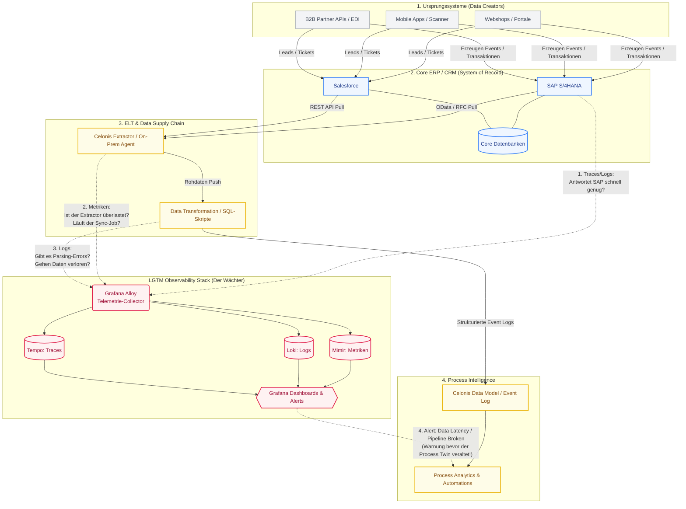

Intells# Process-aware Observability: Celonis, LGTM Stack & Silent Drift Monitoring

## 1. Ausgangspunkt

Die Grundidee ist nicht, **Celonis einfach mit Grafana zu monitoren**. Die sinnvollere Verbindung ist:

> **Celonis baut bzw. kennt den digitalen Zwilling des Geschäftsprozesses. Observability überwacht die technischen, datenbezogenen und semantischen Signale, die zeigen, ob dieser Prozess-Zwilling noch zur operativen Realität passt.**

Celonis wird in den Exxeta-Unterlagen als **Process Intelligence** bzw. digitaler Zwilling realer End-to-End-Prozesse beschrieben. Es rekonstruiert reale Abläufe, liefert Prozesskontext und macht Varianten, Engpässe und Abweichungen sichtbar.  
Quelle: Exxeta/Celonis-Unterlagen aus der internen Suche: `Exxeta x Celonis_Process Mining`, `CelonisGeneral`, `Celonis Demo - S-Comm_Exxeta`.

Der LGTM-/Grafana-Stack dagegen deckt die technische Laufzeitrealität ab:

- **Mimir** für Metriken
- **Loki** für Logs
- **Tempo** für Traces
- **Pyroscope** für Profiles
- **Grafana** als Visualisierung
- **OpenTelemetry / Grafana Alloy** als Telemetrie- und Pipeline-Schicht

Quelle: Deine Observability-Unterlagen, insbesondere `ObservSolution.pptx`.

---

## 2. Kernthese

Die eigentliche Synergie lautet:

> **Celonis zeigt, wie Prozesse real laufen. LGTM zeigt, warum sie technisch so laufen. Silent Drift Monitoring zeigt, wann Prozess, Daten, Semantik und technische Realität langsam auseinanderlaufen.**

Damit entsteht eine neue Capability:

> **Business Process Drift Observability**  
> oder  
> **Process Twin Integrity Monitoring**

Also nicht nur klassische Systemüberwachung, sondern Überwachung der Frage:

> **Ist unser Prozessverständnis noch korrekt?**

---

## 3. Was bedeutet „Silent Drift“?

**Silent Drift** ist kein klassischer Incident. Es gibt oft keinen roten Alarm, keine kaputte API und keine offensichtliche SLA-Verletzung. Trotzdem verschlechtert sich langsam die Aussagekraft von Dashboards, Automatisierungen, AI/ML-Modellen oder Prozessentscheidungen.

### 3.1 Data Drift

**Data Drift** bedeutet: Die Verteilung der Eingangsdaten verändert sich.

Beispiele:

- andere Kundengruppen
- neue Produkttypen
- neue Märkte
- geänderte Statuscodes
- neue Aktivitätsnamen
- andere Mengenverteilungen
- mehr fehlende Werte
- geänderte Event-Frequenzen

Im ML-/AI-Kontext bedeutet Data Drift: Das Modell sieht Produktionsdaten, die nicht mehr wie die Trainings- oder Baseline-Daten aussehen.

### 3.2 Concept Drift

**Concept Drift** bedeutet: Die Beziehung zwischen Input und gewünschtem Output verändert sich.

Das ist subtiler als Data Drift. Die Daten können ähnlich aussehen, aber ihre Bedeutung hat sich verändert.

Beispiele:

- Ein früher erfolgreicher Prozesspfad führt plötzlich häufiger zu Rework.
- Eine Automatisierung läuft technisch erfolgreich, erzeugt aber weniger Business Value.
- Kunden verhalten sich anders, obwohl die gleichen Input-Felder vorhanden sind.
- Eine Entscheidungskategorie bedeutet fachlich nicht mehr dasselbe wie vorher.

### 3.3 Process Twin Drift

**Process Twin Drift** bedeutet: Der digitale Prozess-Zwilling bildet die Realität nicht mehr sauber ab.

Beispiele:

- Events fehlen.
- Events kommen verspätet an.
- Activity-Namen ändern sich.
- neue Prozessvarianten entstehen.
- Objektbeziehungen sind unvollständig.
- Case-IDs werden inkonsistent vergeben.
- neue Systeme liefern Daten in anderer Semantik.
- Automatisierungen verändern reale Prozesspfade, aber das Modell wird nicht angepasst.

---

## 4. Warum Celonis hier relevant ist

Celonis ist nicht einfach ein Dashboard-Tool. Es erstellt eine datenbasierte Sicht auf reale End-to-End-Prozesse.

Aus den Exxeta-Unterlagen ergeben sich folgende Bausteine:

- operative Quellsysteme anbinden, z. B. ERP, CRM, Service-/Ticketing-Systeme
- Events extrahieren
- Business-Objekte modellieren
- Case IDs, Activity Names und Timestamps korrekt abbilden
- Event Logs bzw. Object-Centric Data Models aufbauen
- Prozessvarianten analysieren
- Bottlenecks, Rework und Abweichungen sichtbar machen
- Business Impact und Optimierungspotenziale ableiten

Das heißt: Celonis liefert den **Prozesskontext**. Genau dieser Kontext ist die Brücke zur Observability.

---

## 5. Warum LGTM / OpenTelemetry hier relevant ist

Der LGTM-Stack liefert die technische Erklärungsebene:

- Welche Services waren beteiligt?
- Welche Requests waren langsam?
- Welche Logs erklären einen Fehler?
- Welche Traces zeigen den kritischen Pfad?
- Welche Deployments korrelieren mit einer Veränderung?
- Welche Infrastruktur- oder Pipeline-Probleme beeinflussen die Prozessdaten?

OpenTelemetry ist dabei die Verbindungsschicht, weil man Business-Kontext als Attribute an Spans, Logs und Metrics hängen kann.

Beispielhafte Attribute:

```text
business.process = "service_booking"
business.step = "dealer_confirmation"
process.instance.id = "BOOKING-12345"
case.id = "BOOKING-12345"
object.type = "vehicle"
object.id = "VIN-..."
source.system = "dms"
market = "DE"
channel = "mobile_app"
deployment.version = "2026.05.1"
```

Damit wird technische Telemetrie prozessfähig.

---

## 6. Monitoring Targets für „elevated knowledge“

Der wichtigste Teil: Welche Targets sollte man monitoren, um mehr als klassisches Systemmonitoring zu bekommen?

---

## 6.1 Data Drift Targets

Diese Targets beantworten:

> **Hat sich die Datengrundlage verändert?**

### Mögliche Targets

- Event Count pro Aktivität
- Verteilung von Event-Typen
- Verteilung von Statuscodes
- Anteil fehlender Case IDs
- Anteil fehlender Timestamps
- Anteil fehlender Objektbeziehungen
- neue Activity-Namen
- Cardinality Drift bei wichtigen Feldern
- Schema Changes
- Source-System-Mix
- Event Lag / Datenlatenz
- ungültige Event-Reihenfolgen
- negative oder unrealistische Durchlaufzeiten

### Beispielmetriken

```text
celonis_event_count_total{source_system, activity}
celonis_missing_case_id_ratio{source_system}
celonis_missing_timestamp_ratio{source_system}
celonis_event_lag_seconds{source_system}
celonis_activity_cardinality{process}
celonis_schema_change_total{source_system}
celonis_invalid_timestamp_order_total{process}
```

### Beispiel-Insight

> „Seit dem letzten Release steigt die Anzahl unbekannter Activity-Namen im Prozess `service_booking`. Gleichzeitig sinkt die Event Coverage aus dem DMS-System. Das ist ein Hinweis auf Data Drift oder Schema Drift in der Prozessdatengrundlage.“

---

## 6.2 Concept Drift Targets

Diese Targets beantworten:

> **Hat sich die Bedeutung oder Wirkung des Prozesses verändert?**

### Mögliche Targets

- Conversion Rate je Prozessvariante
- Completion Rate je Prozesspfad
- Drop-off Rate je Prozessschritt
- Rework Rate
- Wiederöffnungsrate
- Eskalationsrate
- Abweichung vom Soll-Prozess
- Business Outcome Rate
- Automation Success Ratio
- manuelle Nacharbeit trotz Automatisierung
- Prozesskosten je Case
- P95/P99 Durchlaufzeit je Prozessschritt
- SLA-Verletzungen je Prozessvariante

### Beispielmetriken

```text
process_variant_share{process, variant}
process_rework_ratio{process, activity}
process_dropoff_ratio{process, activity}
process_completion_ratio{process, variant}
process_p95_duration_seconds{process, activity}
process_conformance_violation_total{process}
process_automation_success_ratio{automation_id}
business_outcome_rate{process, outcome}
```

### Beispiel-Insight

> „Die Prozessvariante `A-B-D-F` sieht technisch unverändert aus, führt aber seit kurzem häufiger zu Rework. Das ist ein Hinweis auf Concept Drift: Die Prozesslogik oder fachliche Bedeutung dieser Variante hat sich verändert.“

---

## 6.3 Process Twin Drift Targets

Diese Targets beantworten:

> **Passt der digitale Prozess-Zwilling noch zur Realität?**

### Mögliche Targets

- unbekannte Events
- unbekannte Prozessvarianten
- Events ohne Objektzuordnung
- Cases ohne Start-Event
- Cases ohne End-Event
- unvollständige Object Lifecycles
- sinkende Event Coverage
- sinkender Conformance Score
- verzögerte Aktualisierung des Prozessmodells
- nicht modellierte neue Prozesspfade
- neue Objektbeziehungen, die im Modell fehlen

### Beispielmetriken

```text
process_unknown_event_ratio{process}
process_unknown_variant_ratio{process}
process_event_coverage_ratio{source_system}
process_unlinked_event_ratio{object_type}
process_incomplete_case_ratio{process}
process_twin_freshness_seconds{source_system}
process_model_conformance_score{process}
```

### Beispiel-Insight

> „Der digitale Zwilling für `order_to_cash` ist technisch aktuell, aber 18 % der neuen Cases passen nicht mehr zu bekannten Varianten. Das deutet auf Process Twin Drift hin: Der reale Prozess hat sich verändert, ohne dass das Modell angepasst wurde.“

---

## 6.4 Technical Runtime Targets

Diese Targets beantworten:

> **Warum driftet der Prozess technisch?**

### Mögliche Targets

- Service-Latenz je Business Step
- Error Rate je Business Step
- Timeout Rate
- Retry Rate
- Queue Lag
- Consumer Lag
- API Dependency Failures
- Trace Coverage
- Log Parsing Error Rate
- Collector Drop Rate
- Backpressure in Telemetry Pipelines
- Deployment-Version pro Service
- Ressourcenengpässe pro Prozesspfad

### Beispielmetriken

```text
http_request_duration_seconds{service, business_process, business_step}
http_request_errors_total{service, business_process, business_step}
message_queue_lag{topic, consumer_group}
otelcol_exporter_send_failed_spans_total
otelcol_processor_dropped_spans_total
deployment_info{service, version}
trace_coverage_ratio{service, business_process}
```

### Beispiel-Insight

> „Die Drop-off Rate im Prozessschritt `dealer_confirmation` steigt. Gleichzeitig zeigen Traces erhöhte Latenz im DMS-Adapter und Logs mehr Timeouts. Das ist nicht nur ein Prozessproblem, sondern eine technische Ursache hinter einem Business Drift.“

---

## 7. Elevated Knowledge: Was ist der Mehrwert?

Klassisches Monitoring sagt:

> „Service X hat hohe Latenz.“

Process-aware Observability sagt:

> „Seit Release Y entsteht im Prozess `service_booking` eine neue Variante, bei der `dealer_confirmation` häufiger in Rework läuft. Technisch korreliert das mit höheren Timeouts im DMS-Adapter. Gleichzeitig sinkt die Conversion Rate in Markt DE. Das ist kein klassischer Incident, sondern Silent Concept Drift im Prozessverhalten.“

Das ist **elevated knowledge**, weil vier Ebenen kombiniert werden:

1. **Business Outcome**  
   Conversion, Completion, Cost, SLA, Customer Impact

2. **Process Twin**  
   Variante, Bottleneck, Rework, Abweichung, Conformance

3. **Data Quality / Drift**  
   Event Coverage, Missing Fields, Schema Drift, Object Linkage

4. **Runtime Cause**  
   Trace, Log, Metric, Deployment, Dependency, Infrastructure

---

## 8. Zielarchitektur

Die folgende Grafik visualisiert den Datenfluss und zeigt, an welchen Knotenpunkten der **LGTM-Stack** eingreift, um die **Integrität der Data Supply Chain** abzusichern, ohne Celonis-Features nachzubauen.



---

## 9. MVP-Idee

Ein sinnvoller MVP sollte nicht zu breit starten. Besser ein konkreter Prozess mit klarer Business-ID.

### Beispielprozess

- Service Booking
- Ticket Resolution
- Order-to-Cash
- Claims Handling
- Onboarding
- Incident-to-Resolution

### MVP-Ziel

> Einen Prozessschritt mit hoher Durchlaufzeit oder hoher Rework-Rate technisch erklärbar machen.

### Minimaler Scope

1. Einen Prozess auswählen
2. Eine Business Case ID definieren
3. Case ID / Process ID in OpenTelemetry als Attribut propagieren
4. Events im Celonis-Modell mit derselben ID abbilden
5. Grafana-Dashboard nach `business_process` und `business_step` bauen
6. Celonis-Prozessvariante oder Bottleneck identifizieren
7. Drilldown von Prozessfall zu Trace/Logs ermöglichen
8. Drift-Metriken ergänzen:
   - Event Coverage
   - Unknown Variant Ratio
   - Rework Ratio
   - Drop-off Ratio
   - Trace Coverage
   - Event Lag

### MVP-Ergebnis

> „Wir können zeigen, welcher Business-Prozess driftet, welche Prozessvariante betroffen ist und welche technische Ursache dahinterliegt.“

---

## 10. Positionierung für Exxeta / Kunden

### Variante 1: Technisch

> **Process-aware Observability**  
> Exxeta verbindet Celonis Process Intelligence mit OpenTelemetry-basierter Observability im LGTM Stack, um Business-Prozesse und technische Laufzeitdaten Ende-zu-Ende zu korrelieren.

### Variante 2: Sales-tauglich

> **From Process Mining to Process Reliability**  
> Wir machen nicht nur sichtbar, wie Prozesse laufen, sondern überwachen kontinuierlich, ob Prozessdaten, Prozesslogik und technische Ausführung stabil bleiben.

### Variante 3: AI-/Automation-Fokus

> **Reliable Process Intelligence for Enterprise AI**  
> Celonis liefert den Prozesskontext. Observability überwacht, ob Daten, Modelle, Automatisierungen und Prozessrealität weiterhin zusammenpassen.

---

## 11. Wichtigste Aussage

> **Celonis zeigt den digitalen Zwilling des Prozesses. Observability überwacht die Vitalwerte dieses Zwillings. Drift Monitoring erkennt, wann der Zwilling nicht mehr zur Realität passt.**

Das ist die klare Verbindung zwischen Celonis, LGTM Stack und Silent Drift Monitoring.

---

## 12. Kurzfassung

- Celonis = Prozess-Digital-Twin / Process Intelligence
- LGTM = technische Runtime Observability
- OpenTelemetry = Kontext- und Korrelationsschicht
- Silent Drift = langsame Abweichung ohne klaren Incident
- Data Drift = Eingangsdaten verändern sich
- Concept Drift = Bedeutung / Wirkung verändert sich
- Process Twin Drift = digitaler Prozess-Zwilling passt nicht mehr zur Realität
- Elevated Knowledge = Business Outcome + Prozessvariante + Datenqualität + technische Ursache

---

## 13. Potenzielle Dashboard-Struktur

### Dashboard 1: Process Twin Health

- Event Coverage
- Unknown Event Ratio
- Unknown Variant Ratio
- Incomplete Case Ratio
- Twin Freshness
- Conformance Score

### Dashboard 2: Process Drift

- Variant Share Over Time
- Rework Ratio
- Drop-off Ratio
- Completion Rate
- P95 Duration per Step
- Outcome Rate

### Dashboard 3: Data Quality & Drift

- Missing Case ID Ratio
- Missing Timestamp Ratio
- Activity Cardinality
- Schema Change Count
- Event Lag
- Source System Mix

### Dashboard 4: Technical Root Cause

- Service Latency by Business Step
- Error Rate by Business Step
- Timeout / Retry Rate
- Trace Coverage
- Queue Lag
- Deployment Correlation

---

## 14. Kritische Reflexion & Engineering-Realität

Während die Vision von „Process-aware Observability“ strategisch wertvoll ist, erfordert die praktische Umsetzung eine kritische Differenzierung zwischen Marketing-Versprechen und technischer Machbarkeit. 

### Die „Marketing-Fallen“

1.  **Die „10-Minuten-RCA“ via Golden Link:** Die Idee, per Klick von einem Celonis-Engpass direkt zur technischen Ursache in Grafana zu springen, setzt eine durchgängige Propagierung der `Case-ID` in technische `Trace-IDs` voraus. Ohne weitreichende Code-Anpassungen in den Quellsystemen (SAP, etc.) oder dem Extractor ist dieser „Golden Link“ eine Illusion.
2.  **Das „Extractor-Anchor“ Ceiling:** Die Nutzung des Celonis Extractors als primären Telemetrie-Anker (z.B. via eBPF) überwacht nur den „Postboten“. Interne Systemblockaden im Quellsystem bleiben oft unsichtbar (Visibility-Ceiling).
3.  **Gefahr der Redundanz (Double Work):** Der Versuch, Business-KPIs (wie fehlende Case IDs oder Varianten-Splits) in Grafana/Prometheus nachzubauen, ist ineffizient. Celonis ist das spezialisierte Werkzeug für diese Berechnungen. Grafana sollte nicht berechnen, *dass* Daten fehlen, sondern technisch überwachen, *warum* die Pipeline sie verloren hat.

### Der Engineering-Fokus: Integrität der Data Supply Chain

Anstatt zu versuchen, Celonis-Funktionalitäten im LGTM-Stack nachzubauen, sollte der Fokus auf der Absicherung der **Data Supply Chain** liegen. Der Wert für den Celonis-Nutzer liegt in der Garantie, dass der „digitale Zwilling“ auf einem gesunden, aktuellen und vollständigen Datenfundament basiert.

#### Konkrete Monitoring-Targets im LGTM-Stack

Diese Metriken lassen sich ohne komplexe Eingriffe in Quellsysteme realisieren und bieten direkten Mehrwert:

1.  **Data Latency (Das Echtzeit-Versprechen absichern):**
    *   **Ziel:** Überwachung der Zeitdifferenz zwischen der Entstehung eines Events im Quellsystem und seiner Verfügbarkeit in Celonis.
    *   **LGTM Metrik:** `celonis_extractor_data_latency_seconds` (z.B. berechnet durch Log-Parsing: Differenz zwischen SAP-Timestamp im Log und Ingestion-Timestamp).
    *   **Wert für Celonis-Nutzer:** Erkennt, wenn der Process Twin „hinterherhinkt“ und Analysen auf veralteten Daten basieren.
2.  **Telemetry Pipeline Health (Verhinderung von „Blindheit“):**
    *   **Ziel:** Überwachung der Stabilität der Datenextraktion und des Transports (z.B. Alloy, Loki).
    *   **LGTM Metrik:** `alloy_receiver_accepted_log_records`, `alloy_exporter_sent_log_records`, `extractor_api_timeouts_total`.
    *   **Wert für Celonis-Nutzer:** Ein Alert in Grafana meldet, wenn die Pipeline bricht (z.B. durch ein SAP-Update, das die Log-Struktur ändert), *bevor* der Process Owner das Fehlen von Daten im Dashboard bemerkt.
3.  **Semantic Mapping Coverage (Grundvoraussetzung für Korrelation):**
    *   **Ziel:** Messung, wie viele Logs/Traces tatsächlich die minimalen Business-Attribute (z.B. `business_process`, `source_system`) enthalten.
    *   **LGTM Metrik:** `otelcol_processor_dropped_spans_total{reason="missing_mandatory_attributes"}` oder PromQL-Abfragen zur Kardinalität dieser Labels.
    *   **Wert für Celonis-Nutzer:** Stellt sicher, dass die technische Grundlage für künftige, tiefere Korrelationen überhaupt vorhanden ist.
4.  **Extractor Resource Saturation:**
    *   **Ziel:** Klassisches Infrastruktur-Monitoring des Extractors, um Engpässe bei steigendem Datenvolumen zu erkennen.
    *   **LGTM Metrik:** `node_cpu_utilization`, `node_memory_utilization` für den Extractor-Host.
    *   **Wert für Celonis-Nutzer:** Proaktive Vermeidung von Datenstaus durch Hardware-Limitierungen.

### Der reale Business Value für Celonis-Experten

Der messbare Vorteil dieser Engineering-fokussierten Observability ist nicht, dass der Process Owner plötzlich Traces liest. Der Vorteil ist das **Vertrauen in das Datenfundament (Process Twin Integrity)**.

Wenn die IT (via LGTM) alarmiert wird, dass die *Data Supply Chain* stottert (z.B. wegen Latenz oder Timeouts), können proaktive Maßnahmen ergriffen werden. Der Celonis-Nutzer kann sich darauf verlassen, dass sein Process Twin die Realität abbildet – oder er wird aktiv informiert, wenn dies technisch gerade nicht der Fall ist. Das verhindert Fehlentscheidungen auf Basis unvollständiger oder veralteter Prozessdaten.

---

## 15. Operationalisierung & Skalierung (Der DevOps-Ansatz)

Aus der Diskussion zwischen Celonis-, Observability- und DevOps-Experten haben sich folgende kritische Leitplanken für eine erfolgreiche Skalierung ergeben:

### 15.1 Fleet Management & GitOps-Integration
Bei 50+ Extraktoren ist ein manuelles Management unmöglich. 
*   **Strategie:** Einsatz von **Grafana Alloy Fleet Management** (Remote Configuration).
*   **Umsetzung:** Die Windows-Server hosten nur ein "nacktes" Alloy-Binary. Die eigentliche Logik (Filter, Scrape-Configs, Regex) liegt zentral im **GitOps-Repository**.
*   **Vorteil:** Zentrale Steuerung, Versionierung über Git und automatisches Rollout von Konfigurationsänderungen ohne RDP-Zugriff auf die Server.

### 15.2 Resource Governance auf Windows-Systemen
Um die Stabilität der produktiven Extraktoren zu garantieren, muss Observability „asynchroner Beobachter“ bleiben.
*   **Throttling:** Nutzung von **Windows Job Objects** oder CPU-Quotas, um Alloy auf einen festen Wert (z. B. max. 5% CPU) zu limitieren.
*   **Fail-Safe:** Ein „Dead Man’s Switch“, der Alloy bei geringem Festplattenplatz (<10%) oder hohem RAM-Druck automatisch abschaltet, priorisiert die Produktion vor der Observability.

### 15.3 Mean Time to Innocence (MTTI)
Der größte Mehrwert für das IT-Plattform-Team ist die schnelle Entlastung bei Störungen.
*   **Konzept:** Durch die Korrelation von Netzwerk-Latenz (eBPF), Server-Metriken und Applikations-Logs kann die IT sofort beweisen: „Der Server läuft einwandfrei, das Problem liegt in der SAP-Antwortzeit oder einer Firewall-Regel.“
*   **Ergebnis:** Kürzere War-Rooms und gezieltere Zuweisung von Tickets.

### 15.4 Runbook-Integration & Self-Service
Das Dashboard darf keine Sackgasse sein.
*   **Actionable Dashboards:** Bei technischen Fehlern (z. B. Connection Timeout) enthält das Dashboard direkte Links zu Runbooks oder Self-Service-Portalen der IT.
*   **Ziel:** Der Fachbereich kann einfache Diagnosen selbst anstoßen, bevor ein Support-Ticket erstellt wird.

---

## 16. Persönliche Einschätzung

Der stärkste Use Case ist nicht „Celonis monitoren“, sondern:

> **Prozessveränderungen früh erkennen, bevor sie als Business-Schaden oder Incident sichtbar werden.**

Damit wird Observability von einer rein technischen Disziplin zu einer **Process Reliability Capability**.

Für dein Profil mit Kubernetes, OpenTelemetry, Grafana Alloy, Mimir/Loki/Tempo und Exxeta/Celonis-Kontext ist das ein sehr starker Anschluss: Du bringst die technische Runtime-Ebene ein, während Celonis die Prozess- und Business-Ebene liefert.


