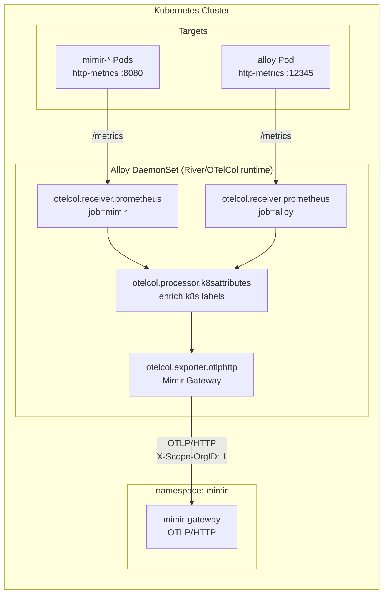

# Observability Guide (GitOps)

This document serves as the central source of truth for the Observability stack, including onboarding instructions, architecture details, and operational know-how for Grafana Alloy and Mimir.

---

## 1. Getting Started

Dieser Guide richtet sich an Customers, die unsere Observability-Lösung nutzen wollen. Er beschreibt, wie das Repo aufgebaut ist, wie Onboarding funktioniert und was je nach Instrumentierungsstand zu tun ist.

### 1.1 Was ihr von der Lösung erwarten könnt
- Zentrales Observability-Frontend in Grafana.
- Metriken in Mimir.
- Traces in Tempo, Logs in Loki (geplant).
- Einfache Promotability via Kargo-Stages (dev -> int -> prod).
- Optionales Auto-Instrumentieren über den OpenTelemetry Operator.

### 1.2 Voraussetzungen
- Zugriff auf das Observability-GitOps-Repo.
- Zugriff auf das Ziel-Cluster (Namespaces, Ingress/Service-Zugriff).
- Falls ihr bereits instrumentiert: vorhandene OTLP-Exports.

---

## 2. Grafana Alloy (Metrics Pipeline)

Grafana Alloy fungiert als zentraler Collector und Agent, der Metriken sammelt, anreichert und an Mimir weiterleitet.

### 2.1 High-Level Architektur (Alloy)



---

## 3. Grafana Mimir (Metrics Backend)

Grafana Mimir ist der skalierbare TSDB-Backend für die langfristige Speicherung und Abfrage von Prometheus-Metriken.

### 3.1 High-Level Architektur (Mimir)

```mermaid
flowchart LR
  subgraph K8S["Kubernetes Cluster"]
    subgraph ALLOY_NS["namespace: alloy"]
      ALLOY["Alloy DaemonSet<br/>(Metrics Collector)"]
    end

    subgraph MIMIR_NS["namespace: mimir"]
      direction TB
      GW[mimir-gateway<br/>(NGINX)]
      DIST[mimir-distributor<br/>(1 replica)]
      ING[mimir-ingester<br/>(1 replica)]
      COMP[mimir-compactor<br/>(1 replica)]
      QF[mimir-query-frontend<br/>(1 replica)]
      QR[mimir-querier<br/>(1 replica)]
      SG[mimir-store-gateway<br/>(1 replica)]
      AM[mimir-alertmanager<br/>(1 replica)]
      
      FS[(Local Filesystem Storage)]
    end
    
    GRAFANA["Grafana<br/>(UI)"]
  end

  %% Write Path
  ALLOY -- "OTLP/HTTP<br/>X-Scope-OrgID: 1" --> GW
  GW --> DIST
  DIST -- "gRPC Push" --> ING
  ING -- "Write-Ahead Log & <br/>2h Block Flush" --> FS
  COMP -- "Merge Blocks" --> FS
  
  %% Read Path
  GRAFANA -- "PromQL via HTTP" --> GW
  GW --> QF
  QF --> QR
  QR -- "Recent Data" --> ING
  QR -- "Historical Data" --> SG
  SG -. "Index/Chunks" .-> FS
```

---

## 4. Grafana Frontend & Dashboards

Grafana wird über den **Grafana Operator** verwaltet. Alle Dashboards und Ordner werden deklarativ über GitOps provisioniert.

### 4.1 Dashboard Provisioning (Automated Files Sync)
Dashboards werden nicht manuell in der UI erstellt, sondern über JSON-Dateien im Verzeichnis `apps/grafana/prod/files/` gesteuert.

#### Ordner-Mapping & Verschachtelung
Das Helm-Template bildet die Verzeichnisstruktur unter `files/` 1:1 in Grafana ab:
1. **GrafanaFolder**: Für jedes Verzeichnis wird eine `GrafanaFolder` Custom Resource (CR) erzeugt.
2. **Verschachtelung**: Unterordner nutzen das Feld `parentFolderRef`, um auf ihren Eltern-Ordner zu verweisen (z. B. wird `files/mimir/dashboards` zu einem Ordner `dashboards` innerhalb des Ordners `mimir`).

#### ConfigMap & Dashboard Ressourcen
Um die Kubernetes Custom Resources klein zu halten und das Limit für `etcd`-Objekte nicht zu sprengen, wird folgende Logik angewendet:
1. **ConfigMap**: Für jede `.json` Datei wird eine `ConfigMap` generiert, die den rohen JSON-Inhalt des Dashboards enthält.
2. **GrafanaDashboard**: Die `GrafanaDashboard` CR referenziert diese ConfigMap (`configMapRef`) und den zugehörigen Ordner (`folderRef`).

### 4.2 Passwort-Management & Reset
Grafana speichert das Admin-Passwort in einer internen DB. Falls das Passwort in GitOps geändert wird, stellt ein **postStart-Lifecycle-Hook** sicher, dass das DB-Passwort automatisch an den neuen Wert aus dem Secret angepasst wird:
```yaml
command: ['/bin/sh', '-c', 'sleep 25 && grafana cli admin reset-admin-password "$GF_SECURITY_ADMIN_PASSWORD" || true']
```

---

## 5. Mimir Analyse & Cardinality

### 5.1 Baseline Metriken
- **Gateway request rate:** `sum(rate(nginx_http_requests_total[5m]))`
- **Distributor received samples rate:** `sum(rate(cortex_distributor_received_samples_total[5m]))`
- **Ingester active series:** `sum(cortex_ingester_active_series)`

### 5.2 Top Metrics by Active Series
```promql
topk(15, count by (__name__)({__name__!~"up|scrape_.*"}))
```

---

## 6. Cardinality Analyse (Agent Tooling)

Für automatisierte Analysen kann der folgende Prompt genutzt werden.

### 6.1 Agent Prompt
Du bist ein technischer Analyse-Agent. Führe eine kurze Cardinality-Analyse gegen Mimir durch und speichere das Ergebnis in `docs/cardinality-analysis.yaml`.
- Tenant Header: `X-Scope-OrgID: anonymous` (oder entsprechend konfiguriert)
- Basis-URL: `http://127.0.0.1:8080/prometheus` (nach Port-Forward)
- Ergebnis-Struktur: YAML mit `top_label_names`, `top_label_values_by_label` und `recommendations`.
