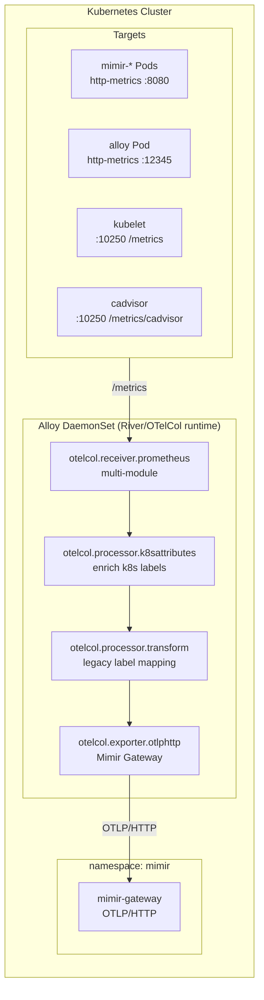

# Observability Guide (GitOps)

This document serves as the central source of truth for the Observability stack, including onboarding instructions, architecture details, and operational know-how for Grafana Alloy and Mimir.

---

## 1. Getting Started

Dieser Guide richtet sich an Customers, die unsere Observability-Lösung nutzen wollen. Er beschreibt, wie das Repo aufgebaut ist, wie Onboarding funktioniert und was je nach Instrumentierungsstand zu tun ist.

### 1.1 Was ihr von der Lösung erwarten könnt
- Zentrales Observability-Frontend in Grafana.
- Metriken in Mimir.
- Traces in Tempo, Logs in Loki.
- Einfache Promotability via Kargo-Stages (dev -> int -> prod).
- Optionales Auto-Instrumentieren über den OpenTelemetry Operator.

---

## 2. Grafana Alloy (Metrics Pipeline)

Grafana Alloy fungiert als zentraler Collector und Agent, der Metriken sammelt, anreichert und an Mimir weiterleitet.

### 2.1 High-Level Architektur (Alloy)



### 2.2 Core Concepts
- **Vendor-Neutral Egress**: Alle Metriken werden via OTLP/HTTP an Mimir übertragen.
- **ServiceMonitor-First**: Infrastrukturmetriken werden bevorzugt über ServiceMonitor-Discovery erfasst.
- **Node-Local Scraping**: Für Node-Metriken (Kubelet/cAdvisor) nutzt jeder Alloy-Pod die **InternalIP** und filtert über `sys.env("K8S_NODE_NAME")`, um Duplikate zu vermeiden.

### 2.3 Reliable Labeling Strategy
Um sicherzustellen, dass alle Metriken (auch statische wie `cortex_build_info`) über das `namespace` Label filterbar sind, nutzen wir eine zweistufige Strategie:

1.  **Explizites Discovery-Relabeling**: Jedes Scrape-Modul (Mimir, Alloy, Kubelet) erzeugt die Labels `namespace` und `pod` direkt aus den Kubernetes-Metadaten (`__meta_kubernetes_namespace`). Dies ist die zuverlässigste Methode für Prometheus-Scrapes.
2.  **OTel Processor Enrichment**: Der globale `otelcol_k8s_enrich` Block reichert alle Signale zusätzlich mit OTel-Attributen an. Dabei werden die OTel-Semantic-Conventions nicht nur "übersetzt", sondern **dupliziert (gespiegelt)**. Wir behalten bewusst beide Formate (OTel und Prometheus-Legacy) parallel im Datenstrom, um maximale Kompatibilität für bestehende und zukünftige Dashboards zu gewährleisten.

### 2.4 Advanced Label Enrichment & Pod Association
Die Anreicherung erfolgt zentral im Modul `otelcol_k8s_enrich`. Der Prozessor `otelcol.processor.k8sattributes` unterhält dafür im Hintergrund eine eigene, privilegierte Verbindung zur Kubernetes-API und pflegt einen lokalen Cache aller relevanten Objekte (Pods, Namespaces, Deployments). 

Ein kritischer Teil dabei ist die **Pod Association**, also die Logik, wie eine eingehende Metrik einem konkreten Pod im Cluster zugeordnet wird, um die Metadaten anzuhängen.

#### Pod Association Strategien
Wir nutzen aktuell primär die **Connection**-Strategie.

| Strategie | Funktionsweise | Anwendungsfall & Details |
| :--- | :--- | :--- |
| **connection** (Standard) | Nutzt die IP-Adresse der eingehenden Netzwerkverbindung, um den Pod im API-Server zu finden. | Ideal für direktes Scraping von Pod-Endpunkten und **OTLP-Push**. |
| **resource_attribute** | Nutzt bereits vorhandene Attribute (wie `k8s.pod.ip`) im OTel-Resource-Objekt. | Wenn Daten von einem anderen Collector (z.B. OTel Gateway) weitergereicht werden. |
| **pod_name** | Sucht den Pod explizit über ein Label, das den Namen enthält. | Legacy-Szenarien oder wenn IP-Matching nicht möglich ist. |

#### Warum Prozessierung bei OTLP-Push (Java App)?
Man könnte annehmen, dass eine OTel-instrumentierte Java-App bereits alle korrekten Labels selbst sendet. In der Praxis "sieht" eine Anwendung von innen heraus jedoch oft nicht den vollen Kubernetes-Kontext:
- Sie kennt oft ihren Pod-Namen, aber nicht unbedingt das übergeordnete `Deployment`, das `ReplicaSet` oder den `Node`.
- Sie hat keinen Zugriff auf K8s-Labels oder Annotations, die ein Administrator von "außen" an den Pod geheftet hat.
- Der `k8sattributes` Prozessor agiert hier als **vertrauenswürdige zentrale Instanz**: Er nimmt die Quell-IP der Java-App, identifiziert sie sicher gegen die K8s-API und reichert den gesamten fehlenden Kontext konsistent an.

#### Legacy Label Mapping (Compatibility)
Über einen `otelcol.processor.transform` Block werden die OTel-Attribute zusätzlich in die Welt der klassischen Prometheus-Dashboards gespiegelt. Wir **erweitern** den Label-Satz, statt ihn zu ersetzen:
- `k8s.namespace.name` -> `namespace`
- `k8s.pod.name` -> `pod`
- `k8s.container.name` -> `container`
- `k8s.node.name` -> `node`
- `k8s.cluster.name` -> `cluster` (statisch auf `prod-bwcloud` gesetzt)

---

## 3. Grafana Mimir (Metrics Backend)

Grafana Mimir ist der skalierbare TSDB-Backend für die langfristige Speicherung und Abfrage von Prometheus-Metriken.

Für detaillierte Setup-Anweisungen und Fehlerbehebungen (z.B. Ruler), siehe [Mimir Setup Guide](MIMIR.md).

### 3.1 High-Level Architektur (Mimir)

```mermaid
flowchart LR
  subgraph K8S["Kubernetes Cluster"]
    subgraph ALLOY_NS["namespace: alloy"]
      ALLOY["Alloy DaemonSet<br/>(Metrics Collector)"]
    end

    subgraph MIMIR_NS["namespace: mimir"]
      direction TB
      GW[mimir-gateway<br/>(NGINX)]
      DIST[mimir-distributor]
      ING[mimir-ingester]
      COMP[mimir-compactor]
      QF[mimir-query-frontend]
      QR[mimir-querier]
      SG[mimir-store-gateway]
      
      FS[(Local Filesystem Storage)]
    end
    
    GRAFANA["Grafana<br/>(UI)"]
  end

  %% Write Path
  ALLOY -- "OTLP/HTTP" --> GW
  GW --> DIST
  DIST -- "gRPC Push" --> ING
  ING -- "Flush" --> FS
  
  %% Read Path
  GRAFANA -- "PromQL" --> GW
  GW --> QF
  QF --> QR
  QR -- "Fetch" --> ING & SG
  SG -.-> FS
```

### 3.2 Operational Know-How
- **Multi-Tenancy**: Mimir benötigt den `X-Scope-OrgID` Header (aktuell auf `"1"` gesetzt).
- **Storage**: In diesem Setup wird das lokale Dateisystem (`filesystem`) statt S3 genutzt, um den Ressourcenverbrauch minimal zu halten.
- **Retention**: Die Aufbewahrungsdauer der Metriken ist aktuell auf **1 Tag (24h)** konfiguriert (`compactor_blocks_retention_period: 24h`). Dies dient dazu, den Speicherverbrauch auf dem lokalen Filesystem gering zu halten.
- **Cardinality Management**: Hohe Cardinality (viele unique Labels) führt zu hohem RAM-Verbrauch. Nutze die untenstehenden Queries zur Analyse.

---

## 4. Grafana Frontend & Dashboards

### 4.1 Dashboard Provisioning (Automated Files Sync)
Dashboards werden über JSON-Dateien im Verzeichnis `apps/grafana/prod/files/` gesteuert. Das Helm-Template bildet die Verzeichnisstruktur 1:1 in Grafana ab.

#### Ordner-Mapping
1. **GrafanaFolder**: Für jedes Verzeichnis wird eine CR erzeugt.
2. **ConfigMap**: JSON-Inhalte werden in ConfigMaps ausgelagert, um CR-Limits zu umgehen.
3. **GrafanaDashboard**: Referenziert die ConfigMap und den Ordner.

### 4.2 LGTM Datenkorrelation

Metriken (Mimir), Logs (Loki) und Traces (Tempo) sind in Grafana signalübergreifend verlinkt:

| Richtung | Mechanismus | Konfiguration |
| :--- | :--- | :--- |
| Mimir → Tempo | Exemplars (`trace_id`) | `apps/grafana/base/values.yaml` → `exemplarTraceIdDestinations` |
| Tempo → Loki | `tracesToLogsV2` + `trace_id` | Tempo-Datasource → `filterByTraceID: true` |
| Loki → Tempo | `derivedFields` auf Logzeilen | Loki-Datasource → Regex `trace_id`/`traceID` |
| Tempo → Mimir | Span metrics / Service graph | Tempo Metrics Generator → Mimir remote write |

**Beispiel-App:** Spring Petclinic (`namespace: spring-petclinic`) mit OTel Java Auto-Instrumentation. Dashboard in Grafana: *Spring Petclinic / LGTM Correlation* (Ordner `Spring-Petclinic`).

Ausführliche Erklärung: [ObservabilitySolutions/General/LGTM-Korrelation.md](ObservabilitySolutions/General/LGTM-Korrelation.md).

---

## 5. Mimir Analyse & Cardinality

### 5.1 Baseline Metriken
- **Gateway request rate:** `sum(rate(nginx_http_requests_total[5m]))`
- **Distributor received samples rate:** `sum(rate(cortex_distributor_received_samples_total[5m]))`
- **Ingester active series:** `sum(cortex_ingester_active_series)`

---

## 6. Cardinality Analyse (Agent Tooling)

### 6.1 Agent Prompt
Du bist ein technischer Analyse-Agent. Führe eine kurze Cardinality-Analyse gegen Mimir durch und speichere das Ergebnis in `docs/cardinality-analysis.yaml`.
- Basis-URL: `http://127.0.0.1:8080/prometheus`
- Ergebnis-Struktur: YAML mit `top_label_names`, `top_label_values_by_label` und `recommendations`.
