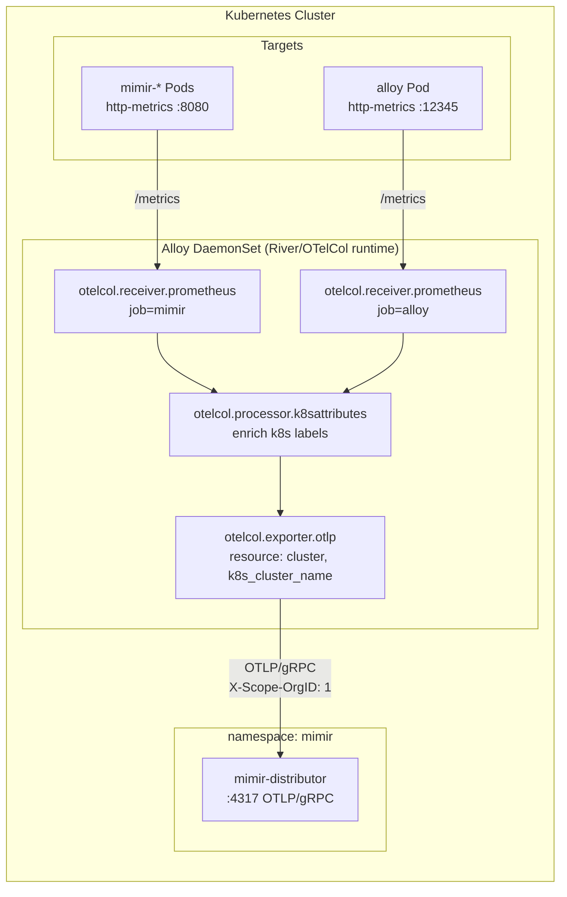

# Observability Guide (GitOps)

This document serves as the central source of truth for the Observability stack, including onboarding instructions, architecture details, and operational know-how for Grafana Alloy and Mimir.

---

## 1. Getting Started

Dieser Guide richtet sich an Customers, die unsere Observability-Lösung nutzen wollen. Er beschreibt, wie das Repo aufgebaut ist, wie Onboarding funktioniert und was je nach Instrumentierungsstand zu tun ist.

### 1.1 Was ihr von der Lösung erwarten könnt
- Zentrales Observability-Frontend in Grafana.
- Metriken in Mimir.
- Traces in Tempo, Logs in Loki (geplant).
- Einfache Promotability via Kargo-Stages (dev -> int -> prod).
- Optionales Auto-Instrumentieren über den OpenTelemetry Operator.

### 1.2 Voraussetzungen
- Zugriff auf das Observability-GitOps-Repo.
- Zugriff auf das Ziel-Cluster (Namespaces, Ingress/Service-Zugriff).
- Falls ihr bereits instrumentiert: vorhandene OTLP-Exports.

### 1.3 Getting Started nach Instrumentierungsstand

#### Keine Instrumentierung vorhanden
Empfohlen: Auto-Instrumentierung über den OpenTelemetry Operator.
1. Service ins Cluster deployen (via Argo CD).
2. Auto-Instrumentierung aktivieren (Java Agent via Instrumentation-CR).
3. Telemetry-Weiterleitung über OTLP an den Collector/Alloy.

#### Teilweise instrumentiert (z. B. nur Metriken)
Wir empfehlen, bestehende Teil-Instrumentierung durch OpenTelemetry Auto-Instrumentation zu ersetzen, um den Betrieb zu vereinfachen.
1. Vorhandene Exporte auf OTLP umstellen.
2. Daten an den zentralen Collector/Alloy senden.

#### Voll instrumentiert (Metriken + Traces + Logs)
1. Alle Signale (OTLP) an den zentralen Collector/Alloy schicken.
2. Service-spezifische Dashboards/Alerts im Repo pflegen.

---

## 2. Grafana Alloy (Metrics Pipeline)

Grafana Alloy fungiert als zentraler Collector und Agent, der Metriken sammelt, anreichert und an Mimir weiterleitet.

### 2.1 High-Level Architektur (Alloy)



### 2.2 Core Concepts
- **Vendor-Neutral Egress**: Alle Metriken werden via OTLP/HTTP an Mimir übertragen.
- **ServiceMonitor-First**: Infrastrukturmetriken werden bevorzugt über ServiceMonitor-Discovery erfasst.
- **Label Governance**: Ein zweistufiges Relabeling-Verfahren kontrolliert die Cardinality und stellt einen konsistenten Label-Vertrag sicher.
- **Dual Labeling Strategy**: Wir nutzen sowohl Prometheus-Labels (`pod`, `namespace`) für Kompatibilität als auch OTel Semantic Conventions (`k8s_pod_name`, `k8s_namespace_name`) für Cross-Signal Korrelation.

---

## 3. Grafana Mimir (Metrics Backend)

Grafana Mimir ist der skalierbare TSDB-Backend für die langfristige Speicherung und Abfrage von Prometheus-Metriken.

### 3.1 High-Level Architektur (Mimir)

```mermaid
flowchart LR
  subgraph K8S["Kubernetes Cluster"]
    subgraph ALLOY_NS["namespace: alloy"]
      ALLOY["Alloy DaemonSet<br/>(Metrics Collector)"]
    end

    subgraph MIMIR_NS["namespace: mimir"]
      direction TB
      GW[mimir-gateway<br/>(NGINX)]
      DIST[mimir-distributor<br/>(1 replica)]
      ING[mimir-ingester<br/>(1 replica)]
      COMP[mimir-compactor<br/>(1 replica)]
      QF[mimir-query-frontend<br/>(1 replica)]
      QR[mimir-querier<br/>(1 replica)]
      SG[mimir-store-gateway<br/>(1 replica)]
      AM[mimir-alertmanager<br/>(1 replica)]
      
      FS[(Local Filesystem Storage)]
    end
    
    GRAFANA["Grafana<br/>(UI)"]
  end

  %% Write Path
  ALLOY -- "OTLP/gRPC<br/>X-Scope-OrgID: 1" --> DIST
  DIST -- "gRPC Push" --> ING
  ING -- "Write-Ahead Log & <br/>2h Block Flush" --> FS
  COMP -- "Merge Blocks" --> FS
  
  %% Read Path
  GRAFANA -- "PromQL via HTTP" --> GW
  GW --> QF
  QF --> QR
  QR -- "Recent Data" --> ING
  QR -- "Historical Data" --> SG
  SG -. "Index/Chunks" .-> FS
```

### 3.2 Operational Know-How
- **Multi-Tenancy**: Mimir benötigt den `X-Scope-OrgID` Header (aktuell auf `"1"` gesetzt).
- **Storage**: In diesem Setup wird das lokale Dateisystem (`filesystem`) statt S3 genutzt, um den Ressourcenverbrauch minimal zu halten.
- **Cardinality Management**: Hohe Cardinality (viele unique Labels) führt zu hohem RAM-Verbrauch. Nutze die untenstehenden Queries zur Analyse.

### 3.3 Mimir Analyse & Cardinality

#### Baseline Metriken
- **Gateway request rate:** `sum(rate(nginx_http_requests_total[5m]))`
- **Distributor received samples rate:** `sum(rate(cortex_distributor_received_samples_total[5m]))`
- **Ingester active series:** `sum(cortex_ingester_active_series)`

#### Top Metrics by Active Series
```promql
topk(15, count by (__name__)({__name__!~"up|scrape_.*"}))
```

#### Cardinality Drivers (Label Dimensions)
```promql
topk(
  15,
  sum by (label_name, __name__) (
    label_replace(count by (__name__, pod)({pod!="", __name__!~"up|scrape_.*"}), "label_name", "pod", "pod", ".*")
    or label_replace(count by (__name__, instance)({instance!="", __name__!~"up|scrape_.*"}), "label_name", "instance", "instance", ".*")
    or label_replace(count by (__name__, path)({path!="", __name__!~"up|scrape_.*"}), "label_name", "path", "path", ".*")
  )
)
```

---

## 4. Cardinality Analyse (Agent Tooling)

Für automatisierte Analysen kann der folgende Prompt genutzt werden.

### 4.1 Agent Prompt
Du bist ein technischer Analyse-Agent. Führe eine kurze Cardinality-Analyse gegen Mimir durch und speichere das Ergebnis in `docs/cardinality-analysis.yaml`.
- Tenant Header: `X-Scope-OrgID: anonymous` (oder entsprechend konfiguriert)
- Basis-URL: `http://127.0.0.1:8080/prometheus` (nach Port-Forward)
- Ergebnis-Struktur: YAML mit `top_label_names`, `top_label_values_by_label` und `recommendations`.
