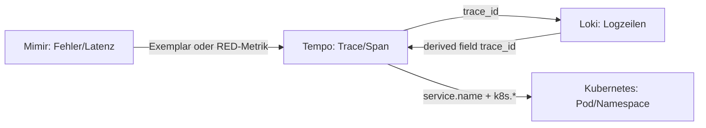
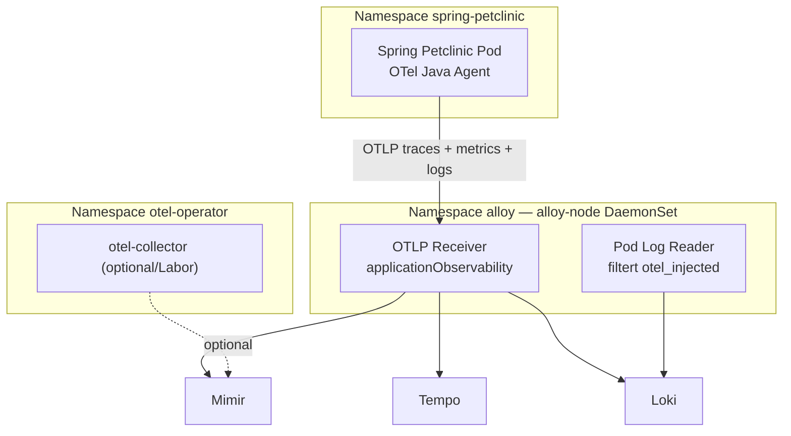

# Datenkorrelation im LGTM-Stack (Grundlagen)

Dieses Dokument erklärt **von Grund auf**, wie Metriken (Mimir), Logs (Loki) und Traces (Tempo) in unserem Noctua-Deployment zusammenhängen und wie man sie in Grafana korreliert. Als Referenz-Workload dient **Spring Petclinic** mit Java Auto-Instrumentation und Alloy als Collector.

---

## 1. Was bedeutet „Korrelation“?

Observability liefert drei Signalarten:

| Signal | Backend | Typische Frage |
| :--- | :--- | :--- |
| **Metrics** | Mimir | *Ist etwas langsam, fehlerhaft oder ungewöhnlich?* |
| **Traces** | Tempo | *Welcher Request, welcher Service, welcher Span ist betroffen?* |
| **Logs** | Loki | *Was ist genau passiert – Stacktrace, Kontext, Business-Event?* |

**Korrelation** bedeutet: Dieselbe Anfrage oder dasselbe Incident über alle drei Signale hinweg wiederfinden können – ohne manuelles Raten.

Empfohlener Ablauf (Symptom → Ursache):



---

## 2. Die Verbindungsstücke (Schlüssel-Identifikatoren)

### 2.1 Trace-ID und Span-ID

- **`trace_id`**: Eindeutige ID für einen gesamten Request über alle Services hinweg.
- **`span_id`**: ID eines einzelnen Schritts innerhalb des Traces.

Diese IDs sind der **stärkste Korrelationsanker** zwischen Traces und Logs. Wenn ein Log `trace_id` enthält, kann Grafana direkt von Loki nach Tempo springen – und umgekehrt.

### 2.2 Service-Identität (`service.name`)

- OTel-Standard: **`service.name`** (Resource-Attribut).
- In Mimir/Prometheus oft als Label **`job`** oder **`service_name`** gespiegelt.
- Spring Petclinic setzt: `resource.opentelemetry.io/service.name: spring-petclinic`.

Damit filtert man App-Metriken, Traces und Logs auf dieselbe Anwendung.

### 2.3 Kubernetes-Kontext (`k8s.*` / Prometheus-Labels)

Alloy reichert alle Signale mit gemeinsamen Metadaten an:

| OTel Resource-Attribut | Prometheus/Mimir-Label (Dual Semantics) | Bedeutung |
| :--- | :--- | :--- |
| `k8s.namespace.name` | `namespace` | Kubernetes-Namespace |
| `k8s.pod.name` | `pod` | Pod-Name |
| `k8s.container.name` | `container` | Container |
| `k8s.cluster.name` | `cluster` | Cluster-Name (`prod-bwcloud`) |
| `service.name` | `job` | Logischer Service |

So kann man von einem Trace zu Pod-Ressourcen (CPU, Memory, Restarts) in den Kubernetes-Dashboards wechseln.

### 2.4 Umgebung und Version

- **`deployment.environment.name`**: z. B. `noctua` – trennt Stages in Queries.
- **`service.version`**: Image-Tag – hilft bei Rollout-Vergleichen.

---

## 3. Wie die Korrelation in Grafana technisch funktioniert

Konfiguration in [`apps/grafana/base/values.yaml`](../../../apps/grafana/base/values.yaml):

### 3.1 Mimir → Tempo (Exemplars)

Histogram-Metriken können **Exemplars** mit einer `trace_id` tragen. Grafana verlinkt diese über `exemplarTraceIdDestinations` direkt zu Tempo.

**Praxis:** In einem Latenz-Panel auf einen Exemplar-Punkt (Diamant-Marker) klicken → Trace in Tempo öffnen.

**Konfiguration:** Vier Schichten (Agent, Alloy, Mimir, Grafana) — siehe [Abschnitt 5](#5-exemplars-konfiguration-pro-komponente-anfänger-guide).

### 3.2 Tempo → Loki (`tracesToLogsV2`)

Tempo kann Logs in Loki nach derselben Trace-ID suchen (`filterByTraceID: true`). Zusätzlich wird über `service.name` eingegrenzt.

**Praxis:** Trace in Tempo öffnen → Tab **Logs** → passende Logzeilen in Loki.

### 3.3 Loki → Tempo (`derivedFields`)

Loki erkennt in Logzeilen Muster wie `trace_id=…`, `traceID=…` oder `traceId=…` und zeigt einen Link **TraceID** an.

**Praxis:** Logzeile in Explore → auf **TraceID** klicken → derselbe Trace in Tempo.

### 3.4 Tempo → Mimir (Service Map / Span Metrics)

Tempo **Metrics Generator** schreibt abgeleitete Metriken (Service Graph, Span Metrics) nach Mimir. Grafana nutzt diese für **Service Map** und **Node Graph**.

---

## 4. Datenfluss in Noctua (Spring Petclinic)



**Wichtig für Logs:** Pods mit OTel-Injection senden Logs **nur per OTLP** (stdout wird von Alloy bewusst ausgefiltert, um Duplikate zu vermeiden). Endpoint: `http://alloy-kai-alloy-node.alloy.svc.cluster.local:4318`.

**Exemplars:** Histogramm-Punkte mit `trace_id` → Klick in Grafana öffnet Tempo. Dafür müssen **vier Schichten** zusammenpassen (Instrumentation → Alloy → Mimir → Grafana). Details und alle Pflicht-Variablen: [Abschnitt 5](#5-exemplars-konfiguration-pro-komponente-anfänger-guide).

*(Der separate `otel-collector` im Namespace `otel-operator` ist optional/Labor — Spring Petclinic nutzt Alloy.)*

---

## 5. Exemplars: Konfiguration pro Komponente (Anfänger-Guide)

Exemplars sind **Diamant-Marker** auf Latenz-Histogrammen in Grafana. Ein Klick springt zum zugehörigen Trace in Tempo. Damit das funktioniert, müssen an **vier Stellen** Einstellungen gesetzt sein — fehlt eine, sieht man **keine klickbaren Marker**, obwohl Metriken und Traces sonst normal laufen.

### 5.1 Kurzüberblick: Wer macht was?

```mermaid
flowchart LR
  subgraph L1["1. Java Agent"]
    A1["OTEL_METRICS_EXEMPLAR_FILTER"]
    A2["OTEL_TRACES_SAMPLER"]
  end
  subgraph L2["2. Alloy"]
    B1["prometheus.remote_write"]
    B2["send_exemplars = true"]
  end
  subgraph L3["3. Mimir"]
    C1["max_global_exemplars_per_user"]
    C2["ignore_ooo_exemplars"]
  end
  subgraph L4["4. Grafana"]
    D1["exemplarTraceIdDestinations"]
    D2["Panel: exemplar: true"]
  end
  L1 -->|"OTLP metrics + exemplars"| L2
  L2 -->|"/api/v1/push"| L3
  L3 -->|"query_exemplars API"| L4
  L4 -->|"Klick → trace_id"| Tempo["Tempo"]
```



### 5.2 Cheat-Sheet: Variable → Komponente → Datei

| Was setzen? | Wert (Noctua) | Komponente | GitOps-Datei |
| :--- | :--- | :--- | :--- |
| `OTEL_METRICS_EXEMPLAR_FILTER` | `always_on` | OTel Operator / Java Agent | [`apps/otel-operator/noctua/templates/instrumentation-java.yaml`](../../../apps/otel-operator/noctua/templates/instrumentation-java.yaml) |
| `OTEL_TRACES_SAMPLER` | `always_on` | OTel Operator / Java Agent | dieselbe Datei |
| `OTEL_METRICS_EXPORTER` | `otlp` | OTel Operator / Java Agent | dieselbe Datei |
| `OTEL_EXPORTER_OTLP_ENDPOINT` | `http://alloy-kai-alloy-node.alloy.svc.cluster.local:4318` | OTel Operator / Java Agent | [`apps/otel-operator/noctua/values.yaml`](../../../apps/otel-operator/noctua/values.yaml) → `otlpGateway.endpoint` |
| Metrics-Export-Pfad | `otelcol.exporter.prometheus` + `prometheus.remote_write` | Alloy | [`apps/alloy/noctua-kai/values.yaml`](../../../apps/alloy/noctua-kai/values.yaml) |
| `send_exemplars` | `true` | Alloy → Mimir | dieselbe Datei (`prometheus.remote_write "mimir"`) |
| `X-Scope-OrgID` | `"1"` | Alloy → Mimir | dieselbe Datei (Remote-Write-Header) |
| `max_global_exemplars_per_user` | `100000` | Mimir | [`apps/mimir/noctua/values.yaml`](../../../apps/mimir/noctua/values.yaml) |
| `ignore_ooo_exemplars` | `true` | Mimir | dieselbe Datei |
| `out_of_order_time_window` | `5m` | Mimir | dieselbe Datei |
| `exemplarTraceIdDestinations` | `trace_id` / `traceID` → Tempo | Grafana Datasource | [`apps/grafana/base/values.yaml`](../../../apps/grafana/base/values.yaml) |
| `"exemplar": true` | pro Panel-Target | Grafana Dashboard | [`apps/grafana/noctua/files/spring-petclinic/dashboards/correlation.json`](../../../apps/grafana/noctua/files/spring-petclinic/dashboards/correlation.json) |

**Nach Änderungen an der Instrumentation-CR:** App-Pod neu starten (`kubectl rollout restart deployment/spring-petclinic -n spring-petclinic`), sonst läuft der alte Agent mit alten Env-Variablen weiter.

---

### 5.3 Schicht 1 — Java Agent (Instrumentation CR)

**Datei:** `apps/otel-operator/noctua/templates/instrumentation-java.yaml`

Der Agent hängt bei Histogram-Metriken (z. B. HTTP-Latenz) optional eine **Trace-ID** als Exemplar an. Ohne diese Env-Variablen kommen **keine** Exemplars aus der App.

```yaml
spec:
  env:
    - name: OTEL_METRICS_EXPORTER
      value: "otlp"
    - name: OTEL_METRICS_EXEMPLAR_FILTER
      value: "always_on"          # Pflicht für sichtbare Marker
    - name: OTEL_TRACES_SAMPLER
      value: "always_on"          # Spans müssen existieren (bei trace_based relevant)
  exporter:
    endpoint: http://alloy-kai-alloy-node.alloy.svc.cluster.local:4318
```

| Variable | Bedeutung | Typischer Anfängerfehler |
| :--- | :--- | :--- |
| `OTEL_METRICS_EXEMPLAR_FILTER=always_on` | Exemplar an **jede** Histogram-Messung anhängen | `trace_based` → nur bei gesampelten Spans; wirkt oft wie „keine Marker“ |
| `OTEL_TRACES_SAMPLER=always_on` | Jeder Request erzeugt einen Span | Bei `trace_based` ohne Sampling → keine Exemplars |
| Endpoint → Alloy | Metriken inkl. Exemplars an Collector | Falscher Endpoint → gar keine Daten |

**Prüfen im laufenden Pod:**

```bash
kubectl exec -n spring-petclinic deploy/spring-petclinic -- env | grep OTEL_METRICS_EXEMPLAR
# Erwartung: OTEL_METRICS_EXEMPLAR_FILTER=always_on
```

---

### 5.4 Schicht 2 — Alloy (Collector)

**Datei:** `apps/alloy/noctua-kai/values.yaml`

Alloy empfängt OTLP von der App (`applicationObservability` auf `alloy-node`) und leitet Metriken an Mimir weiter. **Wichtig:** Der direkte OTLP-HTTP-Pfad nach Mimir (`/otlp`) ist für Exemplars **ungeeignet** — Mimir verwirft sie mit Grund `exemplar_labels_missing` (leere `{}`-Labels, keine `trace_id`).

**Produktiv-Pfad:** OTLP → `otelcol.exporter.prometheus` → `prometheus.remote_write` mit `send_exemplars = true`.

```yaml
# replaceComponent: Batch-Ausgang auf Prometheus-Exporter umbiegen
replaceComponent:
  - type: otelcol.processor.batch
    name: mimir
    content: |
      output {
        metrics = [otelcol.exporter.prometheus.mimir_rw.input]
      }

# extraConfig (alloy-metrics + alloy-node):
otelcol.exporter.prometheus "mimir_rw" {
  forward_to = [prometheus.remote_write.mimir.receiver]
}

prometheus.remote_write "mimir" {
  endpoint {
    url = "http://mimir-distributor.mimir.svc.cluster.local:8080/api/v1/push"
    headers = { "X-Scope-OrgID" = "1" }
    send_exemplars = true    # Pflicht
  }
}
```

| Einstellung | Warum |
| :--- | :--- |
| **Kein** `otelcol.exporter.otlphttp` für App-Metriken | OTLP-Push verliert Exemplar-Labels → Mimir discard `exemplar_labels_missing` |
| `send_exemplars = true` | Remote Write muss Exemplars explizit mitschicken |
| `X-Scope-OrgID: "1"` | Mimir-Tenant; ohne Header keine korrekte Zuordnung |

**Merksatz:** Exemplars brauchen auf dem Weg nach Mimir **`trace_id` als Label** — das liefert der Prometheus-Remote-Write-Pfad, nicht der reine OTLP-Push.

---

### 5.5 Schicht 3 — Mimir (Speicher)

**Datei:** `apps/mimir/noctua/values.yaml`

Mimir speichert Exemplars **standardmäßig nicht**. Der Default `max_global_exemplars_per_user: 0` bedeutet: **Speicher aus**. Dann sieht man in Metriken zwar `cortex_distributor_exemplars_in_total > 0`, aber `cortex_distributor_received_exemplars_total` bleibt **0** und Grafana zeigt keine Marker.

```yaml
mimir-distributed:
  mimir:
    structuredConfig:
      limits:
        max_global_exemplars_per_user: 100000   # 0 = deaktiviert!
        out_of_order_time_window: 5m
        ignore_ooo_exemplars: true
```

| Limit | Bedeutung | Symptom wenn falsch |
| :--- | :--- | :--- |
| `max_global_exemplars_per_user` | Exemplar-Speicher aktivieren | Exemplars kommen an, werden aber nicht gespeichert |
| `ignore_ooo_exemplars` | Out-of-order Exemplars still verwerfen | Remote Write schlägt sonst fehl (OTel/Java-Timestamps) |
| `out_of_order_time_window` | Toleranz für zeitversetzte Samples | Hilft bei Batch-/Agent-Timing |

**Diagnose-Metriken (Tenant `X-Scope-OrgID: 1`):**

| Metrik | Gesund | Problem |
| :--- | :--- | :--- |
| `cortex_distributor_received_exemplars_total` | steigt | `0` trotz Traffic → Speicher aus oder Labels fehlen |
| `cortex_discarded_exemplars_total{reason="exemplar_labels_missing"}` | `0` | `> 0` → OTLP-Pfad statt Remote Write |
| `cortex_ingester_tsdb_exemplar_series_with_exemplars_in_storage` | `> 0` | `0` → nichts in TSDB gespeichert |
| `query_exemplars` API | Einträge mit `trace_id` | leeres `data: []` → Pipeline oben prüfen |

**Exemplar-Check per API:**

```bash
curl -sG -H "X-Scope-OrgID: 1" \
  "http://mimir-query-frontend.mimir.svc.cluster.local:8080/prometheus/api/v1/query_exemplars" \
  --data-urlencode 'query=http_server_request_duration_bucket{job=~"spring-petclinic.*"}' \
  --data-urlencode "start=$(($(date +%s)-900))" \
  --data-urlencode "end=$(date +%s)"
```

Erwartung: JSON mit `"exemplars":[{"labels":{"trace_id":"…","span_id":"…"}, …}]`.

---

### 5.6 Schicht 4 — Grafana (Anzeige & Klick)

**Datasource:** `apps/grafana/base/values.yaml`

Grafana muss wissen, welches Exemplar-Label die Trace-ID trägt und wohin der Link geht:

```yaml
jsonData:
  exemplarTraceIdDestinations:
    - datasourceUid: tempo
      name: traceID
    - datasourceUid: tempo
      name: trace_id      # Label-Name aus Mimir-Exemplars
```

**Dashboard:** `apps/grafana/noctua/files/spring-petclinic/dashboards/correlation.json`

Jedes Prometheus-Target im Latenz-Panel braucht `"exemplar": true`. Zusätzlich ein **verstecktes** Bucket-Query (`refId: C`), damit Grafana Exemplars für die Histogram-Serie laden kann:

```json
{
  "exemplar": true,
  "expr": "histogram_quantile(0.95, sum by (le) (rate(http_server_request_duration_bucket{job=~\"spring-petclinic.*\"}[$__rate_interval])))",
  "refId": "A"
}
```

| Einstellung | Symptom wenn vergessen |
| :--- | :--- |
| `exemplarTraceIdDestinations` | Marker sichtbar, Klick tut nichts / falscher Datasource |
| `"exemplar": true` im Panel | Keine Diamant-Marker trotz Daten in Mimir |
| Korrekte Metrik `http_server_request_duration_bucket` | Panel leer (falscher Metrikname) |

**In der UI:** Dashboard hart neu laden (Strg+Shift+R), Zeitbereich z. B. „Last 15 minutes“, vorher Traffic erzeugen (`/vets`, `/owners/1`). Marker erscheinen **nur** an Punkten mit gesampeltem Trace — nicht auf jeder Linie.

---

### 5.7 Typische Fehlerbilder (Troubleshooting)

| Symptom | Wahrscheinliche Ursache | Wo nachsehen |
| :--- | :--- | :--- |
| Keine Diamant-Marker in Grafana | Panel ohne `exemplar: true` oder Dashboard nicht synced | `correlation.json`, Argo CD App `grafana` |
| Metriken OK, Traces OK, keine Marker | `max_global_exemplars_per_user: 0` (Default) | `apps/mimir/noctua/values.yaml` |
| `exemplars_in > 0`, `received = 0` | Exemplar-Speicher aus **oder** leere Exemplar-Labels (OTLP-Pfad) | Mimir-Limits + Alloy Remote Write |
| `exemplar_labels_missing` in Discards | Metriken via OTLP/HTTP nach Mimir statt Remote Write | `apps/alloy/noctua-kai/values.yaml` |
| Pod hat `trace_based`, CR sagt `always_on` | Instrumentation geändert, Pod nicht neu gestartet | `kubectl rollout restart …` |
| Marker da, Klick öffnet kein Tempo | `exemplarTraceIdDestinations` fehlt / falsches Label | `apps/grafana/base/values.yaml` |

---

### 5.8 Deploy-Reihenfolge nach GitOps-Änderung

1. **Git push** → Argo CD sync: `mimir`, `alloy-kai`, `otel-operator`, `grafana`
2. **Mimir-Ingester** ggf. Rollout (Config-Reload)
3. **Spring Petclinic** neu starten (Instrumentation-Env)
4. **Traffic** erzeugen, dann Grafana-Dashboard prüfen

---

## 6. Konkrete Korrelations-Szenarien

### Szenario A: Hohe Fehlerrate entdecken

1. **Mimir:** Panel „HTTP 5xx Rate“ für `job=~"spring-petclinic.*"`.
2. **Exemplar** auf dem Spike klicken → **Tempo** Trace mit Fehler-Span.
3. In Tempo **Logs**-Tab → **Loki** Logzeile mit Stacktrace.
4. Parallel **Kubernetes / Pod** Dashboard mit `namespace=spring-petclinic`, `pod=<pod aus Trace>` → CPU/Memory/OOM?

### Szenario B: Langsame Anfrage

1. **Mimir:** p95/p99 Latenz (`http_server_request_duration_bucket`, Einheit Sekunden).
2. Exemplar oder **Tempo Explore** mit `{ resource.service.name = "spring-petclinic" && duration > 1s }`.
3. Span-Breakdown zeigt DB-Call vs. HTTP-Handler.
4. Logs mit gleicher `trace_id` zeigen SQL/Parameter oder Business-Kontext.

### Szenario C: Log-first (Fehler in Loki gesehen)

1. **Loki:** `{service_name="spring-petclinic"} |= "ERROR"`.
2. Logzeile enthält `trace_id` → Link **TraceID** → **Tempo**.
3. Von dort zu **Mimir**-Metriken zum gleichen Zeitfenster (Request-Rate, JVM Heap).

### Szenario D: Infrastruktur-Kontext

1. Trace oder Log liefert `k8s.pod.name` / Label `pod`.
2. Dashboard **Kubernetes / Compute Resources / Pod** mit `cluster`, `namespace`, `pod`.
3. Korrelation: App-Problem vs. Ressourcen-Engpass (Throttling, Restarts).

---

## 7. Typische Metriken für Spring Petclinic (Mimir)

Nach Java Auto-Instrumentation und OTLP-Export erwarten wir u. a.:

| Metrik (Beispielname) | Nutzen |
| :--- | :--- |
| `http_server_request_duration_bucket` / `_count` / `_sum` | Latenz RED (Histogram; Einheit Sekunden) |
| `http_server_active_requests` | Last |
| `jvm_memory_used` | Heap-Druck |
| `jvm_gc_duration_seconds_*` | GC-Probleme |
| `process_runtime_jvm_*` | JVM-Runtime |

Labels für Filter: `job=~"spring-petclinic.*"` (Wert z. B. `spring-petclinic/spring-petclinic`). Pod-Variablen aus `kube_pod_info`; OTel-Metriken per `instance=~".*<pod>.*"` filtern. Kubernetes-Panels nutzen `cluster`, `namespace`, `pod` wie gewohnt.

---

## 8. Typische Log- und Trace-Felder

### Loki (OTLP oder stdout)

- `trace_id`, `span_id` – Korrelation zu Tempo
- `service_name` / `service.name` – App-Filter
- `k8s_namespace_name`, `k8s_pod_name` – K8s-Kontext
- `severity_text` / `level` – Error-Filter

### Tempo (Span-Attribute)

- `http.request.method`, `http.response.status_code`
- `url.path` oder `http.route`
- `service.name`, `k8s.pod.name`

---

## 9. Checkliste: Korrelation funktioniert

| Prüfung | Erwartung | Siehe auch |
| :--- | :--- | :--- |
| Mimir `query_exemplars` | Einträge mit `trace_id` | [5.5](#55-schicht-3--mimir-speicher) |
| Mimir-Exemplar → Tempo | Klick auf Diamant-Marker öffnet Trace | [5.6](#56-schicht-4--grafana-anzeige--klick) |
| Tempo → Loki | Logs-Tab zeigt Zeilen mit gleicher `trace_id` | [3.2](#32-tempo--loki-tracestologsv2) |
| Loki → Tempo | Derived-Field-Link **TraceID** sichtbar | [3.3](#33-loki--tempo-derivedfields) |
| Service Map | Abhängigkeiten von `spring-petclinic` sichtbar (nach Metrics Generator) | [3.4](#34-tempo--mimir-service-map--span-metrics) |
| K8s-Labels | `namespace`, `pod`, `cluster` in Mimir **und** Loki konsistent | [2.3](#23-kubernetes-kontext-k8s--prometheus-labels) |

---

## 10. Weiterführende Docs in diesem Repo

- [Observability Guide](../../OBSERVABILITY.md) – Alloy-Pipeline, Label-Strategie
- [Alloy noctua-kai README](../../../apps/alloy/noctua-kai/README.md) – Dual Semantics, Log-Deduplication
- [Grafana Datasources](../../../apps/grafana/base/values.yaml) – Exemplars, derivedFields, tracesToLogs
- [Design & Stack-Vergleich](../Design.md) – LGTM vs. ELK vs. Datadog

---

*Stand: Noctua-Stage mit Spring Petclinic, Alloy noctua-kai, Mimir, Loki, Tempo, Grafana.*
