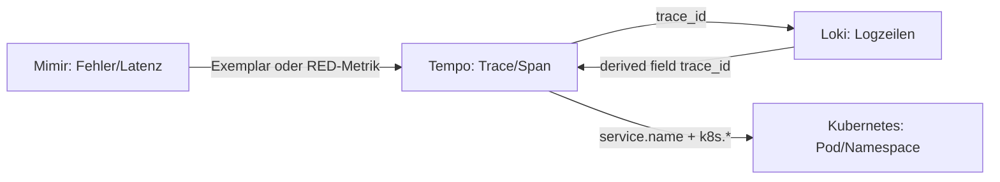
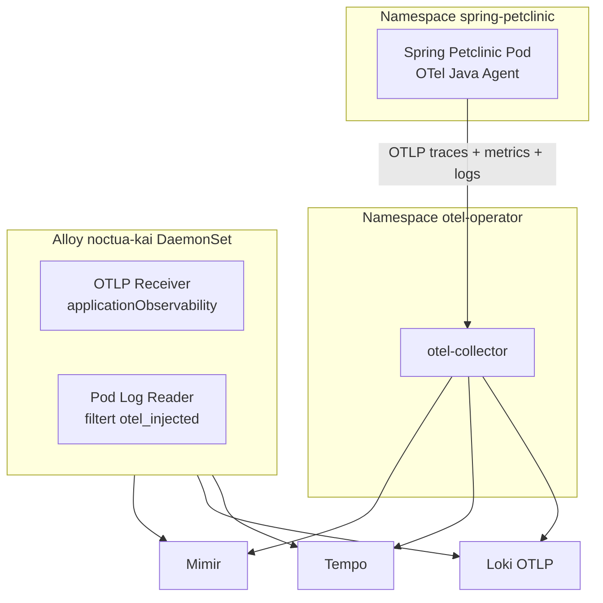

# Datenkorrelation im LGTM-Stack (Grundlagen)

Dieses Dokument erklärt **von Grund auf**, wie Metriken (Mimir), Logs (Loki) und Traces (Tempo) in unserem Noctua-Deployment zusammenhängen und wie man sie in Grafana korreliert. Als Referenz-Workload dient **Spring Petclinic** mit Java Auto-Instrumentation und Alloy als Collector.

---

## 1. Was bedeutet „Korrelation“?

Observability liefert drei Signalarten:

| Signal | Backend | Typische Frage |
| :--- | :--- | :--- |
| **Metrics** | Mimir | *Ist etwas langsam, fehlerhaft oder ungewöhnlich?* |
| **Traces** | Tempo | *Welcher Request, welcher Service, welcher Span ist betroffen?* |
| **Logs** | Loki | *Was ist genau passiert – Stacktrace, Kontext, Business-Event?* |

**Korrelation** bedeutet: Dieselbe Anfrage oder dasselbe Incident über alle drei Signale hinweg wiederfinden können – ohne manuelles Raten.

Empfohlener Ablauf (Symptom → Ursache):

---

## 2. Die Verbindungsstücke (Schlüssel-Identifikatoren)

### 2.1 Trace-ID und Span-ID

- **`trace_id`**: Eindeutige ID für einen gesamten Request über alle Services hinweg.
- **`span_id`**: ID eines einzelnen Schritts innerhalb des Traces.

Diese IDs sind der **stärkste Korrelationsanker** zwischen Traces und Logs. Wenn ein Log `trace_id` enthält, kann Grafana direkt von Loki nach Tempo springen – und umgekehrt.

### 2.2 Service-Identität (`service.name`)

- OTel-Standard: **`service.name`** (Resource-Attribut).
- In Mimir/Prometheus oft als Label **`job`** oder **`service_name`** gespiegelt.
- Spring Petclinic setzt: `resource.opentelemetry.io/service.name: spring-petclinic`.

Damit filtert man App-Metriken, Traces und Logs auf dieselbe Anwendung.

### 2.3 Kubernetes-Kontext (`k8s.*` / Prometheus-Labels)

Alloy reichert alle Signale mit gemeinsamen Metadaten an:

| OTel Resource-Attribut | Prometheus/Mimir-Label (Dual Semantics) | Bedeutung |
| :--- | :--- | :--- |
| `k8s.namespace.name` | `namespace` | Kubernetes-Namespace |
| `k8s.pod.name` | `pod` | Pod-Name |
| `k8s.container.name` | `container` | Container |
| `k8s.cluster.name` | `cluster` | Cluster-Name (`prod-bwcloud`) |
| `service.name` | `job` | Logischer Service |

So kann man von einem Trace zu Pod-Ressourcen (CPU, Memory, Restarts) in den Kubernetes-Dashboards wechseln.

### 2.4 Umgebung und Version

- **`deployment.environment.name`**: z. B. `noctua` – trennt Stages in Queries.
- **`service.version`**: Image-Tag – hilft bei Rollout-Vergleichen.

---

## 3. Wie die Korrelation in Grafana technisch funktioniert

Konfiguration in [`apps/grafana/base/values.yaml`](../../../apps/grafana/base/values.yaml):

### 3.1 Mimir → Tempo (Exemplars)

Histogram-Metriken können **Exemplars** mit einer `trace_id` tragen. Grafana verlinkt diese über `exemplarTraceIdDestinations` direkt zu Tempo.

**Praxis:** In einem Latenz-Panel auf einen Exemplar-Punkt klicken → Trace in Tempo öffnen.

### 3.2 Tempo → Loki (`tracesToLogsV2`)

Tempo kann Logs in Loki nach derselben Trace-ID suchen (`filterByTraceID: true`). Zusätzlich wird über `service.name` eingegrenzt.

**Praxis:** Trace in Tempo öffnen → Tab **Logs** → passende Logzeilen in Loki.

### 3.3 Loki → Tempo (`derivedFields`)

Loki erkennt in Logzeilen Muster wie `trace_id=…`, `traceID=…` oder `traceId=…` und zeigt einen Link **TraceID** an.

**Praxis:** Logzeile in Explore → auf **TraceID** klicken → derselbe Trace in Tempo.

### 3.4 Tempo → Mimir (Service Map / Span Metrics)

Tempo **Metrics Generator** schreibt abgeleitete Metriken (Service Graph, Span Metrics) nach Mimir. Grafana nutzt diese für **Service Map** und **Node Graph**.

---

## 4. Datenfluss in Noctua (Spring Petclinic)

**Wichtig für Logs:** Pods mit OTel-Injection senden Logs **nur per OTLP** (stdout wird von Alloy bewusst ausgefiltert, um Duplikate zu vermeiden). Daher muss `OTEL_LOGS_EXPORTER=otlp` gesetzt sein und der Collector Logs nach Loki weiterleiten.

---

## 5. Konkrete Korrelations-Szenarien

### Szenario A: Hohe Fehlerrate entdecken

1. **Mimir:** Panel „HTTP 5xx Rate“ für `job="spring-petclinic"`.
2. **Exemplar** auf dem Spike klicken → **Tempo** Trace mit Fehler-Span.
3. In Tempo **Logs**-Tab → **Loki** Logzeile mit Stacktrace.
4. Parallel **Kubernetes / Pod** Dashboard mit `namespace=spring-petclinic`, `pod=<pod aus Trace>` → CPU/Memory/OOM?

### Szenario B: Langsame Anfrage

1. **Mimir:** p95/p99 Latenz (`http_server_duration_milliseconds` o. ä.).
2. Exemplar oder **Tempo Explore** mit `{ resource.service.name = "spring-petclinic" && duration > 1s }`.
3. Span-Breakdown zeigt DB-Call vs. HTTP-Handler.
4. Logs mit gleicher `trace_id` zeigen SQL/Parameter oder Business-Kontext.

### Szenario C: Log-first (Fehler in Loki gesehen)

1. **Loki:** `{service_name="spring-petclinic"} |= "ERROR"`.
2. Logzeile enthält `trace_id` → Link **TraceID** → **Tempo**.
3. Von dort zu **Mimir**-Metriken zum gleichen Zeitfenster (Request-Rate, JVM Heap).

### Szenario D: Infrastruktur-Kontext

1. Trace oder Log liefert `k8s.pod.name` / Label `pod`.
2. Dashboard **Kubernetes / Compute Resources / Pod** mit `cluster`, `namespace`, `pod`.
3. Korrelation: App-Problem vs. Ressourcen-Engpass (Throttling, Restarts).

---

## 6. Typische Metriken für Spring Petclinic (Mimir)

Nach Java Auto-Instrumentation und OTLP-Export erwarten wir u. a.:

| Metrik (Beispielname) | Nutzen |
| :--- | :--- |
| `http_server_duration_milliseconds_*` | Latenz RED |
| `http_server_active_requests` | Last |
| `jvm_memory_used_bytes` | Heap-Druck |
| `jvm_gc_duration_seconds_*` | GC-Probleme |
| `process_runtime_jvm_*` | JVM-Runtime |

Labels für Filter: `job="spring-petclinic"`, `namespace="spring-petclinic"`, `pod=~"spring-petclinic.*"`.

---

## 7. Typische Log- und Trace-Felder

### Loki (OTLP oder stdout)

- `trace_id`, `span_id` – Korrelation zu Tempo
- `service_name` / `service.name` – App-Filter
- `k8s_namespace_name`, `k8s_pod_name` – K8s-Kontext
- `severity_text` / `level` – Error-Filter

### Tempo (Span-Attribute)

- `http.request.method`, `http.response.status_code`
- `url.path` oder `http.route`
- `service.name`, `k8s.pod.name`

---

## 8. Checkliste: Korrelation funktioniert

| Prüfung | Erwartung |
| :--- | :--- |
| Mimir-Exemplar → Tempo | Klick auf Exemplar öffnet Trace |
| Tempo → Loki | Logs-Tab zeigt Zeilen mit gleicher `trace_id` |
| Loki → Tempo | Derived-Field-Link **TraceID** sichtbar |
| Service Map | Abhängigkeiten von `spring-petclinic` sichtbar (nach Metrics Generator) |
| K8s-Labels | `namespace`, `pod`, `cluster` in Mimir **und** Loki konsistent |

---

## 9. Weiterführende Docs in diesem Repo

- [Observability Guide](../../OBSERVABILITY.md) – Alloy-Pipeline, Label-Strategie
- [Alloy noctua-kai README](../../../apps/alloy/noctua-kai/README.md) – Dual Semantics, Log-Deduplication
- [Grafana Datasources](../../../apps/grafana/base/values.yaml) – Exemplars, derivedFields, tracesToLogs
- [Design & Stack-Vergleich](../Design.md) – LGTM vs. ELK vs. Datadog

---

*Stand: Noctua-Stage mit Spring Petclinic, Alloy noctua-kai, Mimir, Loki, Tempo, Grafana.*
