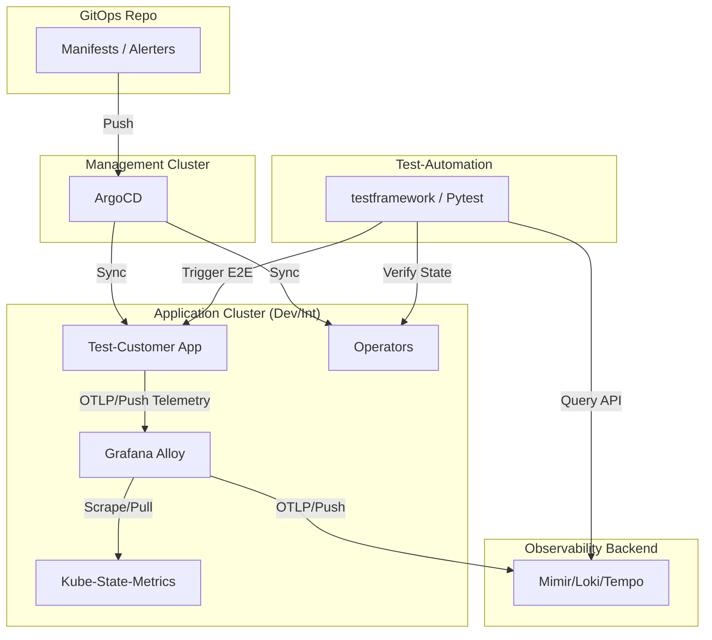

# Operatives Testkonzept: Observability-Plattform (Implementierung)
 
## 1. System & Test-Infrastruktur
 
### 1.1 Test-Setup Schaubild

 
### 1.2 Datenversorgung für Dev & Int
- **Synthetische Last:** Der `Test-Customer` generiert via Java Auto-Instrumentation Telemetriedaten (Metriken, Logs, Traces), die direkt an Alloy gepusht werden.
- **Infrastruktur-Daten:** Alloy scrapet reale Kubernetes-Metriken (z.B. KSM, Node-Exporter) im Cluster, um die Pull-Pipeline zu validieren.
 
---
 
## 2. Implementierung der Automatisierung (testframework)
 
### 2.1 Das GitOps-Testmuster
Alle Tests, die Konfigurationsänderungen (Dashboards, Rules, Instrumentation) validieren, folgen diesem Muster:
1. **Commit:** `with git_manager.GitManager(...)` -> Clone -> Edit YAML -> Auto-Push.
2. **Sync:** `utils.argocd_sync(appname)` -> Forciert ArgoCD Sync und wartet auf Health.
3. **Validierung:** Abfrage der Backends via Python `requests` Library gegen die REST-APIs.
 
### 2.2 Telemetrie-Generierung via E2E-Tests
Die bestehenden Tests in `tests/e2e/test_e2e.py` werden als Generatoren genutzt:
- Triggern von API-Aufrufen (z.B. `/strings`) am Test-Customer.
- Zeitversetzte Abfrage der Loki/Tempo APIs, um die generierten Daten zu validieren.
 
---
 
## 3. Testfälle (Operativ)
 
### 3.1 Backend & Operator Health (Ebene 2 & 3)
 
| ID | Ziel | Vorgehen | Erwartung |
| --- | --- | --- | --- |
| TC-OP-01 | Grafana-Op | Push Dashboard CRD -> `argocd_sync` | Dashboard ist via Grafana-API (HTTP 200) abrufbar. |
| TC-OP-02 | OTel-Op | Push Instrumentation CRD -> `argocd_sync` | Sidecars sind im Test-Customer Pod injiziert. |
| TC-BE-01 | Mimir | `requests.post` (Write) -> `requests.get` (Read) | Metrik-Sample ist erfolgreich persistiert. |
| TC-BE-02 | Loki | Write Log -> Query via LogQL | Log mit korrektem Label ist findbar. |
| TC-BE-03 | Tempo | Push Span -> Query via TraceID | Trace-Daten sind vollständig abfragbar. |
| TC-BE-04 | Ruler | Push AlertRule -> API Check | Mimir Ruler meldet "Rule Group loaded". |
 
### 3.2 Alloy Data Pipeline & Infrastruktur (Ebene 3)
 
Dieser Testabschnitt validiert, ob Alloy alle relevanten Quellen (Scrape & Push) korrekt verarbeitet und mit den definierten Pflichtlabels an die Backends weiterleitet.
 
#### A. Pull-Schnittstellen (Infrastruktur-Scraping)
Wir validieren die Pipeline anhand von 1-2 festen Metriken pro Quelle.
 
| Quelle | Referenz-Metrik | Erwartete Labels (Beispiele) |
| --- | --- | --- |
| **Node-Exporter** | `node_cpu_seconds_total` | `instance`, `job="node-exporter"`, `cluster` |
| **Kube-API** | `apiserver_request_total` | `verb`, `code`, `resource="pods"` |
| **KSM** | `kube_pod_status_phase` | `phase="Running"`, `namespace="test-customer"` |
| **Kubelet** | `kubelet_running_pods` | `node`, `cluster` |
| **cAdvisor** | `container_cpu_usage_seconds_total` | `container="test-customer-backend"`, `image` |
 
#### B. Push-Schnittstellen (Java Auto-Instrumentation)
Validierung der Telemetrie, die via OTLP/Push an Alloy gesendet wird.
 
| Signal | Validierungspunkt | Erwarteter Inhalt |
| --- | --- | --- |
| **Java Metrics** | `http_server_requests_seconds_count` | `method`, `status`, `uri` (via Test-Customer) |
| **Java Logs** | Log-Struktur | Vorhandensein von `service_name`, `severity`, `trace_id` |
| **Java Traces** | Span-Attribute | `http.method`, `http.target`, `net.peer.name` |
 
#### C. Lifecycle-Triggerung (Redeploy-Validierung)
Durch den automatisierten (Re-)Deployment-Prozess des Test-Customers im `testframework` werden gezielt Zustandsänderungen provoziert:
- **Test:** `utils.argocd_sync` triggert Rollout.
- **Validierung:** Metrik `kube_pod_container_status_restarts_total` oder `kube_pod_status_scheduled_time` muss für den neuen Test-Customer Pod zeitnah in Mimir erscheinen.
 
### 3.3 Validierung des Alert-Status (Post-Deployment / Runtime)
Ergänzend zu den funktionalen Tests prüfen wir den Systemzustand direkt über die Alerting-Schnittstelle.
 
| ID | Test-Szenario | Vorgehen (via testframework) | Erwartung im Report |
| --- | --- | --- | --- |
| **TC-AL-01** | Kritische Plattform-Health | Abfrage der Alertmanager-API auf aktive Alerts mit `severity="critical"`. | Liste ist leer (Test bestanden). |
| **TC-AL-02** | Ingestion-Subset | Gezielte Prüfung auf Alerts wie `AlloyIngestionStopped` oder `MimirNoData`. | Status "Inactive" wird für diese Alert-Namen geloggt. |
 
---
 
## 4. Signal-Korrelation & E2E (Ebene 4)
 
### 4.1 Log-to-Trace Korrelation
- **Schritt 1:** Triggern eines E2E-Tests am Test-Customer.
- **Schritt 2:** Abfrage von Loki nach dem Request-Log.
- **Schritt 3:** Extraktion der `trace_id` aus dem Log-Feld.
- **Schritt 4:** Abfrage von Tempo mit dieser ID.
- **Ziel:** Lückenlose Nachverfolgung eines Requests über Signalgrenzen hinweg.
 
### 4.2 Metrics-to-Trace Korrelation
- **Schritt 1:** Prüfung von Latenz-Metriken (Histograms) in Mimir.
- **Schritt 2:** Abfrage von Exemplars (verknüpfte Trace-IDs in Metriken).
- **Schritt 3:** Validierung der Zeitdauer im zugehörigen Tempo-Trace.
 
---
 
## 5. Performance- & Stabilitäts-Check (Int-Stage)
 
Da eine vollständige Replikation der Prod-Last auf der Int-Stage technisch nicht möglich ist, fokussieren wir uns auf **Stabilitätstrends**.
 
### 5.1 Lasttreiber & Tools
- **k6s (TODO):** Evaluierung der Einbindung von `k6s` für gezielte Lastszenarien gegen den Test-Customer.
- **testframework Loops:** Durchführung der E2E-Tests (`test_e2e.py`) in einer intensiven Schleife.
 
### 5.2 Validierung
- **Pipeline-Health:** Check auf `mimir_discarded_samples_total == 0` (Verarbeitet Alloy die Last fehlerfrei?).
- **Baseline-Ressourcen:** Überwachung der CPU/Memory-Trends für Alloy und Mimir während des Testfensters (Vermeidung von Memory-Leaks bei Konfigurationsänderungen).
 
---
 
## 7. Roadmap & TODOs (Härtung des Frameworks)
 
Basierend auf einer Review-Analyse werden folgende Punkte zur Härtung des Testvorgangs sukzessive in das `@testframework` integriert:
 
### 7.1 Kritische Verbesserungen (Prio: Hoch)
- [ ] **Synthetische Telemetrie (Plattform-Isolation):** Implementierung eines Tests, der direkt vom Framework OTLP-Payloads (Metriken/Spans) an den Alloy-Ingress sendet. Ziel: Plattform-Health unabhängig vom Status der Test-Customer App prüfen.
- [ ] **Negativ-Validierung (Alerting-Kette):** Einbau eines Tests, der eine "AlwaysFiring"-AlertRule via GitOps deployt, um zu beweisen, dass die Kette Ruler -> Alertmanager -> API real funktioniert.
- [ ] **Operator-Robustheit:** Testfall für absichtlich invalide CRDs (z.B. kaputtes Dashboard-JSON), um sicherzustellen, dass der Operator sinnvolle Error-Status im Cluster setzt.
- [ ] **Diagnostic Reporting:** Erweiterung der Pytest-Logs (`utils.logger`), um im Fehlerfall detaillierte Kontext-Infos (HTTP Status, Backend-Response, Alloy-Logs) direkt in den HTML-Report zu schreiben.
 
### 7.2 Funktionale Erweiterungen (Prio: Mittel)
- [ ] **Idempotenz & Updates:** Erweiterung der Operator-Tests auf Update-Szenarien (bestehendes Dashboard ändern) und Prüfung der erfolgreichen Reconciliation.
- [ ] **Messbare SLOs:** Definition und automatisierte Prüfung einfacher Schwellwerte für die Datenverfügbarkeit (z.B. "Trace muss innerhalb von 5s nach Request in Tempo findbar sein").
- [ ] **Performance-Grobplanung:** Finale Evaluierung der Lastszenarien via `k6s` (siehe Kap. 5.1).
 