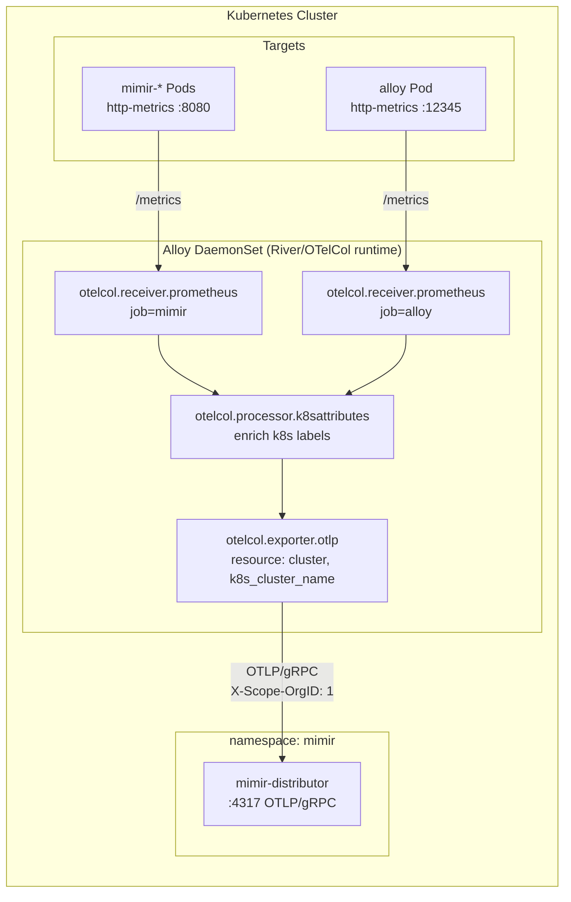

# Alloy Observability Pipeline – Current Implementation & Structure

This document details the concrete implementation of the Alloy pipeline as currently deployed in the cluster, outlining the flow from metrics collection to Mimir ingestion.

## High-Level Architecture

## Current Configuration Details

The pipeline is defined as a Directed Acyclic Graph (DAG) using Alloy's River configuration language. Components declare outputs that are consumed as inputs by subsequent components in the chain.

### 1. Data Collection (`otelcol.receiver.prometheus`)
Alloy uses Prometheus-compatible receivers to scrape metrics from identified endpoints.
- **`job=mimir`**: Discovers services in the `mimir` namespace matching specific component names (e.g., `distributor`, `ingester`, `querier`) on ports `http-metrics` or `legacy-http-metrics`.
- **`job=alloy`**: Scrapes the Alloy instance itself on port `12345`.

### 2. Label Enrichment (`otelcol.processor.k8sattributes`)
This crucial step enriches the raw scraped metrics with Kubernetes metadata.
- **Process:** It injects labels like `k8s_namespace_name`, `k8s_pod_name`, `k8s_container_name`, and `k8s_node_name` based on the discovery metadata.
- **Prometheus Compatibility:** It also creates the legacy Prometheus labels (`namespace`, `pod`, `container`, `node`) to ensure compatibility with existing dashboards and alerts.

### 3. Export (`otelcol.exporter.otlp`)
The enriched metrics are then funneled into the OTLP exporter.
- **Endpoint:** `mimir-distributor.mimir.svc.cluster.local:4317`
- **Protocol:** OTLP over gRPC.
- **Global Attributes:** Injects cluster-level labels (`cluster` and `k8s_cluster_name`) to every outgoing metric sample.
- **Authentication:** Includes the `X-Scope-OrgID` header (currently set to `"1"`) required by Mimir for tenant identification.

## Adding New Scrape Targets

Adding a new target involves creating a new module definition (a `declare` block) and instantiating it, feeding its output into the common exporter. 

Example pattern for adding a new target like `kube-state-metrics`:
1. Define the `otelcol.receiver.prometheus` block for discovery and specific relabeling (like setting the `job` label).
2. Pass the output to the common `otelcol.processor.k8sattributes` block for enrichment.
3. Export the final enriched output.
4. Instantiate the block and link its output to the `forward_to` input of the global `otelcol.exporter.otlp` component.
