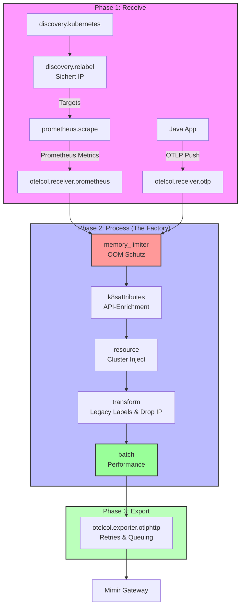

# Observability Data Pipeline Concept (Grafana Alloy)

## 1. Zielsetzung & Motivation

Aktuell müssen Standard-Labels (wie `cluster`, `namespace`, `pod`) für jedes Scrape-Target (z.B. Kubelet, cAdvisor, Mimir, Alloy) einzeln in der Konfiguration (via `discovery.relabel`) definiert und gemappt werden. Dies führt zu redundanter Konfiguration, ist fehleranfällig und erschwert das Hinzufügen neuer Targets.

Zusätzlich stehen wir vor dem Problem der **Label-Kompatibilität**:
*   **Moderne Instrumentierung (OpenTelemetry)** nutzt Semantic Conventions (z. B. `k8s.namespace.name`). Deine Java-Anwendung sendet diese standardmäßig.
*   **Bestehende Community-Dashboards** (z. B. Kubernetes Mixin oder fertige Dashboards aus dem Internet) erwarten klassische Prometheus-Labels (z. B. `namespace`, `cluster`, `pod`).

**Ziel dieses Konzepts** ist eine modulare, dreistufige Pipeline-Architektur (Receive -> Process -> Export), die das DRY-Prinzip (Don't Repeat Yourself) anwendet. Jedes Target wird nur minimal konfiguriert; die Anreicherung mit Kubernetes-Metadaten und die Übersetzung der Labels passieren an einer einzigen, zentralen Stelle.

---

## 2. Die Architektur: Receive -> Process -> Export

Wir strukturieren die Alloy-Konfiguration strikt in drei logische Phasen. Alle Daten (egal ob Prometheus-Scrape oder OTLP-Push der Java-App) fließen durch diese Pipeline.

### Phase 1: Receive (Target-Spezifisch)
Hier definieren wir nur, *was* gesammelt wird und welche *absolut spezifischen* Filter für genau dieses eine Target gelten.

**Zuständigkeiten:**
*   `discovery.kubernetes`: Finden der Endpunkte (Pods, Nodes).
*   `discovery.relabel`: Setzen der absoluten Basis-Labels (`job`, `instance`). **Wichtig für Pod-Scrapes:** Sichern der Ziel-IP (`__meta_kubernetes_pod_ip`) als sichtbares Label `k8s_pod_ip` (ohne doppelte Unterstriche `__`, da diese sonst von Prometheus gedroppt werden) für die spätere Anreicherung.
*   `prometheus.scrape`: Ausführen des eigentlichen Scrapes (nur für Pull-basierte Targets).
*   `otelcol.receiver.otlp`: Empfangen von Push-Metriken (z.B. von der Java-App).

**Output:** Rohe, unvollständige Metriken, die an Phase 2 weitergegeben werden.

### Phase 2: Process (Global & Zentral - "The Factory")
Hier laufen alle Metriken aller Targets zusammen. Dies ist der "Single Point of Truth" für Sicherheit, Anreicherung und Performance. Die Reihenfolge der Prozessoren ist sicherheits- und erfolgskritisch!

**Zuständigkeiten (in strikter Ausführungsreihenfolge):**
1.  **Stabilität (`otelcol.processor.memory_limiter`)**:
    Der wichtigste Prozessor. Wenn Mimir kurz ausfällt, stauen sich Metriken im Arbeitsspeicher von Alloy. Ohne diesen Limiter stürzt Alloy durch OOM (Out Of Memory) ab. Er droppt im Notfall Metriken, um die Pipeline am Leben zu halten.
2.  **Resource Attribute Enrichment (`otelcol.processor.k8sattributes`)**: 
    Hängt fehlende Kubernetes-Metadaten (Namespace, Pod-Name, Deployment-Name) an. Der Prozessor nutzt einen Multi-Source-Ansatz zur **Pod Association**:
    *   **Pull-Targets (Pods)**: Nutzt das in Phase 1 gesetzte, sichtbare Attribut `k8s_pod_ip`.
    *   **Push-Targets**: Nutzt als Fallback die Quell-IP der eingehenden Verbindung (`connection`).
    *   *Achtung:* Node-Level Targets (wie Kubelet/cAdvisor) durchlaufen diese Pod-Association nicht oder nutzen den Node-Namen als Identifier, da sie keine Pod-IPs haben.
    *   *Achtung:* Damit der Deployment-Name aufgelöst wird, muss `deployment_name_from_replicaset = true` explizit konfiguriert sein.
3.  **Cluster Name Injection (`otelcol.processor.resource`)**:
    Da die Kube-API den Namen des Clusters selbst nicht kennt, wird `k8s.cluster.name` hier hart (oder via Environment Variable) für alle Signale injiziert.
4.  **Legacy Label Mapping (`otelcol.processor.transform`)**: 
    Nutzt OTTL im **Datapoint-Kontext**, um OTel Resource Attributes sicher in klassische Prometheus-Metrik-Labels (Datapoints) zu promoten.
    *   *Design Entscheidung zur Label-Duplizierung:* Wir behalten bewusst beide Formate (OTel und Prometheus-Legacy) parallel. Zwar bedeutet dies ca. 30-50% mehr Label-Overhead in Mimir, jedoch sichert es maximale Kompatibilität "out-of-the-box" für bestehende Community-Dashboards, ohne dass komplexe Recording Rules gepflegt werden müssen.
5.  **Performance (`otelcol.processor.batch`)**:
    Bündelt tausende kleine Datenpunkte in große Pakete, bevor sie gesendet werden. Reduziert die Netzwerk- und CPU-Last auf Mimir drastisch.

**Output:** Vollständig angereicherte, gebatchte und standardisierte Metriken.

### Phase 3: Export (Zentral)
Nimmt den Output aus Phase 2 und sendet ihn gebündelt an das Backend.

**Zuständigkeiten:**
*   `otelcol.exporter.otlphttp`: Senden der Daten an den Mimir Gateway.
*   **Error Handling**: Retry-Logik und Sending-Queue sind zwingend erforderlich, um kurze Netzwerkaussetzer ohne Datenverlust abzufangen.

---

## 3. Technischer Deep Dive: Warum ist K8s-Anreicherung komplex?

### Die OTel-Lösung & "Pod Association"
In OpenTelemetry gibt es sogenannte **Resource Attributes**. Das sind Metadaten, die beschreiben, *woher* die Metrik kommt (z.B. ein K8s Pod). 

Der zentrale Prozessor `otelcol.processor.k8sattributes` in unserer Phase 2 nimmt uns die Arbeit ab: Er fragt die Kubernetes-API nach all diesen Metadaten (Labels, Annotations, Deployment). **Dafür benötigt Alloy spezifische RBAC-Rechte (get, list, watch für pods, namespaces, replicasets, deployments)**, sonst scheitert die Anreicherung stumm.

**Aber er muss wissen, für welchen Pod er die API fragen soll.** 
Das nennt man **Pod Association**. Wir nutzen zwei Strategien:

*   **Bei OTLP-Push (Java App):**
    Die App kennt zwar via Downward API ihren Pod-Namen, aber nicht ihren Owner (Deployment) oder ihre Node-Labels. Der K8s-Prozessor agiert hier als **vertrauenswürdige zentrale Instanz**: Er nimmt die Quell-IP der Java-App (`connection`), identifiziert den Pod sicher in seinem lokalen API-Cache und reichert den gesamten fehlenden Kontext konsistent an.
*   **Bei Prometheus-Scrapes (Alloy Pull - Pod Level):**
    Wenn Alloy selbst Pods scrapt, ist die Netzwerk-Verbindung (`connection`) die von Alloy, nicht die des Targets. Daher müssen wir im `discovery.relabel` Block die IP des Targets (`__meta_kubernetes_pod_ip`) als temporäres Attribut `k8s_pod_ip` speichern. Der `k8sattributes` Prozessor liest dieses Attribut (`resource_attribute`) und findet so den korrekten Pod in der API.
*   **Bei Node-Scrapes (Kubelet/cAdvisor):**
    Nodes haben keine Pod-IP. Hier wird im Target direkt der Node-Name ausgelesen (`__meta_kubernetes_node_name`) und diese Metriken erfordern keine Pod-Association durch den `k8sattributes` Prozessor.

---

## 4. Ziel-Konfiguration (Pseudo-Code)

So sieht die production-ready Konfiguration in Alloy aus:

```alloy
// ==========================================
// === PHASE 3: EXPORT ===
// ==========================================
otelcol.exporter.otlphttp "mimir" {
  client {
    endpoint = "http://mimir-gateway.mimir.svc.cluster.local/otlp"
    headers  = { "X-Scope-OrgID" = "1" }
  }
  sending_queue {
    enabled    = true
    queue_size = 5000
  }
  retry_on_failure {
    enabled          = true
    max_elapsed_time = "5m"
  }
}

// ==========================================
// === PHASE 2: PROCESS (ZENTRAL) ===
// ==========================================

// 5. Batching für Performance
otelcol.processor.batch "default" {
  output { metrics = [otelcol.exporter.otlphttp.mimir.input] }
  send_batch_size = 1024
  timeout         = "5s"
}

// 5. Spiegeln der Labels für Prometheus-Kompatibilität & Cleanup
otelcol.processor.transform "mirror_legacy_labels" {
  output { metrics = [otelcol.processor.batch.default.input] }
  
  // Block 1: Datapoint-Kontext – Labels promoten
  metric_statements {
    context = "datapoint"
    statements = [
      "set(attributes[\"namespace\"], resource.attributes[\"k8s.namespace.name\"])",
      "set(attributes[\"cluster\"],   resource.attributes[\"k8s.cluster.name\"])",
      "set(attributes[\"pod\"],       resource.attributes[\"k8s.pod.name\"])",
    ]
  }

  // Block 2: Resource-Kontext – Hilfsattribut aufräumen
  metric_statements {
    context = "resource"
    statements = [
      "delete_key(attributes, \"k8s_pod_ip\")",
    ]
  }
}

// 4. Cluster-Name statisch injizieren
otelcol.processor.resource "inject_cluster" {
  output { metrics = [otelcol.processor.transform.mirror_legacy_labels.input] }
  attributes {
    action = "insert"
    key    = "k8s.cluster.name"
    value  = "prod-bwcloud"
  }
}

// 3. K8s Metadaten anreichern (Single Point of Truth)
otelcol.processor.k8sattributes "global_enrich" {
  output { metrics = [otelcol.processor.resource.inject_cluster.input] }
  extract {
    metadata = ["k8s.namespace.name", "k8s.pod.name", "k8s.node.name", "k8s.deployment.name"]
    deployment_name_from_replicaset = true
  }
  pod_association {
    // Priorität 1: Für gescrapte Targets (IP wird von promote_pod_ip propagiert)
    source { from = "resource_attribute" name = "k8s_pod_ip" }
  }
  pod_association {
    // Priorität 2: Fallback für OTLP-Push
    source { from = "connection" }
  }
}

// 2. Vorstufe: Metrik-Label als Resource Attribute hochziehen (vor k8sattributes!)
otelcol.processor.transform "promote_pod_ip" {
  output { metrics = [otelcol.processor.k8sattributes.global_enrich.input] }
  metric_statements {
    context = "datapoint"
    statements = [
      // Datapoint-Attribut -> Resource-Attribut kopieren
      "set(resource.attributes[\"k8s_pod_ip\"], attributes[\"k8s_pod_ip\"])",
      // Original auf Datapoint-Ebene entfernen
      "delete_key(attributes, \"k8s_pod_ip\")",
    ]
  }
}

// 1. Memory Limiter (OOM Schutz)
otelcol.processor.memory_limiter "default" {
  output { metrics = [otelcol.processor.transform.promote_pod_ip.input] }
  check_interval  = "1s"
  limit_mib       = 512
  spike_limit_mib = 128
}


// OTLP Receiver für die Java App (Push)
otelcol.receiver.otlp "default" {
  grpc { endpoint = "0.0.0.0:4317" }
  output { metrics = [otelcol.processor.memory_limiter.default.input] }
}

// ==========================================
// === PHASE 1: RECEIVE (TARGET-SPEZIFISCH) ===
// ==========================================

// --- Target: App Scrape (Pod Level) ---
discovery.kubernetes "pods" { role = "pod" }
discovery.relabel "app" { 
  targets = discovery.kubernetes.pods.targets
  // WICHTIG: Sichern der IP OHNE Doppel-Underscore für Pod-Association in Phase 2
  rule {
    source_labels = ["__meta_kubernetes_pod_ip"]
    target_label  = "k8s_pod_ip" 
  }
  rule { target_label = "job"; replacement = "my-app" }
}

prometheus.scrape "app" {
  targets    = discovery.relabel.app.output
  forward_to = [otelcol.receiver.prometheus.app.receiver]
  // Kein prometheus.relabel mehr – Drop passiert sicher in Phase 2
}

otelcol.receiver.prometheus "app" {
  output { metrics = [otelcol.processor.memory_limiter.default.input] }
}
```

---

## 5. Visualisierung der Komponenten-Kette

Das folgende Diagramm zeigt den exakten, produktionstauglichen Weg eines Datenpunkts.



### Komponenten-Erklärung

#### 1. Discovery & Scraping (Die "Fühler")
*   **`discovery.kubernetes`**: Spricht mit dem K8s-API-Server, um IP-Adressen von Pods oder Nodes zu finden.
*   **`discovery.relabel`**: Filtert die gefundenen Ziele und sichert die Target-IP in `k8s_pod_ip`, was später vom K8s-Prozessor genutzt wird.
*   **`prometheus.scrape`**: Der eigentliche "Staubsauger", der die `/metrics` Endpunkte abfragt.
*   **`otelcol.receiver.prometheus`**: Ein Übersetzer. Er nimmt die Prometheus-Daten und wandelt sie in das interne OpenTelemetry-Format (OTel) um. *(Hinweis: Wir sollten via Alloy UI verifizieren, ob dieser Receiver bestimmte Labels wie die Pod-IP evtl. schon automatisch konvertiert).*

#### 2. Central Processing (Die "Fabrik")
*   **`otelcol.processor.memory_limiter`**: Der Lebensretter. Ohne ihn crasht Alloy bei Backend-Ausfällen.
*   **`otelcol.processor.k8sattributes`**: Die Intelligenz-Zentrale. Er nimmt die `k8s_pod_ip` (Pull) oder die `connection` IP (Push), schaut im K8s-Cache nach und fügt die "Resource Attributes" (Deployment, ReplicaSet, Labels) hinzu. Erfordert RBAC.
*   **`otelcol.processor.resource`**: Injiziert harte Werte wie den `k8s.cluster.name`.
*   **`otelcol.processor.transform`**: Der Label-Spiegler und Aufräumer. Er nutzt OTTL, um aus dem OTel-Attribut `k8s.namespace.name` das klassische Prometheus-Label `namespace` auf Datapoint-Ebene zu kopieren und löscht am Ende das temporäre `k8s_pod_ip` Attribut.
*   **`otelcol.processor.batch`**: Der Paketdienst. Bündelt hunderte Einzelmetriken in kompakte HTTP-Requests.

#### 3. Export (Der "Versand")
*   **`otelcol.exporter.otlphttp`**: Sendet die Pakete an Mimir. Verfügt über `retry_on_failure` und `sending_queue` für robusten Betrieb.