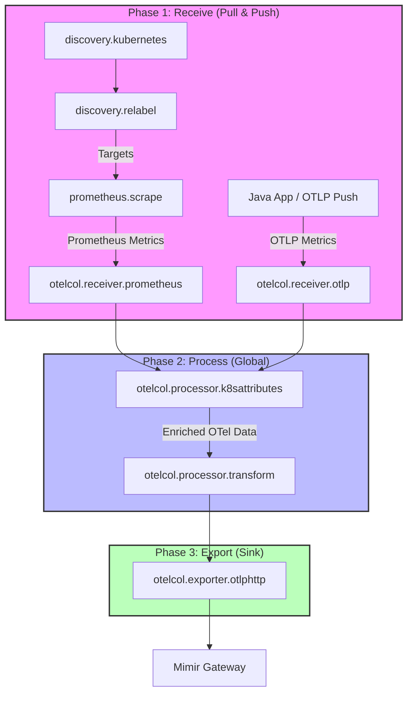

# Observability Data Pipeline Concept (Grafana Alloy)

## 1. Zielsetzung & Motivation

Aktuell müssen Standard-Labels (wie `cluster`, `namespace`, `pod`) für jedes Scrape-Target (z.B. Kubelet, cAdvisor, Mimir, Alloy) einzeln in der Konfiguration (via `discovery.relabel`) definiert und gemappt werden. Dies führt zu redundanter Konfiguration, ist fehleranfällig und erschwert das Hinzufügen neuer Targets.

Zusätzlich stehen wir vor dem Problem der **Label-Kompatibilität**:
*   **Moderne Instrumentierung (OpenTelemetry)** nutzt Semantic Conventions (z. B. `k8s.namespace.name`). Deine Java-Anwendung sendet diese standardmäßig.
*   **Bestehende Community-Dashboards** (z. B. Kubernetes Mixin oder fertige Dashboards aus dem Internet) erwarten klassische Prometheus-Labels (z. B. `namespace`, `cluster`, `pod`).

**Ziel dieses Konzepts** ist eine modulare, dreistufige Pipeline-Architektur (Receive -> Process -> Export), die das DRY-Prinzip (Don't Repeat Yourself) anwendet. Jedes Target wird nur minimal konfiguriert; die Anreicherung mit Kubernetes-Metadaten und die Übersetzung der Labels passieren an einer einzigen, zentralen Stelle.

---

## 2. Die Architektur: Receive -> Process -> Export

Wir strukturieren die Alloy-Konfiguration strikt in drei logische Phasen. Alle Daten (egal ob Prometheus-Scrape oder OTLP-Push der Java-App) fließen durch diese Pipeline.

### Phase 1: Receive (Target-Spezifisch)
Hier definieren wir nur, *was* gesammelt wird und welche *absolut spezifischen* Filter für genau dieses eine Target gelten.

**Zuständigkeiten:**
*   `discovery.kubernetes`: Finden der Endpunkte (Pods, Nodes).
*   `discovery.relabel`: Setzen der absoluten Basis-Labels (`job`, `instance`) und Filtern der Targets (z.B. "Scrape nur Mimir-Pods").
*   `prometheus.scrape`: Ausführen des eigentlichen Scrapes (nur für Pull-basierte Targets).
*   `otelcol.receiver.otlp`: Empfangen von Push-Metriken (z.B. von der Java-App).
*   `prometheus.relabel` (Optional): **Target-spezifische Metrik-Filter**. 
    *   *Beispiel ("Target Ape"):* Wenn die Metrik `food` vom Target `ape` das hochkardinale Label `banane` mitbringt, wird dieses Label *genau hier* und *nur für das Target Ape* über eine `labeldrop`-Aktion entfernt, bevor es in die globale Pipeline geht.

**Output:** Rohe, unvollständige Metriken, die an Phase 2 weitergegeben werden.

### Phase 2: Process (Global & Zentral)
Hier laufen alle Metriken aller Targets zusammen. Dies ist der "Single Point of Truth" für Anreicherung und Label-Mapping.

**Zuständigkeiten:**
1.  **Resource Attribute Enrichment (`otelcol.processor.k8sattributes`)**: 
    Hängt fehlende Kubernetes-Metadaten (Namespace, Pod-Name, Node-Name, Deployment-Name) als sogenannte "Resource Attributes" an die Metriken an. Der Prozessor unterhält dafür im Hintergrund eine eigene Verbindung zur Kubernetes-API und pflegt einen lokalen Cache aller Pod- und Namespace-Objekte.
2.  **Kopieren & Spiegeln von Labels (`otelcol.processor.transform`)**: 
    Kopiert (dupliziert) die OTel-spezifischen Attribute in die Welt der klassischen Prometheus-Dashboards und promotet sie zu Labels. Wir behalten bewusst beide Formate (OTel Semantic Conventions und Prometheus-Legacy) parallel im Datenstrom, um maximale Kompatibilität für alte und neue Dashboards zu gewährleisten.
    *   Kopiert `k8s.cluster.name` nach `cluster`
    *   Kopiert `k8s.namespace.name` nach `namespace`
    *   Kopiert `k8s.pod.name` nach `pod`

**Output:** Vollständig angereicherte, standardisierte Metriken mit sowohl OTel- als auch Prometheus-Labels.

### Phase 3: Export (Zentral)
Nimmt den Output aus Phase 2 und sendet ihn gebündelt an das Backend.

**Zuständigkeiten:**
*   `otelcol.exporter.otlphttp`: Senden der Daten an den Mimir Gateway.
*   Authentifizierung (Tenant-Header `X-Scope-OrgID`).

---

## 3. Technischer Deep Dive: Warum ist K8s-Anreicherung komplex?

Du hast angemerkt, dass es unklar ist, warum die K8s-Anreicherung nicht einfach ein trivialer "Process"-Schritt ist und warum wir bisher viel Logik in den Scrape-Targets hatten. 

Das liegt am fundamentalen Unterschied zwischen dem **Prometheus-Datenmodell** und dem **OpenTelemetry-Datenmodell**.

### Das Prometheus-Problem
Wenn Alloy via `prometheus.scrape` Daten abholt, sieht es nur nackte Metriken (z. B. `http_requests_total{status="200"}`). Prometheus selbst weiß nichts von Kubernetes. Damit Alloy weiß, dass dieser Endpunkt z.B. zu Pod X in Namespace Y gehört, nutzt es *Service Discovery* (`discovery.kubernetes`). 

Bisher haben wir diese Discovery-Daten (die Alloy beim Finden des Pods sammelt) über komplexe `discovery.relabel` Regeln direkt an die Metrik geklebt. Das mussten wir für jedes Target mühsam wiederholen.

### Die OTel-Lösung & "Pod Association"
In OpenTelemetry gibt es sogenannte **Resource Attributes**. Das sind Metadaten, die beschreiben, *woher* die Metrik kommt (die "Ressource", z.B. ein K8s Pod), abgekoppelt von den eigentlichen Metrik-Datenpunkten. Wenn OTel-Daten nach Mimir (Prometheus-Format) exportiert werden, wandelt der Exporter alle Resource Attributes automatisch in Prometheus-Labels um.

Der zentrale Prozessor `otelcol.processor.k8sattributes` in unserer Phase 2 nimmt uns die Arbeit ab: Er fragt die Kubernetes-API nach all diesen Metadaten (Labels, Annotations, Deployment-Zugehörigkeit). 

**Aber er muss wissen, für welchen Pod er die API fragen soll.** 
Das nennt man **Pod Association**.

*   **Wie erfährt die App ihren Namen? (Downward API):**
    Damit die Java-Anwendung ihren eigenen Pod-Namen (`k8s.pod.name`) mitsenden kann, muss dieser via **Kubernetes Downward API** als Umgebungsvariable in den Container injiziert werden. Der OTel-Operator automatisiert dies bei der Instrumentierung über die `Instrumentation` CR (er injiziert automatisch die Variable `OTEL_RESOURCE_ATTRIBUTES`). Ohne diese explizite "Zuarbeit" von Kubernetes "weiß" die App in ihrem isolierten Container absolut nichts von ihrer Identität in der Kubernetes-Welt.

*   **Warum kann die App nicht einfach "alles" mitsenden?**
    Theoretisch könnte man versuchen, mehr Informationen via Downward API in die App zu drücken. Das hat jedoch enge technische und sicherheitsrelevante Grenzen:
    1.  **Fehlende Hierarchie-Informationen**: Die Downward API kann den Pod-Namen liefern, aber **nicht** den Namen des übergeordneten `Deployments`, `StatefulSets` oder `ReplicaSets`. Diese Information existiert nur in der Kubernetes-API (OwnerReferences), auf die die App keinen Zugriff hat.
    2.  **Node-Kontext**: Die App kennt ihren Node-Namen, aber keine Node-Labels (z.B. Cloud-Provider Region, Instance-Typ).
    3.  **Sicherheitsrisiko (RBAC)**: Damit eine Anwendung ihren eigenen "Owner" oder zusätzliche K8s-Labels abfragen könnte, müsste sie einen `ServiceAccount` mit Leserechten auf die Kube-API besitzen. Es ist ein **Security-Anti-Pattern**, jeder Business-App solche Infrastruktur-Rechte zu geben.
    4.  **Effizienz**: Würden 500 Pods jeweils die Kube-API pollen, um ihren Kontext zu erfahren, würde das die Control-Plane unnötig belasten. Der zentrale Prozessor in Alloy tut dies einmalig und cached die Ergebnisse effizient.
    5.  **Konsistenz**: Der zentrale Prozessor in Alloy agiert als **"Single Source of Truth"**. Er nutzt die Quell-IP der Verbindung (`connection`), um den Pod sicher zu identifizieren und reichert für alle Applikationen identische, verifizierte Metadaten (Owner, Labels, Node-Infos) an.
*   **Bei Prometheus-Scrapes (Alloy):** Alloy scrapt die Metrik und wandelt sie intern in das OTel-Format um. Der K8s-Prozessor schaut sich die IP-Adresse an, von der Alloy gerade gescrapt hat (`connection`), identifiziert den Pod und holt die restlichen Metadaten.

Sobald der Prozessor den Pod identifiziert hat, fügt er automatisch alle OTel-Standard-Attribute hinzu (`k8s.namespace.name`, `k8s.pod.name`, etc.). 

Im letzten Schritt (Phase 2, Teil 2) nutzen wir dann einfach einen `transform` Prozessor, um diese standardisierten OTel-Attribute für unsere fertigen Dashboards in die klassischen Prometheus-Labels (`namespace`, `cluster`) zu spiegeln. Wir "übersetzen" also nicht im Sinne von Ersetzen, sondern wir **erweitern** den Label-Satz um eine kompatible Kopie, sodass sowohl OTel-native als auch klassische Dashboards gleichzeitig funktionieren.

---

## 4. Ziel-Konfiguration (Pseudo-Code)

So sieht die saubere, entkoppelte Konfiguration in Alloy konzeptionell aus:

```alloy
// ==========================================
// === PHASE 3: EXPORT ===
// ==========================================
otelcol.exporter.otlphttp "mimir" { ... }

// ==========================================
// === PHASE 2: PROCESS (ZENTRAL) ===
// ==========================================

// 2. Spiegeln der OTel-Labels für Dashboard-Kompatibilität (Prometheus)
otelcol.processor.transform "mirror_legacy_labels" {
  output { metrics = [otelcol.exporter.otlphttp.mimir.input] } // Geht zum Exporter
  metric_statements {
    context = "resource"
    statements = [
      "set(attributes[\"namespace\"], attributes[\"k8s.namespace.name\"])",
      "set(attributes[\"cluster\"], attributes[\"k8s.cluster.name\"])",
      "set(attributes[\"pod\"], attributes[\"k8s.pod.name\"])",
      // ...
    ]
  }
}

// 1. K8s Metadaten anreichern (Single Point of Truth)
otelcol.processor.k8sattributes "global_enrich" {
  output { metrics = [otelcol.processor.transform.mirror_legacy_labels.input] } // Geht zum Transform-Schritt
  pod_association { source { from = "connection" } }
}

// OTLP Receiver für die Java App (leitet direkt in die zentrale Pipeline)
otelcol.receiver.otlp "default" {
  grpc { endpoint = "0.0.0.0:4317" }
  output { metrics = [otelcol.processor.k8sattributes.global_enrich.input] }
}

// ==========================================
// === PHASE 1: RECEIVE (TARGET-SPEZIFISCH) ===
// ==========================================

// --- Target A: Mimir (Normaler Scrape) ---
discovery.kubernetes "mimir_pods" { ... }
discovery.relabel "mimir" { 
  // NUR Job und Instance setzen, KEIN Namespace/Pod Mapping hier!
}
prometheus.scrape "mimir" {
  forward_to = [otelcol.receiver.prometheus.mimir.receiver]
}
otelcol.receiver.prometheus "mimir" {
  output { metrics = [otelcol.processor.k8sattributes.global_enrich.input] } // Geht in die zentrale Pipeline
}


// --- Target B: Das "Ape" Beispiel (Spezifischer Filter) ---
discovery.kubernetes "ape_pods" { ... }

// Hier entfernen wir target-spezifisch das Label "banane"
prometheus.relabel "filter_ape_banane" {
  forward_to = [otelcol.receiver.prometheus.ape.receiver]
  rule {
    action = "labeldrop"
    regex = "banane" // Entfernt das hochkardinale 'banane' Label nur für Ape
  }
}

prometheus.scrape "ape" {
  forward_to = [prometheus.relabel.filter_ape_banane.receiver] // Geht ERST durch den spezifischen Filter
}

---

## 5. Visualisierung der Komponenten-Kette

Das folgende Diagramm zeigt den exakten Weg eines Datenpunkts durch die Alloy-Komponenten.



### Komponenten-Erklärung

#### 1. Discovery & Scraping (Die "Fühler")
*   **`discovery.kubernetes`**: Spricht mit dem K8s-API-Server, um IP-Adressen von Pods oder Nodes zu finden.
*   **`discovery.relabel`**: Filtert die gefundenen Ziele (z.B. "nur Pods mit Label 'app=mimir'") und setzt die Basis-Labels `job` und `instance`.
*   **`prometheus.scrape`**: Der eigentliche "Staubsauger", der die `/metrics` Endpunkte abfragt.
*   **`otelcol.receiver.prometheus`**: Ein Übersetzer. Er nimmt die Prometheus-Daten und wandelt sie in das interne OpenTelemetry-Format (OTel) um, damit wir sie mit mächtigeren Prozessoren bearbeiten können.

#### 2. Central Processing (Die "Fabrik")
*   **`otelcol.processor.k8sattributes`**: Die Intelligenz-Zentrale. Er nimmt die IP-Adresse des Datenpunkts, schaut in seinem K8s-Cache nach und fügt die "Resource Attributes" (Deployment, ReplicaSet, Labels) hinzu. Er ist der einzige, der RBAC-Rechte für die API benötigt.
*   **`otelcol.processor.transform`**: Der Label-Spiegler. Er nutzt die "OpenTelemetry Transformation Language" (OTTL), um Felder zu kopieren. Er sorgt dafür, dass aus dem OTel-Attribut `k8s.namespace.name` das klassische Prometheus-Label `namespace` wird, ohne das Original zu löschen.

#### 3. Export (Der "Versand")
*   **`otelcol.exporter.otlphttp`**: Bündelt alle bearbeiteten Daten und sendet sie komprimiert via OTLP über HTTP an den Mimir-Gateway. Hier wird auch der `X-Scope-OrgID` Header für das Multi-Tenancy-System von Mimir gesetzt.

