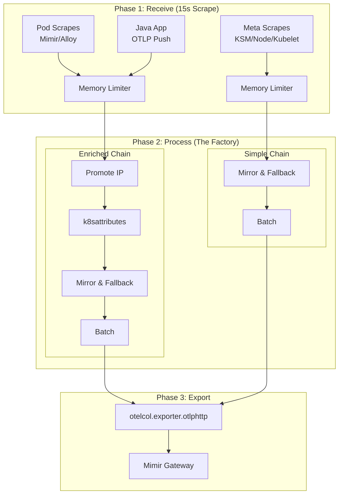

# Observability Data Pipeline Concept (Grafana Alloy)

## 1. Zielsetzung & Motivation

Aktuell müssen Standard-Labels (wie `cluster`, `namespace`, `pod`) für jedes Scrape-Target (z.B. Kubelet, cAdvisor, Mimir, Alloy) einzeln in der Konfiguration (via `discovery.relabel`) definiert und gemappt werden. Dies führt zu redundanter Konfiguration, ist fehleranfällig und erschwert das Hinzufügen neuer Targets.

Zusätzlich stehen wir vor dem Problem der **Label-Kompatibilität**:
*   **Moderne Instrumentierung (OpenTelemetry)** nutzt Semantic Conventions (z. B. `k8s.namespace.name`). Deine Java-Anwendung sendet diese standardmäßig.
*   **Bestehende Community-Dashboards** (z. B. Kubernetes Mixin oder fertige Dashboards aus dem Internet) erwarten klassische Prometheus-Labels (z. B. `namespace`, `cluster`, `pod`).

**Ziel dieses Konzepts** ist eine modulare Pipeline-Architektur (Receive -> Process -> Export), die das DRY-Prinzip (Don't Repeat Yourself) anwendet. Jedes Target wird nur minimal konfiguriert; die Anreicherung mit Kubernetes-Metadaten und die Übersetzung der Labels passieren an einer einzigen, zentralen Stelle.

### 1.1 Architektonische Leitplanken
*   **Topologie (DaemonSet)**: Alloy MUSS als DaemonSet betrieben werden, damit die netzwerkbasierte Pod-Identifizierung (`connection`) für OTLP-Push-Metriken (z.B. aus der Java-App) funktioniert. Hinter einem Kubernetes-Service (Deployment) ginge die originale Quell-IP durch NAT/Kube-Proxy verloren.
*   **Pipeline-Splitting (Dual Chain)**: Wir unterscheiden zwischen direkten Pod-Scrapes (Anreicherung nötig) und Meta-Exportern (Original-Labels erhalten).
*   **Scope (Signals)**: Dieses Konzept fokussiert sich primär auf den **Metrik-Fluss**. Sobald Logs (Loki) und Traces (Tempo) angebunden werden, fließen auch diese Signale durch dieselbe zentrale Phase 2.

---

## 2. Die Architektur: Receive -> Process -> Export

Wir strukturieren die Alloy-Konfiguration in drei logische Phasen. Daten fließen je nach Herkunft durch spezialisierte Prozessierungsketten.

### Phase 1: Receive (Target-Spezifisch)
Hier definieren wir nur, *was* gesammelt wird.
**Wichtig:** Alle Targets nutzen ein einheitliches Scrape-Intervall von **15s**, um stabile Berechnungen (z.B. `rate()`) in Dashboards zu ermöglichen.

### Phase 2: Process (The Factory)
Dies ist der "Single Point of Truth". Wir nutzen zwei Ketten:

#### A. Enriched Chain (für direkte Pod-Scrapes wie Mimir, Alloy)
Hier ist das Target selbst "dumm" (kennt seinen K8s-Kontext nicht).
1.  **Memory Limiter**: Schutz vor OOM.
2.  **Pod IP Promotion**: Zieht `k8s_pod_ip` auf Resource-Ebene.
3.  **k8sattributes**: API-basierte Anreicherung (Namespace, Pod, Deployment).
4.  **Cluster Inject**: Setzt `k8s.cluster.name`.
5.  **Mirror & Fallback**: Erzeugt Prometheus-Legacy Labels (`namespace`, `pod`) aus OTel-Attributen.
6.  **Batching**: Performance-Bündelung.

#### B. Simple Chain (für Meta-Exporter wie KSM, Node-Exporter, Kubelet)
Diese Targets liefern bereits Kontext für *andere* Ressourcen (z.B. KSM liefert Labels für alle Pods im Cluster).
*   **KEIN k8sattributes**: Wir verhindern, dass die Labels des Exporters (z.B. `namespace="alloy"`) die Labels der gemeldeten Ressourcen überschreiben.
*   **Nur Mirror & Fallback**: Stellt sicher, dass das Dual-Labeling (`k8s_*` und Legacy) auch hier konsistent ist.

### Phase 3: Export (Zentral)
Nimmt den Output aus Phase 2 und sendet ihn via `otelcol.exporter.otlphttp` an das Backend (Mimir).

---

## 3. Technischer Deep Dive: Warum ist K8s-Anreicherung komplex?

### Die OTel-Lösung & "Pod Association"
In OpenTelemetry gibt es sogenannte **Resource Attributes**. Das sind Metadaten, die beschreiben, *woher* die Metrik kommt (z.B. ein K8s Pod). 

Der zentrale Prozessor `otelcol.processor.k8sattributes` nimmt uns die Arbeit ab: Er fragt die Kubernetes-API nach all diesen Metadaten (Labels, Annotations, Deployment). **Dafür benötigt Alloy spezifische RBAC-Rechte (get, list, watch für pods, namespaces, replicasets, deployments)**.

**Aber er muss wissen, für welchen Pod er die API fragen soll.** 
Das nennt man **Pod Association**. Wir nutzen zwei Strategien:

*   **Bei OTLP-Push (Java App):**
    Die App kennt zwar via Downward API ihren Pod-Namen, aber nicht ihren Owner (Deployment). Der K8s-Prozessor nimmt die Quell-IP der Verbindung (`connection`) zur Identifizierung.
*   **Bei Prometheus-Scrapes (Alloy Pull - Pod Level):**
    Wir sichern die IP im `discovery.relabel` als `k8s_pod_ip`. Die Enriched Chain promotet diese zur `k8s.pod.ip` Resource, damit `k8sattributes` den Pod assoziieren kann.
*   **WICHTIG: Sonderfall KSM / Node-Exporter:**
    Hier darf keine automatische Pod-Association stattfinden! Würden wir diese durch `k8sattributes` jagen, würden alle Metriken (egal aus welchem Namespace) das Label `namespace="alloy"` bekommen, da dies der Namespace des Exporters ist. Deshalb nutzt KSM die **Simple Chain**.

---

## 4. Implementierungs-Highlights

Die aktuelle Konfiguration (siehe `apps/alloy/prod/templates/alloy-configmap.yaml`) setzt folgende Standards um:

1.  **Node-basierte Discovery für Node-Exporter**: 
    Verwendet `role = "node"`. Dadurch wird das `instance`-Label auf den **Node-Namen** (z.B. `noctua`) gesetzt. Dies ist essenziell für Joins mit cAdvisor-Daten, die denselben Standard nutzen.
2.  **Flattened Configuration**:
    Vermeidung von tief verschachtelten Modulen, um Scoping-Fehler und Start-Probleme zu minimieren.
3.  **Semicolon-Free Syntax**:
    Striktes Einhalten der Alloy-Syntax (keine `;` am Zeilenende, saubere Block-Trennung).
4.  **Fallback Labeling**:
    ```alloy
    // Wenn OTel Attribute fehlen, nimm Prometheus Labels (und umgekehrt)
    "set(attributes[\"k8s_namespace_name\"], attributes[\"namespace\"]) where attributes[\"namespace\"] != nil and attributes[\"k8s_namespace_name\"] == nil"
    ```

---

## 5. Visualisierung der Komponenten-Kette


