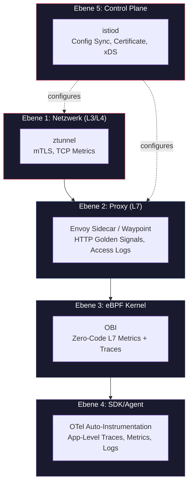
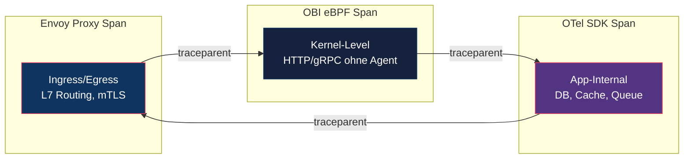
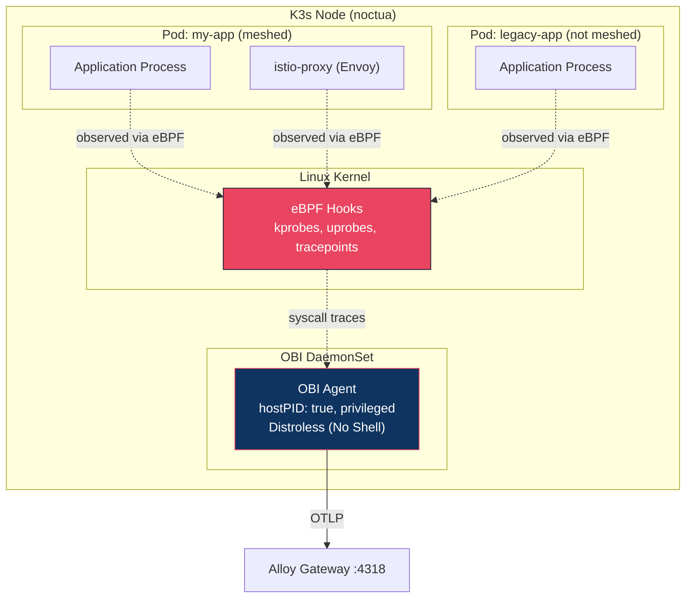
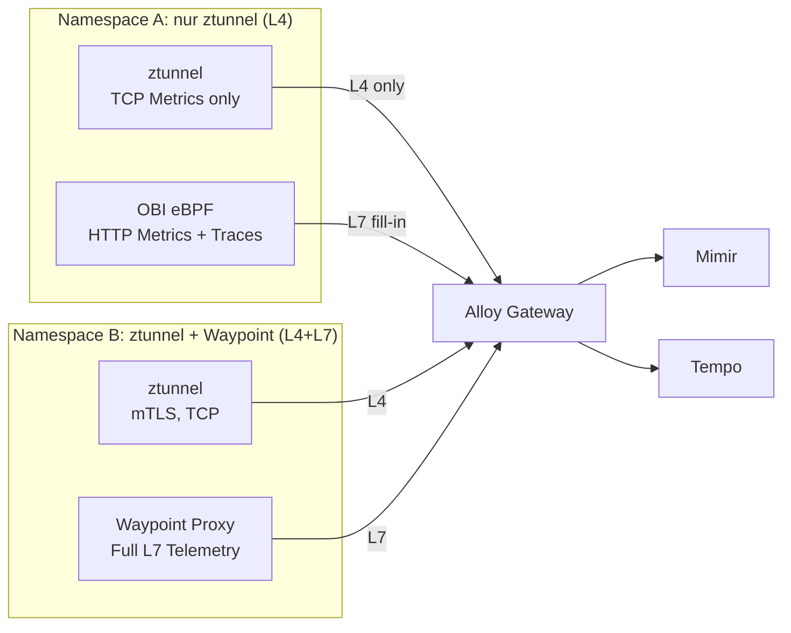

2# Observability × Istio: Feature-Masterplan

> **Source of Truth** für alle Pläne, Features und Synergien an der Schnittstelle von **Istio Service Mesh** und dem **LGTM Observability Stack** (Loki · Grafana · Tempo · Mimir) auf dem Cluster `noctua`.
>
> Dieses Dokument ersetzt und erweitert die bisherigen Observability-Abschnitte in [istio-tech-requirements.md](./istio-tech-requirements.md) (§5) und ist die alleinige Referenz für alle Umsetzungsvorhaben in diesem Bereich.

---

## Inhaltsübersicht

1. [Kontext: Was haben wir heute?](#1-kontext-was-haben-wir-heute)
2. [Die fünf Telemetrie-Ebenen](#2-die-fünf-telemetrie-ebenen)
3. [Feature-Katalog: Metrics](#3-feature-katalog-metrics)
4. [Feature-Katalog: Traces](#4-feature-katalog-traces)
5. [Feature-Katalog: Logs](#5-feature-katalog-logs)
6. [Feature-Katalog: Mesh Topology & Visualization](#6-feature-katalog-mesh-topology--visualization)
7. [Feature-Katalog: Alerting & SLOs](#7-feature-katalog-alerting--slos)
8. [Synergie-Matrix: Werkzeuge × Signale](#8-synergie-matrix-werkzeuge--signale)
9. [OBI: eBPF-basiertes Zero-Code Monitoring (Warum nicht Beyla?)](#9-obi-ebpf-basiertes-zero-code-monitoring-warum-nicht-beyla)
10. [OTel Auto-Instrumentation im Mesh-Kontext](#10-otel-auto-instrumentation-im-mesh-kontext)
11. [Ambient Mesh: Sonderfall ztunnel + Waypoint](#11-ambient-mesh-sonderfall-ztunnel--waypoint)
12. [Implementierungs-Roadmap](#12-implementierungs-roadmap)
13. [Offene Fragen & Entscheidungsbedarf](#13-offene-fragen--entscheidungsbedarf)

---

## 1. Kontext: Was haben wir heute?

### Bestehender Stack (Cluster `noctua`)

| Komponente | Status | Relevanz für Istio |
|:---|:---|:---|
| **Grafana Alloy** (2-Tier: Agent + Gateway) | ✅ Produktiv | Zentraler Collector für alle Signale |
| **Mimir** (Distributed, Filesystem) | ✅ Produktiv | Metrics-Backend (PromQL) |
| **Tempo** | 🟡 Deployed, nicht voll genutzt | Traces-Backend (TraceQL) |
| **Loki** | ❌ Geplant | Logs-Backend |
| **OTel Operator** | ✅ Deployed | Auto-Instrumentation (Java CR vorhanden) |
| **OBI** (eBPF) | 🟡 Template vorhanden, `enabled: false` | Zero-Code L7 Telemetrie |
| **Istio** (base + istiod) | ✅ Deployed als Gateway | mTLS, Gateway API, Envoy Proxies |
| **Kiali** | 🟡 Chart vorhanden, `enabled: false` | Mesh Topology Visualization |
| **Grafana Dashboards** | ✅ Kubernetes, ArgoCD, Mimir, Alloy | Keine Istio-Dashboards bisher |

### Was Istio-Tech-Requirements (§5) bereits abdeckt

- Golden Signals aus Proxies ohne App-Instrumentierung *(Feature OBS-M-01)*
- Prometheus-Scraping der Proxy-Metriken *(Feature OBS-M-02)*
- W3C Trace-Context Header Propagation *(Feature OBS-T-01)*
- Proxy-generierte Spans *(Feature OBS-T-02)*
- Kiali Topology *(Feature OBS-V-01)*

**Was fehlt und in diesem Dokument hinzukommt:** Alles unterhalb dieser Oberfläche — die tiefe Integration mit dem bestehenden LGTM-Stack, eBPF-Synergien, Auto-Instrumentation im Mesh-Kontext, Ambient-Mesh-Besonderheiten, SLO-Automatisierung, Cross-Signal-Korrelation, und konkreter Umsetzungsplan.

---

## 2. Die fünf Telemetrie-Ebenen

Istio operiert auf **mehreren Ebenen**, die unterschiedliche Signalquellen und Werkzeug-Synergien erzeugen:



**Jede Ebene liefert Signale, die sich gegenseitig ergänzen, nicht ersetzen.** Die Kunst liegt in der Korrelation und Deduplizierung.

---

## 3. Feature-Katalog: Metrics

### OBS-M-01: Envoy Proxy Standard Metrics (Sidecar / Waypoint)

| Eigenschaft | Detail |
|:---|:---|
| **Signal** | Metrics |
| **Quelle** | Envoy Proxy (Sidecar oder Waypoint) |
| **Instrumentierung** | Keine (Zero-Code, aus dem Mesh) |
| **Metriken** | `istio_requests_total`, `istio_request_duration_milliseconds`, `istio_tcp_sent_bytes_total`, `istio_tcp_received_bytes_total`, `istio_request_bytes`, `istio_response_bytes` |
| **Labels** | `source_workload`, `destination_workload`, `source_namespace`, `destination_namespace`, `response_code`, `request_protocol`, `connection_security_policy` |
| **Backend** | Mimir |
| **Scraper** | Alloy via `prometheus.scrape` oder Istio Telemetry API → OTLP |

**Umsetzung:**

1. **Variante A (Prometheus Scrape):** Alloy scraped die Envoy-Proxy `/stats/prometheus` Endpoints direkt. Erfordert ServiceMonitor oder Annotation-based Discovery.
2. **Variante B (Istio Telemetry API → OTLP):** Istio 1.22+ unterstützt natives OTLP-Export über die `Telemetry` CRD. Metrics werden direkt als OTLP an den Alloy-Gateway gepusht.

**Empfehlung:** Variante B (OTLP) bevorzugen — passt in unsere bestehende 2-Tier-Architektur und vermeidet Scrape-Discovery-Komplexität. Proxy-Metriken fließen direkt in den Gateway-Pipeline-Pfad (groupbyattrs → promote_meta → k8sattributes → dual_semantics → Mimir).

**Synergie mit bestehendem Stack:**
- Die `dual_semantics`-Pipeline im Alloy-Gateway stellt sicher, dass sowohl OTel-Attribute (`k8s.namespace.name`) als auch Prometheus-Labels (`namespace`) parallel vorliegen.
- Upstream Istio Grafana Dashboards (die `istio_requests_total{destination_workload="..."}` abfragen) funktionieren sofort.

---

### OBS-M-02: Istio Control Plane Metrics (istiod)

| Eigenschaft | Detail |
|:---|:---|
| **Signal** | Metrics |
| **Quelle** | istiod (Pilot, Citadel, Galley) |
| **Metriken** | `pilot_xds_pushes_total`, `pilot_proxy_convergence_time`, `citadel_server_csr_count`, `pilot_conflict_inbound_listener`, `pilot_total_xds_rejects`, `galley_validation_passed` |
| **Scraper** | Alloy via ServiceMonitor auf `istiod:15014` |

**Umsetzung:**
- ServiceMonitor für `istiod` deployen (Port `15014`, Pfad `/metrics`).
- Alloy `prometheusOperatorObjects` Feature ist bereits aktiv → der ServiceMonitor wird automatisch gescraped.

**Dashboard:** Offizielle Istio Control-Plane-Dashboards von [istio.io/grafana](https://grafana.com/grafana/dashboards/?search=istio) herunterladen und unter `apps/grafana/noctua/files/istio/dashboards/` ablegen.

---

### OBS-M-03: Envoy Internal Metrics (Deep Proxy Health)

| Eigenschaft | Detail |
|:---|:---|
| **Signal** | Metrics |
| **Quelle** | Envoy Proxy Internals |
| **Metriken** | `envoy_cluster_upstream_cx_active`, `envoy_cluster_upstream_rq_retry`, `envoy_http_downstream_cx_active`, `envoy_server_memory_allocated`, `envoy_cluster_circuit_breakers_*` |

**Warum relevant:** Golden Signals allein reichen nicht für Root-Cause-Analysis. Circuit-Breaker-Auslösungen, Connection-Pool-Erschöpfung und Retry-Storms sind nur über Envoy-Internals sichtbar.

**Umsetzung:** Envoy Stats-Filter über `EnvoyFilter` oder `ProxyConfig` konfigurieren. Standardmäßig exponiert Istio nur eine Teilmenge; für Deep-Debugging müssen zusätzliche `stat_prefix`-Filter aktiviert werden.

---

### OBS-M-04: OBI eBPF Metrics (Netzwerk-Layer ohne Proxy-Overhead)

| Eigenschaft | Detail |
|:---|:---|
| **Signal** | Metrics |
| **Quelle** | eBPF Hooks im Kernel |
| **Instrumentierung** | Zero-Code, kein Sidecar notwendig |
| **Metriken** | `http_server_request_duration_seconds`, `http_server_request_body_size_bytes`, `rpc_server_duration`, `dns_request_duration`, `tcp_connection_duration` |
| **Semantik** | OTel Semantic Conventions nativ |

**Synergie mit Istio:** OBI kann als **unabhängiger Validierungs-Layer** dienen:
- **Vergleich Proxy-Metriken vs. eBPF-Metriken:** Wenn Envoy meldet, dass Latenz bei 50ms liegt, aber OBI am Kernel 200ms misst, deutet die Differenz auf Proxy-Overhead oder Netzwerk-Probleme hin.
- **Ambient Mesh ohne Waypoint:** In Namespaces ohne Waypoint Proxy liefert ztunnel nur L4-Metriken. OBI füllt die L7-Lücke.
- **Non-Mesh-Workloads:** OBI instrumentiert auch Pods, die nicht im Mesh sind.

**Umsetzung:** OBI DaemonSet Template existiert bereits (`apps/otel-operator/noctua/templates/obi-daemonset.yaml`). Aktivierung: `obi.enabled: true`. OTLP-Endpoint auf Alloy-Gateway umstellen (`http://alloy-gateway.alloy.svc.cluster.local:4318`).

---

### OBS-M-05: mTLS Certificate Health Metrics

| Eigenschaft | Detail |
|:---|:---|
| **Signal** | Metrics |
| **Quelle** | istiod (Citadel) + Envoy Proxy |
| **Metriken** | `citadel_server_csr_count`, `citadel_server_success_cert_issuance_count`, `envoy_ssl_handshake`, `envoy_ssl_connection_error`, Zertifikat-Ablaufzeit |

**Warum relevant:** In einem Zero-Trust-Mesh ist die Zertifikats-Gesundheit sicherheitskritisch. Wenn Zertifikate nicht rotiert werden oder mTLS-Handshakes fehlschlagen, bricht die Kommunikation lautlos.

**Umsetzung:**
- istiod-ServiceMonitor liefert Citadel-Metriken.
- Envoy-Proxy-Metriken enthalten SSL-Statistiken.
- Alert-Rule: `citadel_server_csr_count` stagniert → Zertifikatsrotation stockt.

---

### OBS-M-06: Gateway API Traffic Metrics (North-South)

| Eigenschaft | Detail |
|:---|:---|
| **Signal** | Metrics |
| **Quelle** | Istio Gateway (Envoy am Ingress-Punkt) |
| **Metriken** | Dieselben wie OBS-M-01, aber mit `reporter="destination"` und Gateway-spezifischen Labels |
| **Besonderheit** | Unser `main-gateway` in `istio-system` ist der zentrale Ingress-Punkt |

**Umsetzung:** Der Gateway Pod (`main-gateway-istio`) exponiert Envoy-Metriken. ServiceMonitor oder Pod-Annotation für Alloy Discovery konfigurieren.

**Dashboard:** Dediziertes "Istio Gateway" Dashboard mit:
- Requests/sec nach Host (`HTTPRoute`)
- Error-Rate nach Backend-Service
- TLS-Handshake-Latenz
- Connection Pooling Status

---

## 4. Feature-Katalog: Traces

### OBS-T-01: Envoy-generierte Distributed Traces

| Eigenschaft | Detail |
|:---|:---|
| **Signal** | Traces |
| **Quelle** | Envoy Proxy (automatisch) |
| **Backend** | Tempo |
| **Protokoll** | OTLP (über Istio Telemetry API) oder Zipkin |
| **Span-Inhalt** | HTTP Method, Path, Response Code, Upstream Cluster, Downstream Client IP, mTLS-Status |

**Umsetzung (Istio Telemetry CRD):**

```yaml
apiVersion: telemetry.istio.io/v1
kind: Telemetry
metadata:
  name: mesh-tracing
  namespace: istio-system
spec:
  tracing:
    - providers:
        - name: otel-collector
      randomSamplingPercentage: 100  # Start aggressiv, später reduzieren
      customTags:
        mesh.component:
          literal:
            value: "envoy-proxy"
```

**Mesh Extension Provider (istiod config):**

```yaml
meshConfig:
  extensionProviders:
    - name: otel-collector
      opentelemetry:
        service: alloy-gateway.alloy.svc.cluster.local
        port: 4317  # gRPC OTLP
```

**Synergie mit bestehendem Stack:**
- Traces fließen über denselben Alloy-Gateway, der bereits für Metriken konfiguriert ist.
- Der `k8sattributes`-Prozessor reichert Trace-Spans mit Kubernetes-Kontext an (Pod, Namespace, Deployment).
- In Grafana ermöglicht die Tempo-Datasource direktes Drill-Down von Metriken zu Traces ("Exemplars").

---

### OBS-T-02: OBI eBPF Distributed Traces

| Eigenschaft | Detail |
|:---|:---|
| **Signal** | Traces |
| **Quelle** | eBPF Kernel Hooks |
| **Besonderheit** | Traces **ohne jegliche Instrumentation** — auch für Go, Rust, C++ Binaries |

**Synergie mit Istio:**
- **Trace Stitching:** Envoy generiert einen Span für die Proxy-Ebene. OBI generiert einen Span für die Applikations-Ebene. Wenn beide W3C `traceparent` propagieren, entsteht ein vollständiger End-to-End-Trace.
- **Gap Detection:** OBI sieht, was der Envoy Proxy nicht sieht — z.B. interne Datenbankaufrufe oder lokale File-I/O.

**Wichtig:** OBI kann nur dann W3C-Context weiter propagieren, wenn die Applikation den `traceparent` Header durchreicht. Ohne dies entstehen isolierte Spans.

---

### OBS-T-03: OTel Auto-Instrumentation Traces (SDK-Level)

| Eigenschaft | Detail |
|:---|:---|
| **Signal** | Traces |
| **Quelle** | OTel Java Agent (Bytecode-Injection) |
| **Besonderheit** | Tiefste Instrumentierung: sieht DB-Queries, externe HTTP-Calls, Message-Queue-Interaktionen |

**Aktuelle Konfiguration:** `Instrumentation` CR existiert (`java-instrumentation`), aber Traces-Export ist `none`. Muss aktiviert werden.

**Dreieck der Trace-Quellen im Mesh:**



**Jede Ebene deckt einen anderen Blindspot ab:**
- Envoy sieht das Mesh (Routing, mTLS, Retries).
- OBI sieht das Netzwerk (auch Nicht-Mesh-Traffic).
- OTel SDK sieht die Applikation (Businesslogik, DB-Queries).

---

### OBS-T-04: Trace-to-Metrics Korrelation (Exemplars)

| Eigenschaft | Detail |
|:---|:---|
| **Signal** | Metrics → Traces |
| **Quelle** | Alloy Processor |
| **Backend** | Mimir + Tempo |

**Konzept:** Exemplars sind Trace-IDs, die an Metrik-Samples angehängt werden. In Grafana klickt man auf einen Datenpunkt in einem Metriken-Panel und springt direkt zum korrespondierenden Trace in Tempo.

**Umsetzung:**
1. Alloy muss Exemplars aus Prometheus-Scrapes extrahieren und durchreichen.
2. Mimir muss Exemplars speichern (`ingester.exemplars_update_period` konfigurieren).
3. Grafana Datasource: Mimir + Tempo als korrelierte Datenquellen verknüpfen.

**Synergie:** Istio-Proxy-Metriken (`istio_requests_total`) können mit Trace-IDs aus dem `x-request-id` Header angereichert werden.

---

### OBS-T-05: Trace Sampling Strategien im Mesh

| Strategie | Beschreibung | Use Case |
|:---|:---|:---|
| **Head-based (Istio Telemetry)** | Entscheidung am Ingress-Gateway, ob ein Request getraced wird | Einfachste Variante, Risiko: relevante Fehler-Traces werden verworfen |
| **Tail-based (Alloy/OTel Collector)** | Entscheidung nach Abschluss aller Spans, basierend auf Attributen (Error, Latenz) | Präziser, aber ressourcenintensiv; Alloy muss alle Spans im Memory halten |
| **Probabilistic** | Fester Prozentsatz (z.B. 5%) aller Requests | Guter Kompromiss für Produktion |
| **Error-only** | Nur Traces mit `status_code >= 400` oder `error=true` | Minimaler Overhead, maximaler Debug-Wert |

**Empfehlung für noctua:** Start mit Head-based 100% (Cluster ist klein), dann Migration zu Tail-based mit Error-Bias sobald Tempo stabil.

---

## 5. Feature-Katalog: Logs

### OBS-L-01: Envoy Access Logs → Loki

| Eigenschaft | Detail |
|:---|:---|
| **Signal** | Logs (Structured) |
| **Quelle** | Envoy Proxy Access Log |
| **Format** | JSON (konfigurierbar über `MeshConfig.accessLogFormat`) |
| **Backend** | Loki |
| **Collector** | Alloy (`loki.source.kubernetes` oder `otelcol.receiver.otlp` mit Log-Support) |

**Inhalt eines Envoy Access Logs:**
```json
{
  "start_time": "2026-05-29T20:00:00.000Z",
  "method": "GET",
  "path": "/api/v1/users",
  "protocol": "HTTP/2",
  "response_code": 503,
  "response_flags": "UF",  // Upstream Connection Failure
  "upstream_cluster": "outbound|8080||user-service.default.svc.cluster.local",
  "downstream_remote_address": "10.42.0.15:45832",
  "duration": 1500,
  "authority": "api.saadisfy.me",
  "x_request_id": "a1b2c3d4-e5f6-7890",
  "traceparent": "00-0af7651916cd43dd8448eb211c80319c-b7ad6b7169203331-01"
}
```

**Synergie mit Traces:** Das Feld `traceparent` im Access Log ermöglicht direktes Drill-Down: Log → Trace → Span.

**Synergie mit Metrics:** `response_flags` wie `UF` (Upstream Failure), `UO` (Upstream Overflow / Circuit Breaker), `RL` (Rate Limited) geben Kontext, den reine Metriken nicht liefern.

**Umsetzung:**
1. `meshConfig.accessLogFile: /dev/stdout` aktivieren.
2. `meshConfig.accessLogEncoding: JSON` setzen.
3. Alloy sammelt Logs via Kubernetes Log Collection und routet sie an Loki.
4. Label-Extraktion: `namespace`, `pod`, `response_code`, `response_flags` als Loki-Labels.

---

### OBS-L-02: istiod Control Plane Logs → Loki

| Eigenschaft | Detail |
|:---|:---|
| **Signal** | Logs |
| **Quelle** | istiod Container Logs |
| **Relevanz** | Config-Push-Fehler, xDS-Rejects, Certificate-Issues |

**Umsetzung:** Standard Kubernetes Log Collection via Alloy. Kein Extra-Aufwand — sobald Loki aktiv ist, werden istiod-Logs automatisch erfasst.

---

### OBS-L-03: Log-basiertes Alerting auf Envoy Response Flags

| Eigenschaft | Detail |
|:---|:---|
| **Signal** | Logs → Alerts |
| **Quelle** | Envoy Access Logs in Loki |

**Wertvolle Response Flags für Alerts:**

| Flag | Bedeutung | Alert-Schwere |
|:---|:---|:---|
| `UF` | Upstream Connection Failure | ⚠️ Warning |
| `UO` | Upstream Overflow (Circuit Breaker offen) | 🔴 Critical |
| `RL` | Rate Limited | ⚠️ Warning |
| `NR` | No Route configured | 🔴 Critical |
| `DC` | Downstream Connection Termination | Info |
| `DI` | Delay Injected (Fault Injection aktiv) | Info |

**LogQL Alert-Beispiel:**
```logql
count_over_time({namespace=~".+", container="istio-proxy"} |= "response_flags" | json | response_flags="UO" [5m]) > 10
```

---

## 6. Feature-Katalog: Mesh Topology & Visualization

### OBS-V-01: Kiali Service Graph

| Eigenschaft | Detail |
|:---|:---|
| **Werkzeug** | Kiali |
| **Datenquelle** | Prometheus/Mimir (Istio-Metriken) |
| **Funktionen** | Traffic-Flow, mTLS-Status, Error-Rate, Latenz, Config Validation |
| **Deployment** | Helm Chart bereits vorhanden (`kiali-server`, `enabled: false`) |

**Umsetzung:**
1. `kiali-server.enabled: true` in `apps/istio/base/values.yaml`.
2. Kiali Prometheus-Endpoint auf Mimir umkonfigurieren:
   ```yaml
   kiali-server:
     external_services:
       prometheus:
         url: http://mimir-query-frontend.mimir.svc.cluster.local:8080/prometheus
         custom_headers:
           X-Scope-OrgID: "1"
       tracing:
         enabled: true
         provider: tempo
         internal_url: http://tempo-query-frontend.tempo.svc.cluster.local:3200
       grafana:
         enabled: true
         internal_url: http://grafana.grafana.svc.cluster.local
   ```

**Synergie mit LGTM:** Kiali wird zum visuellen Einstiegspunkt:
- Klick auf einen Service → Grafana Dashboard mit Metriken
- Klick auf eine Kante → Tempo Traces für diese Service-to-Service-Kommunikation
- Klick auf einen Fehler → Loki Logs mit Response Flags

---

### OBS-V-02: Grafana Service Map Panel (Native)

| Eigenschaft | Detail |
|:---|:---|
| **Werkzeug** | Grafana (Node Graph Panel) |
| **Datenquelle** | Tempo (Service Graph) oder Mimir (Istio Metriken) |

**Konzept:** Grafana kann Tempo-Daten als Service Map rendern (ohne Kiali). Das ist leichtgewichtiger als Kiali, bietet aber weniger Mesh-spezifische Features (kein mTLS-Status, keine Config-Validierung).

**Empfehlung:** Beide parallel deployen — Kiali für Mesh-Operations, Grafana Service Map für Developer-Fokus.

---

## 7. Feature-Katalog: Alerting & SLOs

### OBS-A-01: Golden Signal Alerts für Mesh-Services

| Signal | Alert-Name | PromQL |
|:---|:---|:---|
| **Error Rate** | `IstioServiceHighErrorRate` | `sum(rate(istio_requests_total{response_code=~"5.."}[5m])) by (destination_workload, destination_namespace) / sum(rate(istio_requests_total[5m])) by (destination_workload, destination_namespace) > 0.05` |
| **Latency P99** | `IstioServiceHighLatency` | `histogram_quantile(0.99, sum(rate(istio_request_duration_milliseconds_bucket[5m])) by (le, destination_workload)) > 1000` |
| **Traffic** | `IstioServiceTrafficDrop` | `sum(rate(istio_requests_total[5m])) by (destination_workload) < 0.1` (für kritische Services) |
| **Saturation** | `EnvoyConnectionPoolExhausted` | `envoy_cluster_upstream_cx_active / envoy_cluster_upstream_cx_max > 0.9` |

**Umsetzung:** Als Mimir Recording/Alert Rules unter `apps/mimir/noctua/files/istio/alerts.yaml` deployen.

---

### OBS-A-02: Control Plane Health Alerts

| Alert | PromQL | Schwere |
|:---|:---|:---|
| `IstiodPilotXdsPushErrors` | `rate(pilot_xds_pushes_total{type="nack"}[5m]) > 0` | Critical |
| `IstiodHighProxyConvergence` | `pilot_proxy_convergence_time{quantile="0.99"} > 30` | Warning |
| `IstiodCertificateRotationFailed` | `increase(citadel_server_csr_count[1h]) == 0` (wenn Proxies existieren) | Critical |
| `IstioMeshMtlsViolation` | `envoy_ssl_connection_error > 0` | Critical |

---

### OBS-A-03: SLO-basiertes Alerting (Burn-Rate)

| Eigenschaft | Detail |
|:---|:---|
| **Konzept** | Multi-Window Burn-Rate SLOs nach Google SRE Buch |
| **Ziel** | Automatisches Alerting basierend auf Error-Budget-Verbrauch |

**Beispiel-SLO: Verfügbarkeit 99.9% für Service `api-gateway`:**

```yaml
# Recording Rules
- record: istio:service_availability:ratio_rate1h
  expr: |
    1 - (
      sum(rate(istio_requests_total{response_code=~"5..", destination_workload="api-gateway"}[1h]))
      /
      sum(rate(istio_requests_total{destination_workload="api-gateway"}[1h]))
    )

# Burn-Rate Alert (1h Window)
- alert: IstioSLOBurnRateHigh
  expr: |
    (1 - istio:service_availability:ratio_rate1h) / (1 - 0.999) > 14.4
  for: 2m
  labels:
    severity: critical
  annotations:
    summary: "Error budget for api-gateway is burning 14.4x faster than allowed"
```

---

## 8. Synergie-Matrix: Werkzeuge × Signale

Diese Matrix zeigt, welches Werkzeug welches Signal auf welcher Ebene liefert:

| Feature | Envoy Proxy | OBI | OTel Auto-Instr. | Alloy | Kiali |
|:---|:---:|:---:|:---:|:---:|:---:|
| **L7 Request Metrics** | ✅ Golden Signals | ✅ OTel Semantic | ✅ App-Level | 🔧 Collect & Enrich | 📊 Visualize |
| **L4 TCP Metrics** | ✅ (ztunnel) | ✅ eBPF | ❌ | 🔧 Collect | 📊 Visualize |
| **Distributed Traces** | ✅ Proxy Spans | ✅ Kernel Spans | ✅ Deep App Spans | 🔧 Process & Export | 📊 Topology |
| **mTLS Health** | ✅ SSL Stats | ❌ | ❌ | 🔧 Collect | 📊 Lock Icons |
| **Access Logs** | ✅ JSON Structured | ❌ | ❌ | 🔧 Collect → Loki | ❌ |
| **DB/Cache/Queue Spans** | ❌ | ❌ (nur L7) | ✅ | 🔧 Process | ❌ |
| **Config Validation** | ❌ | ❌ | ❌ | ❌ | ✅ |
| **Zero-Code (no Sidecar)** | ❌ (braucht Sidecar) | ✅ | ❌ (braucht Init-Container) | N/A | N/A |
| **Works without Mesh** | ❌ | ✅ | ✅ | ✅ | ❌ |

**Legende:** ✅ = liefert Signal | 🔧 = verarbeitet/transportiert | 📊 = visualisiert | ❌ = nicht möglich

### Kernsynergien

1. **OBI + Envoy = vollständige L7-Sicht ohne Code-Änderung.** Envoy sieht East-West-Traffic im Mesh, OBI sieht auch Nicht-Mesh-Kommunikation und interne Latenz.

2. **OTel Auto-Instrumentation + Envoy = Trace-Tiefe.** Envoy liefert Netzwerk-Spans, OTel SDK liefert Business-Logic-Spans. Zusammen entsteht ein vollständiger Trace von Gateway → Proxy → App → DB.

3. **Alloy Gateway = Single Processing Point.** Alle Signale — egal ob von Envoy, OBI oder OTel — fließen durch denselben Alloy-Gateway. Einmalige Anreicherung, einmaliges Label-Mapping, einmaliger Export.

4. **Kiali + Grafana = Operational + Analytical View.** Kiali für Mesh-Ops (mTLS, Config, Traffic Steering), Grafana für Deep Analytics (PromQL, LogQL, TraceQL).

---

## 9. OBI: eBPF-basiertes Zero-Code Monitoring (Warum nicht Beyla?)

### Architektur & Security-Vorteile im Mesh-Kontext

Wir nutzen **OBI** (`otel/ebpf-instrument`) anstelle von Grafana Beyla. Obwohl Beyla auf OBI basiert, gibt es kritische Security- und Architektur-Unterschiede, die OBI für unseren Stack zur besseren Wahl machen:

1. **Security Posture & Angriffsfläche:**
   - **OBI** verwendet ein Distroless/Scratch Base-Image. Es enthält keine Shell (`sh`, `bash`) und keine System-Utilities. Ein `kubectl exec` für eine interaktive Shell ist **unmöglich**.
   - **Beyla** enthält eine Standard Go-Binary, Grafana-Runtime-Elemente und eine Shell.
   - Da eBPF-Agenten zwingend mit `privileged: true` und `hostPID: true` laufen, ist ein kompromittierter Beyla-Container quasi Node-Root. OBI minimiert dieses Risiko drastisch durch das Fehlen einer Shell.

2. **Redundanz von Features (Service Graph Metrics):**
   - Beyla generiert eigens sogenannte *Service Graph Metrics* (`beyla_service_graph_request_total`), die Grafana für Node Graphs nutzen kann.
   - In unserem Setup ist dies **dreifach redundant**, da wir bereits Istio Envoy Metriken (`istio_requests_total` mit Source/Dest Labels), Kiali (dedizierte Topology-Engine) und Tempo (Service Graph aus Traces) nutzen.
   
3. **Netzwerk-Exposure & Endpunkte:**
   - **OBI** ist ein reiner OTLP-Push-Agent ohne eingehende offene Ports.
   - **Beyla** öffnet einen Prometheus `/metrics` Endpoint und interne Health-Endpoints, die potenziell gescraped oder angegriffen werden können.

Da unser Grafana Alloy bereits das Scrapen und OTLP-Routing übernimmt, ist OBI die sicherere und passendere Wahl.



### Besonderheiten im Mesh

| Aspekt | Detail |
|:---|:---|
| **Deduplizierung** | OBI sieht sowohl den App-Prozess als auch den Envoy-Prozess. Ohne Filter entstehen doppelte Metriken. Lösung: spezifisches Prozess-Filtering konfigurieren. |
| **Envoy vs. App Perspective** | OBI auf dem Envoy-Prozess misst die Proxy-Latenz. OBI auf dem App-Prozess misst die App-Latenz. Die Differenz = Proxy-Overhead. |
| **Ambient Mesh** | Kein Sidecar → OBI sieht nur den App-Prozess, nicht den ztunnel. Ideal für L7-Observability ohne Waypoint. |

### Empfohlene Konfiguration

```yaml
obi:
  enabled: true
  image:
    repository: otel/ebpf-instrument    # Upstream OBI (Distroless)
    tag: v0.1.0 # (aktueller Tag prüfen)
  otlpEndpoint: http://alloy-gateway.alloy.svc.cluster.local:4318
```

---

## 10. OTel Auto-Instrumentation im Mesh-Kontext

### Aktuelle Situation

Die `Instrumentation` CR (`java-instrumentation`) ist deployed, aber:
- **Traces-Export: `none`** → Keine Traces werden gesendet.
- **Logs-Export: `none`** → Keine Logs werden gesendet.
- **Metrics-Export: `otlp`** → Nur Metriken (Runtime Metrics) gehen an den Collector.
- **Endpoint:** Zeigt auf `otel-collector-collector.otel-operator` → muss auf `alloy-gateway.alloy` umgestellt werden.

### Empfohlene Änderungen

```yaml
apiVersion: opentelemetry.io/v1alpha1
kind: Instrumentation
metadata:
  name: java-instrumentation
  namespace: otel-operator
spec:
  env:
    - name: OTEL_LOGS_EXPORTER
      value: "otlp"        # ← Aktivieren sobald Loki bereit
    - name: OTEL_TRACES_EXPORTER
      value: "otlp"        # ← Aktivieren für Tempo
    - name: OTEL_METRICS_EXPORTER
      value: "otlp"
    - name: OTEL_INSTRUMENTATION_RUNTIME_METRICS_ENABLED
      value: "true"
  exporter:
    endpoint: http://alloy-gateway.alloy.svc.cluster.local:4318  # ← Unser Gateway
  resource:
    resourceAttributes:
      deployment.environment: prod
  propagators:
    - tracecontext
    - baggage
    - b3multi         # ← Für Istio/Envoy Kompatibilität (Zipkin B3)
  sampler:
    type: parentbased_traceidratio
    argument: "1.0"     # ← 100% in der Entwicklung, später reduzieren
  java:
    image: ghcr.io/open-telemetry/opentelemetry-operator/autoinstrumentation-java:2.14.0
```

### Interaktion mit Istio Sidecar

Wenn ein Pod sowohl den OTel Java Agent als auch den Istio Sidecar hat:

```
Client → [Envoy Inbound] → [App mit OTel Agent] → [Envoy Outbound] → Upstream
           Span: proxy      Span: app-internal        Span: proxy
```

**Kritisch:** Beide müssen denselben `traceparent` Header propagieren. Der OTel Java Agent tut dies automatisch (Propagator `tracecontext`). Istio Envoy extrahiert und injiziert den Header ebenfalls. Ergebnis: **Ein durchgehender Trace** mit Spans auf allen Ebenen.

### Zusätzliche Instrumentierungen für andere Sprachen

Der OTel Operator unterstützt neben Java auch:
- **Python** (`inject-python`)
- **Node.js** (`inject-nodejs`)
- **Go** (`inject-go`) — experimentell, nutzt eBPF
- **.NET** (`inject-dotnet`)

Für jede Sprache wird eine eigene `Instrumentation` CR angelegt.

---

## 11. Ambient Mesh: Sonderfall ztunnel + Waypoint

### Telemetrie-Unterschiede: Sidecar vs. Ambient

| Signal | Sidecar Mode | Ambient (nur ztunnel) | Ambient (ztunnel + Waypoint) |
|:---|:---|:---|:---|
| **L4 Metrics** (TCP bytes, connections) | ✅ Envoy | ✅ ztunnel | ✅ ztunnel |
| **L7 Metrics** (HTTP codes, latency) | ✅ Envoy | ❌ | ✅ Waypoint |
| **mTLS Status** | ✅ Envoy | ✅ ztunnel (HBONE) | ✅ ztunnel |
| **Distributed Traces** | ✅ Envoy Spans | ❌ | ✅ Waypoint Spans |
| **Access Logs** | ✅ Envoy | ✅ ztunnel (L4 only) | ✅ Waypoint (L7) |

### Implikation für unseren Stack

Wenn wir Ambient Mesh einsetzen (wie in `istio-tech-requirements.md` §1.1 geplant):

1. **Namespaces ohne Waypoint brauchen OBI:** ztunnel liefert nur L4-Metriken. OBI füllt die L7-Lücke ohne den Overhead eines Waypoint Proxy.

2. **ztunnel Metrics scrapen:** ztunnel exponiert eigene Metriken (`ztunnel_tcp_sent_bytes`, `ztunnel_tcp_connection_duration_*`). ServiceMonitor auf Port `15020` des ztunnel DaemonSets konfigurieren.

3. **Waypoint Proxy Traces:** Waypoints sind reguläre Envoy-Instanzen → identische Telemetrie-Konfiguration wie Sidecars. Aber sie sind namespace-scoped, nicht pod-scoped.

### OBI als Ambient-Komplement



---

## 12. Implementierungs-Roadmap

### Phase 1: Foundation (Mesh Metrics & istiod Health)

| # | Feature | Aufwand | Prio |
|:---|:---|:---|:---|
| 1.1 | ServiceMonitor für istiod (`OBS-M-02`) | Klein | 🔴 P0 |
| 1.2 | ServiceMonitor für Gateway Pod `main-gateway-istio` (`OBS-M-06`) | Klein | 🔴 P0 |
| 1.3 | Istio Telemetry CRD: Proxy Metrics → OTLP → Alloy Gateway (`OBS-M-01`) | Mittel | 🔴 P0 |
| 1.4 | Upstream Istio Grafana Dashboards deployen (Control Plane, Mesh, Service, Workload) | Klein | 🔴 P0 |
| 1.5 | Control Plane Alert Rules deployen (`OBS-A-02`) | Klein | 🟡 P1 |

**Ergebnis:** Golden Signals für alle Mesh-Services in Grafana sichtbar. istiod-Health-Monitoring aktiv.

---

### Phase 2: Distributed Tracing (End-to-End)

| # | Feature | Aufwand | Prio |
|:---|:---|:---|:---|
| 2.1 | Istio Extension Provider: OTLP Tracing an Alloy Gateway (`OBS-T-01`) | Mittel | 🔴 P0 |
| 2.2 | Alloy Gateway Pipeline um Trace-Support erweitern (OTLP → Tempo) | Mittel | 🔴 P0 |
| 2.3 | Instrumentation CR: Traces aktivieren (`OBS-T-03`) | Klein | 🟡 P1 |
| 2.4 | Trace-to-Metrics Exemplars konfigurieren (`OBS-T-04`) | Mittel | 🟡 P1 |
| 2.5 | Tail-based Sampling Strategie definieren (`OBS-T-05`) | Mittel | 🟢 P2 |

**Ergebnis:** Vollständige Traces von Gateway → Proxy → App → DB in Tempo. Grafana Drill-Down Metrics → Traces.

---

### Phase 3: Mesh Visualization & eBPF

| # | Feature | Aufwand | Prio |
|:---|:---|:---|:---|
| 3.1 | Kiali aktivieren + Mimir/Tempo/Grafana-Integration (`OBS-V-01`) | Mittel | 🟡 P1 |
| 3.2 | OBI aktivieren + Envoy-Deduplizierung (`OBS-M-04`, `OBS-T-02`) | Mittel | 🟡 P1 |
| 3.3 | Proxy-Overhead-Dashboard (OBI vs. Envoy Latenz-Vergleich) | Klein | 🟢 P2 |
| 3.4 | Grafana Service Map Panel (Tempo-basiert) (`OBS-V-02`) | Klein | 🟢 P2 |

**Ergebnis:** Visueller Mesh-Überblick (Kiali). eBPF-Layer als unabhängiger Validierungs- und Gap-Filling-Layer.

---

### Phase 4: Logs & Advanced Alerting

| # | Feature | Aufwand | Prio |
|:---|:---|:---|:---|
| 4.1 | Envoy Access Logs → Loki (`OBS-L-01`) | Mittel | 🟢 P2 |
| 4.2 | Response-Flag-basierte LogQL Alerts (`OBS-L-03`) | Klein | 🟢 P2 |
| 4.3 | SLO Burn-Rate Alerts für kritische Services (`OBS-A-03`) | Mittel | 🟢 P2 |
| 4.4 | mTLS Certificate Health Alerts (`OBS-M-05`) | Klein | 🟡 P1 |
| 4.5 | Cross-Signal Korrelation: Metrics → Traces → Logs in Grafana | Mittel | 🟢 P2 |

**Ergebnis:** Vollständiges LGTM-Erlebnis. Logs schließen die letzte Observability-Lücke. SLOs automatisieren Incident-Detection.

---

### Phase 5: Production Hardening

| # | Feature | Aufwand | Prio |
|:---|:---|:---|:---|
| 5.1 | Cardinality-Management: Envoy-Label-Explosion verhindern | Mittel | 🟡 P1 |
| 5.2 | Sampling-Tuning (Traces 5-10% in Produktion) | Klein | 🟢 P2 |
| 5.3 | Alloy Gateway High-Availability (2+ Replicas) | Mittel | 🟢 P2 |
| 5.4 | Multi-Sprachen Auto-Instrumentation (Python, Node.js CRs) | Klein | 🟢 P2 |
| 5.5 | Ambient Mesh Telemetrie-Tests (ztunnel + Waypoint) | Groß | 🟢 P2 |

---

## 13. Offene Fragen & Entscheidungsbedarf

| # | Frage | Kontext | Empfehlung |
|:---|:---|:---|:---|
| **Q1** | Sidecar oder Ambient Mesh für erste Observability-Tests? | Ambient ist leichtgewichtiger, aber Telemetrie-Support ist weniger ausgereift. | **Sidecar** für initiale Tests → Ambient nach Stabilisierung. |
| **Q2** | OBI Envoy-Filter: Envoy-Prozesse komplett ausschließen oder parallel messen? | Parallel = Overhead-Messung möglich, aber mehr Cardinality. | Anfangs **parallel** (Overhead-Insights), später filtern. |
| **Q3** | Telemetry CRD (OTLP Push) oder Prometheus Scrape für Envoy Metriken? | OTLP passt besser in unsere 2-Tier-Architektur, Scrape ist simpler. | **OTLP** (Telemetry CRD) — konsistent mit unserer Pipeline. |
| **Q4** | Kiali als eigenes Gateway oder über bestehendes `main-gateway`? | HTTPRoute zum Kiali-Service ist trivial, aber erfordert AuthN. | **HTTPRoute** über `main-gateway` mit Basic-Auth oder OAuth2-Proxy. |
| **Q5** | OTel Java Agent Endpoint: direkt an Alloy-Gateway oder über lokalen Sidecar-Collector? | Lokaler Sidecar-Collector reduziert Latenz, aber erhöht Ressourcenverbrauch. | **Direkt an Alloy-Gateway** — Cluster ist klein genug. |
| **Q6** | Loki Deployment-Modell: Monolithic oder Distributed? | Cluster ist single-node (noctua). | **Monolithic** — minimal Resources für K3s. |
| **Q7** | Trace Sampling: Head-based (100%) oder Tail-based (error-bias)? | Kleiner Cluster = wenig Traffic. | **Head-based 100%** initial, dann Tail-based. |

---

> **Nächster Schritt:** Entscheide dich für Phase 1 und 2 als initiales Arbeitpaket. Alle Features in diesem Dokument sind unabhängig voneinander umsetzbar — es gibt keine harten Abhängigkeiten außer der Reihenfolge: Metrics vor Traces vor Logs.
