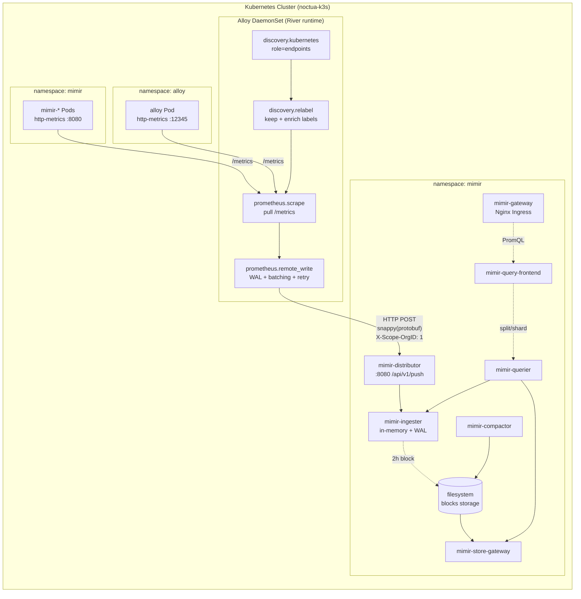
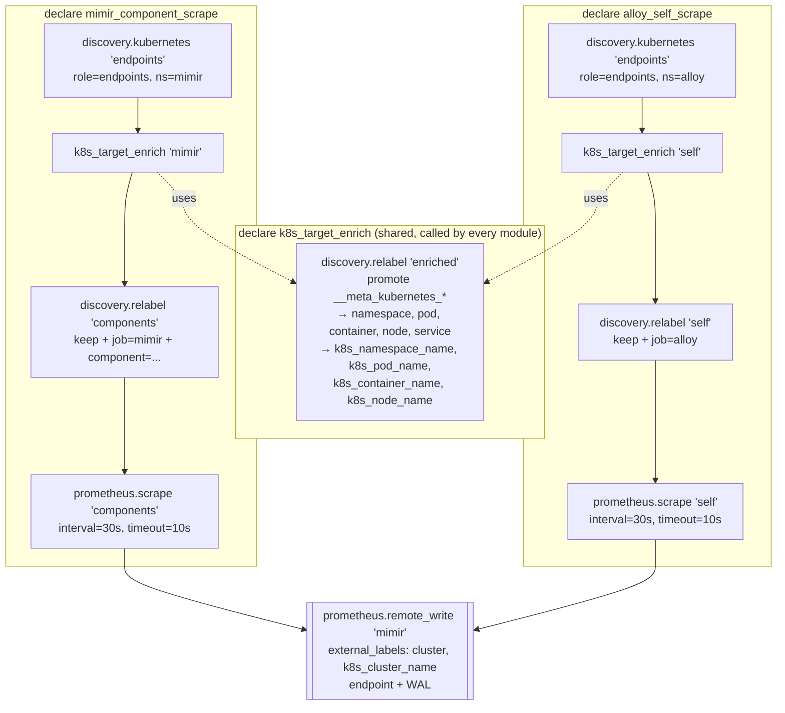
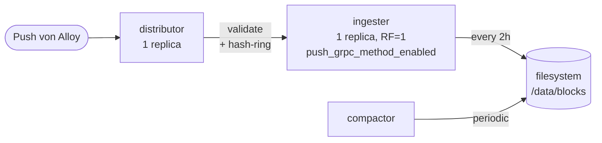

# Metrics Data Pipeline: Alloy → Mimir

Dieses Dokument beschreibt den exakten Weg eines Metrik-Samples vom Zielsystem
(Mimir-Microservice oder Alloy selbst) durch Grafana Alloy bis in den Mimir-Storage,
sowie welche Verarbeitung in jeder Stufe passiert.

Stand: April 2026. Bezieht sich auf die aktuelle, modularisierte River-Config in
[apps/alloy/prod/templates/alloy-configmap.yaml](../apps/alloy/prod/templates/alloy-configmap.yaml)
und die Mimir-Basiskonfiguration in
[apps/mimir/base/values.yaml](../apps/mimir/base/values.yaml).

---

## 1. High-Level-Pfad



Merke:
- **Write-Pfad**: Alloy spricht direkt mit `mimir-distributor.mimir.svc:8080`.
- **Read-Pfad** (PromQL, Grafana, Ingress `mimir.saadisfy.me`): läuft über
  `mimir-gateway`, der vor query-frontend/querier/store-gateway sitzt.
- Der Gateway ist kein Write-Proxy in dieser Installation — wir pushen
  absichtlich direkt an den Distributor, um einen Hop zu sparen.

---

## 2. Quellen (was wird gescraped?)

Aktuell zwei Scrape-Jobs, beide in derselben Alloy-Instanz (DaemonSet, 1 Pod auf Node `noctua`):

| Job (label) | Quelle | Port | Instanzen | Discovery |
|---|---|---|---|---|
| `mimir` | Services `mimir-{alertmanager,compactor,distributor,gateway,ingester,overrides-exporter,querier,query-frontend,query-scheduler,store-gateway}` in ns `mimir` | `http-metrics` (bzw. `legacy-http-metrics` für gateway) | 17 Targets | Kubernetes Endpoints |
| `alloy` | Service `alloy` in ns `alloy` | `http-metrics` (12345) | 1 Target | Kubernetes Endpoints |

Messwert: `count(count by(__name__)({job="alloy"}))` = **191 distinkte Metriken**,
`count(up{job="mimir"})` = **17 aktive Targets**.

---

## 3. Alloy-interne Pipeline (River-Graph)

Alloy führt die Config als DAG (gerichteter azyklischer Graph) aus. Jeder Node
erzeugt ein Output-`export`, das vom nächsten Node per `forward_to` oder
`targets` konsumiert wird. Hier die Kette pro Modul:



### 3.1 `discovery.kubernetes` — Target-Erkennung

Frägt die Kubernetes-API nach allen `Endpoints`-Objekten im angegebenen Namespace
und liefert eine Liste roher Targets. Jedes Target enthält ca. 30 `__meta_kubernetes_*`
Labels (Service-Name, Port-Name, Pod-Name, Node, Labels/Annotations der
Parent-Objects usw.).

Keine Filterung hier — der Job bekommt erstmal **alle** Endpoints des NS.

### 3.2 Label-Architektur — wer setzt was und wo?

Die Konvention ist bewusst dreischichtig, damit jede Information **genau einmal**
definiert wird (DRY) und dasselbe Schema über alle aktuellen und zukünftigen
Scrape-Module gilt.

| Schicht | Ort | Setzt | Skopus |
|---|---|---|---|
| **(1) Per-Target K8s-Enrichment** | `declare "k8s_target_enrich"` | `namespace`, `pod`, `container`, `node`, `service` **und** `k8s_namespace_name`, `k8s_pod_name`, `k8s_container_name`, `k8s_node_name` | Pro Target, gleich für alle Module |
| **(2) Modul-spezifisch** | `declare "<modul>_scrape"` (eigene `discovery.relabel`) | Keep-Filter, `job`, app-spezifisch (z. B. `component`) | Pro Job |
| **(3) Cluster-global** | `prometheus.remote_write "mimir"` `external_labels` | `cluster`, `k8s_cluster_name` | Auf jedem Sample, einmal definiert |
| **(4) Prometheus-built-in** | `prometheus.scrape` | `instance` (`<ip>:<port>`), `up`, `scrape_*` | Automatisch |

Das heißt: Wenn morgen `kube_state_metrics_scrape` dazu kommt, schreibt es
**keinen** Label-Enrichment-Code mehr — es ruft `k8s_target_enrich` auf und
definiert nur noch sein eigenes `job`-Label und seine Keep-Filter.

#### Warum zwei parallele Label-Familien (`pod` und `k8s_pod_name`)?

- **Prometheus-Konvention** (`namespace`, `pod`, `container`, `node`, `service`):
  inoffizieller Standard, den so ziemlich jedes vorgefertigte Grafana-Dashboard,
  jeder Mixin und jede Recording/Alerting-Rule erwartet. Bricht alles, wenn er
  fehlt.
- **OpenTelemetry Semantic Conventions** (`k8s_namespace_name`, `k8s_pod_name`,
  `k8s_container_name`, `k8s_node_name`, `k8s_cluster_name`): offizieller,
  herstellerneutraler Standard ([opentelemetry.io/docs/specs/semconv/resource/k8s/](https://opentelemetry.io/docs/specs/semconv/resource/k8s/)).
  Punkt-Notation (`k8s.pod.name`) ist in Prom-Label-Namen nicht erlaubt → wird
  zu Underscore. Wichtig für Korrelation mit Tempo-Traces und Loki-Logs, die
  ihre Resource-Attribute exakt so emittieren.

Kosten: 4 zusätzliche Labels pro Serie. Das ist überschaubar und vertretbar
für den Vorteil, dass Metrics ↔ Logs ↔ Traces in Grafana per `Loki: {k8s_pod_name="$pod"}`
und `Tempo: { resource.k8s.pod.name = "$pod" }` verlinkbar sind, ohne im
Dashboard erst Label-Mappings zu definieren.

#### Keep-Filter im Mimir-Modul ([alloy-configmap.yaml](../apps/alloy/prod/templates/alloy-configmap.yaml))

1. **Keep-Filter #1**: behalte nur Services, deren Name auf den Regex
   `mimir-(alertmanager|compactor|distributor|...|store-gateway)(-headless)?` passt.
2. **Keep-Filter #2**: behalte nur Ports `http-metrics` oder `legacy-http-metrics`
   (Mimir exposed auch gRPC- und memberlist-Ports, die interessieren uns nicht).
3. **App-spezifisch**: `component` ← Service-Label `app.kubernetes.io/component`
   (z. B. `ingester`, `distributor`).
4. **Job-Label**: `job` ← `mimir`.

**Warum so früh filtern?** Alles, was hier rausgefiltert wird, wird nie
gescraped → weniger Last, weniger Cardinality.

### 3.3 `prometheus.scrape` — Pull

- HTTP GET gegen `http://<pod-ip>:<port>/metrics` alle **30 s** (timeout 10 s).
- Parst Prometheus-Textformat (inkl. OpenMetrics-Erweiterungen).
- Setzt `up{...} = 1|0` Meta-Metrik (Liveness des Targets).
- Setzt `scrape_duration_seconds`, `scrape_samples_scraped`, `scrape_samples_post_metric_relabeling` usw.
- **Keine** `metric_relabel_configs` aktiv — d. h. Samples fließen ungefiltert
  weiter. Das ist bewusst einfach gehalten; Cardinality-Drop-Regeln kommen
  später, falls nötig.

Die Stage leitet dann einen Strom von `prompb.TimeSeries` an **alle** Receiver
aus `forward_to` weiter (aktuell nur `prometheus.remote_write.mimir.receiver`).

### 3.4 `prometheus.remote_write` — Versand an Mimir

Zentrale Sink-Komponente ([alloy-configmap.yaml](../apps/alloy/prod/templates/alloy-configmap.yaml)):

```river
prometheus.remote_write "mimir" {
  external_labels = {
    cluster          = "prod-bwcloud",
    k8s_cluster_name = "prod-bwcloud",
  }
  endpoint {
    url = "http://mimir-distributor.mimir.svc.cluster.local:8080/api/v1/push"
    headers = { "X-Scope-OrgID" = "1" }
  }
}
```

Interner Ablauf pro Sample:
1. **WAL** (Write-Ahead-Log) auf Disk: `/var/lib/alloy/data/prometheus.remote_write.mimir/wal/`.
   Überlebt Pod-Restarts. Verhindert Datenverlust, wenn Mimir kurzzeitig weg ist.
2. **Shards**: Alloy teilt den WAL-Stream auf parallele Queue-Shards auf
   (automatisches Autoscaling basierend auf In/Out-Rate).
3. **Batching**: pro Shard werden Samples zu Batches von bis zu `max_samples_per_send`
   (Default 2000) zusammengefasst, jedoch mindestens alle
   `batch_send_deadline` (5 s).
4. **Serialisierung**: Protobuf (`prometheus.WriteRequest`) → Snappy-Kompression.
5. **HTTP POST** an Distributor-URL mit Headers:
   - `Content-Type: application/x-protobuf`
   - `Content-Encoding: snappy`
   - `User-Agent: Prometheus/...`
   - `X-Scope-OrgID: 1`  ← Mimir-Multitenancy, „Tenant 1"
6. **Retry** bei 5xx/Timeout mit Exponential Backoff; 4xx werden geloggt und
   verworfen (sonst würde ein einziges schlechtes Sample den Stream blockieren).
7. **Periodisch**: `series GC` + WAL-Checkpointing alle 2 h (sichtbar in den
   Alloy-Logs: `msg="series GC completed"` / `msg="WAL checkpoint complete"`).

Metriken über diesen Prozess selbst (werden wieder in Alloy als `{job="alloy"}`
gescraped → schöner Feedback-Loop für Monitoring):
- `prometheus_remote_storage_samples_total`
- `prometheus_remote_storage_samples_pending`
- `prometheus_remote_storage_samples_failed_total`
- `prometheus_remote_storage_shards`
- `prometheus_remote_storage_queue_highest_sent_timestamp_seconds`

---

## 4. Mimir-Seite (Write-Pfad)

Die Mimir-Install ist `mimir-distributed` (microservices mode), Konfiguration:
[apps/mimir/base/values.yaml](../apps/mimir/base/values.yaml).



1. **distributor** ([base/values.yaml#L76-L83](../apps/mimir/base/values.yaml#L76)):
   - Decompress Snappy, deserialize Protobuf.
   - **Validation**: Label-Namen (regex), Reserved-Labels, Max-Label-Count,
     Max-Label-Length, Timestamp-Bounds.
   - **HA-Tracker**: nicht aktiv (brauchen wir nicht, nur 1 Alloy).
   - **Hash-Ring-Lookup**: Wähle Ingester anhand `hash(tenant + labels) mod N`.
   - Bei `replication_factor: 1` geht jede Serie an **genau einen** Ingester
     (keine Replikation — bewusst klein gehalten).
   - gRPC-Push an Ingester (`push_grpc_method_enabled: true` in
     [base/values.yaml#L45](../apps/mimir/base/values.yaml#L45)).

2. **ingester** ([base/values.yaml#L87-L96](../apps/mimir/base/values.yaml#L87)):
   - Hält die letzten ~2 h Daten **im RAM** (TSDB-Head) + eigenen WAL auf Disk.
   - Antwortet auf Queries für recent data direkt aus dem Head.
   - Alle 2 h „ship" des fertigen Blocks nach `/data/blocks` (filesystem-Backend
     statt S3 — [base/values.yaml#L34-L38](../apps/mimir/base/values.yaml#L34)).

3. **compactor** ([base/values.yaml#L68-L75](../apps/mimir/base/values.yaml#L68)):
   - Merge von 2 h-Blöcken zu größeren 12 h / 24 h-Blöcken.
   - Deduplizierung, Downsampling-Vorbereitung.
   - Läuft async, blockiert den Ingest nicht.

4. **store-gateway**: indexiert Blöcke aus `/data/blocks` und serviert sie dem
   Querier (Read-Pfad, nicht Write).

Features **explizit aus** in dieser Installation:
- `ingest_storage` (Kafka-basiertes Ingest) — [base/values.yaml#L44](../apps/mimir/base/values.yaml#L44)
- `ruler` — [base/values.yaml#L137](../apps/mimir/base/values.yaml#L137)
- Caches (chunks/index/metadata/results) — [base/values.yaml#L139-L146](../apps/mimir/base/values.yaml#L139)
- minio, kafka — [base/values.yaml#L148-L153](../apps/mimir/base/values.yaml#L148)

---

## 5. Label-Lebenszyklus eines Samples (Beispiel)

Nehmen wir `cortex_ingester_memory_series` von einem Ingester-Pod.

```
┌─ Im Target (/metrics-Output des Ingester-Pods) ───────────────────────────┐
│ cortex_ingester_memory_series{user="1"} 12345                             │
└───────────────────────────────────────────────────────────────────────────┘
           │
           │  discovery.kubernetes liefert __meta_*-Labels:
           │    __meta_kubernetes_namespace="mimir"
           │    __meta_kubernetes_service_name="mimir-ingester-headless"
           │    __meta_kubernetes_pod_name="mimir-ingester-zone-a-0"
           │    __meta_kubernetes_pod_container_name="mimir"
           │    __meta_kubernetes_pod_node_name="noctua"
           │    __meta_kubernetes_endpoint_port_name="http-metrics"
           │    __meta_kubernetes_service_label_app_kubernetes_io_component="ingester"
           ▼
┌─ Nach k8s_target_enrich (zentral) ────────────────────────────────────────┐
│   namespace="mimir"          k8s_namespace_name="mimir"                   │
│   pod="mimir-ingester-zone-a-0"   k8s_pod_name="mimir-ingester-zone-a-0"  │
│   container="mimir"          k8s_container_name="mimir"                   │
│   node="noctua"              k8s_node_name="noctua"                       │
│   service="mimir-ingester-headless"                                       │
└───────────────────────────────────────────────────────────────────────────┘
           ▼
┌─ Nach modul-eigenem discovery.relabel "components" (nur job + app-spez.) ─┐
│   + component="ingester"                                                  │
│   + job="mimir"                                                           │
└───────────────────────────────────────────────────────────────────────────┘
           │  prometheus.scrape fügt automatisch hinzu:
           │    instance="<pod-ip>:<port>"
           ▼
┌─ Nach prometheus.remote_write.external_labels (cluster-global) ──────────┐
│   + cluster="prod-bwcloud"                                                │
│   + k8s_cluster_name="prod-bwcloud"                                       │
└───────────────────────────────────────────────────────────────────────────┘
           ▼
┌─ Sample, das auf der Leitung an den Distributor geht ────────────────────┐
│ cortex_ingester_memory_series{                                            │
│   user="1",                                                               │
│   namespace="mimir", pod="...", container="mimir", node="noctua",         │
│   service="mimir-ingester-headless",                                      │
│   k8s_namespace_name="mimir", k8s_pod_name="...",                         │
│   k8s_container_name="mimir", k8s_node_name="noctua",                     │
│   component="ingester", job="mimir",                                      │
│   instance="10.42.0.42:8080",                                             │
│   cluster="prod-bwcloud", k8s_cluster_name="prod-bwcloud"                 │
│ } 12345 @ 1776514966                                                      │
└───────────────────────────────────────────────────────────────────────────┘
           │  Transport: snappy(protobuf) POST → distributor, Header
           │    X-Scope-OrgID: 1
           ▼
┌─ In Mimir gespeichert ────────────────────────────────────────────────────┐
│ Tenant "1" · TSDB-Head · Ingester-Pod 0                                   │
│ Series-ID basiert auf allen Labels oben (__name__ + 14 Labels).           │
└───────────────────────────────────────────────────────────────────────────┘
```

Wer setzt was — auf einen Blick:

| Label(s) | Quelle |
|---|---|
| `namespace`, `pod`, `container`, `node`, `service` | `k8s_target_enrich` (zentral) |
| `k8s_namespace_name`, `k8s_pod_name`, `k8s_container_name`, `k8s_node_name` | `k8s_target_enrich` (zentral, OTel semconv) |
| `component` | Modul `mimir_component_scrape` (app-spezifisch) |
| `job` | jeweiliges Scrape-Modul |
| `instance` | `prometheus.scrape` (built-in) |
| `cluster`, `k8s_cluster_name` | `prometheus.remote_write.external_labels` (global) |

Wichtige Regel: **jedes** Label (auch `pod`, `instance`) multipliziert die
Cardinality. `pod` z. B. ist bei langlebigen StatefulSets okay, bei Deployments
mit häufigem Rollout aber ein bekannter Cardinality-Treiber. Das ist der Grund,
warum in der Relabel-Stage gezielt nur wenige stabile Labels gesetzt werden.

---

## 6. Failure-Modi und wo sie auftreten

| Symptom | Wahrscheinliche Ursache | Sichtbar in |
|---|---|---|
| `up{job="mimir"} == 0` für einen Pod | Pod nicht ready, Port-Name falsch, NetworkPolicy | Alloy-Logs: `scrape failed`; `kubectl describe pod` |
| Keine neuen Samples in Mimir, aber `up == 1` | remote_write Pipeline hängt | `prometheus_remote_storage_samples_pending` steigt, Alloy-Logs `msg="non-recoverable error"` |
| `429 Too Many Requests` vom Distributor | Rate-Limits im Mimir-Tenant | Alloy-Logs; Mimir-`cortex_distributor_ingester_append_failures_total` |
| WAL wächst ins Unendliche | Mimir komplett down | `prometheus_wal_storage_size_bytes` in `{job="alloy"}` |
| Queries geben nichts zurück, aber Ingest läuft | query-frontend oder scheduler kaputt, Ingester-Ring nicht sauber | Mimir-Logs; `cortex_ring_members{state="ACTIVE"}` |
| `sample timestamp out of order` | Uhren-Drift zwischen Nodes | Distributor-Log, `cortex_distributor_sample_delay_seconds` |

---

## 7. Erweiterung der Pipeline

Neues Scrape-Ziel hinzufügen = **ein** neuer `declare`-Block + **eine**
Instanziierung. **Kein** Enrichment-Code, **kein** `cluster`-Argument — beide
leben zentral.

```river
declare "kube_state_metrics_scrape" {
  argument "forward_to"      { }
  argument "namespace"       { optional = true  default = "alloy" }
  argument "service_name"    { optional = true  default = "alloy-kube-state-metrics" }
  argument "scrape_interval" { optional = true  default = "30s" }
  argument "scrape_timeout"  { optional = true  default = "10s" }

  discovery.kubernetes "endpoints" {
    role = "endpoints"
    namespaces { names = [argument.namespace.value] }
  }

  // Zentrales K8s-Enrichment — setzt namespace/pod/container/node/service
  // sowie alle k8s_* OTel-Labels in einem Aufruf.
  k8s_target_enrich "ksm" {
    targets = discovery.kubernetes.endpoints.targets
  }

  discovery.relabel "ksm" {
    targets = k8s_target_enrich.ksm.output
    rule {
      source_labels = ["__meta_kubernetes_service_name"]
      regex         = argument.service_name.value
      action        = "keep"
    }
    rule { target_label = "job"  replacement = "kube-state-metrics" }
  }

  prometheus.scrape "ksm" {
    targets         = discovery.relabel.ksm.output
    forward_to      = argument.forward_to.value
    scrape_interval = argument.scrape_interval.value
    scrape_timeout  = argument.scrape_timeout.value
  }
}

kube_state_metrics_scrape "default" {
  forward_to = [prometheus.remote_write.mimir.receiver]
}
```

`cluster` und `k8s_cluster_name` bekommt das neue Modul **gratis** über die
`external_labels` am `prometheus.remote_write.mimir`.

Danach:
```bash
bash scripts/render-helm.sh apps/alloy/prod alloy alloy
git add apps/alloy/prod/{templates/alloy-configmap.yaml,render.yaml}
git commit -m "alloy: scrape kube-state-metrics"
git push
kubectl -n argocd annotate application alloy argocd.argoproj.io/refresh=hard --overwrite
```

Alloy lädt die neue Config per Reloader hot (kein Pod-Restart), siehe
[KubeernetesAlertNotes.md](../KubeernetesAlertNotes.md) und die Reloader-App
in [apps/reloader/](../apps/reloader/).

---

## 8. Zahlen/Fakten aktuell (Stand: Commit `7ad7b22`)

| Metrik | Wert |
|---|---|
| Targets `job=mimir` | 17 |
| Targets `job=alloy` | 1 |
| Distinkte Metriknamen unter `{job="alloy"}` | 191 |
| Distinkte Serien `cortex_* OR mimir_* OR up` | 439 |
| Scrape-Intervall | 30 s |
| Scrape-Timeout | 10 s |
| Remote-Write Endpoint | `mimir-distributor.mimir.svc:8080/api/v1/push` |
| Tenant | `1` (Header `X-Scope-OrgID`) |
| Mimir replication_factor | 1 (single ingester) |
| Blocks-Backend | filesystem (`/data/blocks`) |

---

## 9. Referenzen

- River module syntax: <https://grafana.com/docs/alloy/latest/concepts/modules/>
- `prometheus.remote_write`: <https://grafana.com/docs/alloy/latest/reference/components/prometheus/prometheus.remote_write/>
- `discovery.relabel` rules: <https://grafana.com/docs/alloy/latest/reference/components/discovery/discovery.relabel/>
- Mimir architecture: <https://grafana.com/docs/mimir/latest/references/architecture/>
- Interne Doku:
  - [docs/observability-getting-started.md](./observability-getting-started.md)
  - [docs/how-to-alloy.md](./how-to-alloy.md)
  - [docs/how-to-analyse-mimir-series-and-cardinality.md](./how-to-analyse-mimir-series-and-cardinality.md)
